#Contenidos

<br>

1.[Variables estadísticas](#vestad)

2.[Distribución de probabilidaes](#distrib)

3.[Estadística descriptiva: medidas de posición](#posicion)

4.[Estadistica descriptiva: medidas de dispersión](#dispersion)

5.[Ejercicios](#ejercicios)

<center>

  

---
class: inverse, center, middle

# Variables estadísticas

---

##**Variables estadísticas**

**Elementos de la población -> unidades estadísticas**

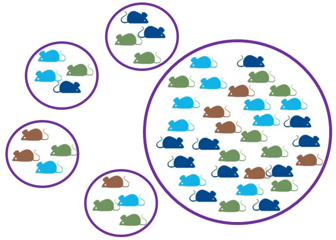

---
 ##**Variables estadísticas**
 <br>
 
  - **Variables cualitativas **
     - *ordinales*
     - *nominales*  

  - **Variables cuantitativas**
    -  *discretas*
    -  *continuas*
      <center>    
  
---
##**Variables estadísticas**

- **Variables cualitativas **
     - *ordinales* **->**   tamaño (grande, mediano, pequeño); distancia (muy lejos, lejos, cerca);  clases de edades; año de muestreo; tratamiento (1,2,3;a,b,c)
     
     - *nominales*  **->** sexo, especie, sitio, color, uso del suelo, cuadrante, presencia/ausencia
     
- **Variables cuantitativas**
    -  *discretas* **->** abundancia, indv. positivos, cantidad de huevos/embriones
    - *continuas* **->** índices, peso, largo, temperatura, humedad, intensidad luminica
    
           <center>    
 
---
##**Ejemplo**
>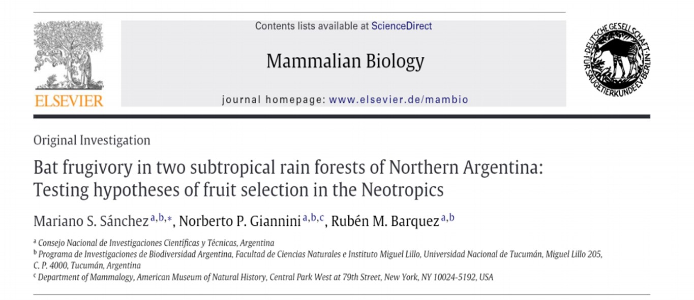
 
**OBJETIVO**: evaluar la dieta y el nicho dietario de especies de murciélagos frugívoros. 

<br>
<center>
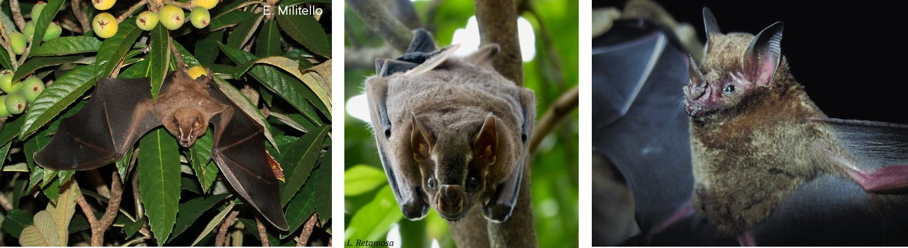


---
##**Ejemplo**

**METODOLOGíA**

**Datos**: recopilaron datos novedosos y utilizaron datos de estudios previos
  - **Murcielagos**
    - masa corporal
    - largo del antebrazo
    - sexo (macho, hembra)
    - edad (juvenil, adulto)

  - **Vegetación**: colectaron ejemplares en cada sitio 
   - tamaño individual de las semillas
   - color de la fruta
   - forma de la fruta
   - n° de semillas por fruto
   - habitat (bosque primario vs bosque secundario ribereño)
---
 
<br>

Parámetro     | Tipo de variable
------------- | -------------
**Murcielagos**| 
  masa corporal| cuantitativa continua
  largo del antebrazo| cuantitativa continua 
  sexo        | cualitativa nominal de dos niveles: macho/hembra
  edad      | cualitativa ordinal de dos niveles: juvenil/adulto

  
---
 

Parámetro     | Tipo de variable
------------- | -------------
**Vegetación**| 
  tamaño de semilla| cuantitativa continua
  color del fruto|cualitativa nominal
  forma del fruto|cualitativa nominal
  n° de semillas por fruto| cuantitativa discreta
  habitat| cualitativa nominal de dos niveles: bosque primario/bosque secundario
---
##**Ejemplo**
>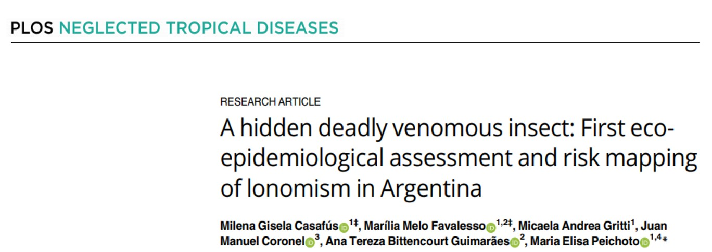

<br>
**OBJETIVO**:  analizar el perfil eco-epidemiológico de accidentes y ocurrencias de taturanas (*Lonomias sp*) en Misiones (Argentina) entre enero de 2014 y mayo de 2020

---
**Ejemplo**

**METODOLOGíA**

**Datos**: epidemiológicos y registros a campo
  - **Accidentes**
      - aspectos socio-demográficos
      - localidad del accidente
      - hora del día
      - circunstancias del accidente 
      - área anatómica afectada
      

---
**Ejemplo**

**METODOLOGíA**  

- **Ocurrencia**
    - planta hospedadora
    - tipo de ambiente
  
- **Nicho ecologico de las taturanas**
   - Temperaturas máximas y mínimas
   - Precipitaciones
   - Evapotranspiración 
    
---
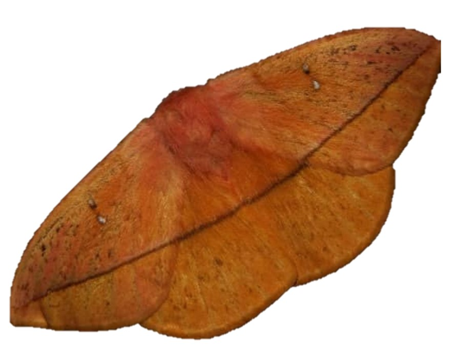

<br>

Parámetro     | Tipo de variable
------------- | -------------
**Accidentes** |
   sexo       | cualitativa nominal de dos niveles: m/f
   grupo etario| cualitativa ordinal de 7 niveles: 0-10; 11-20; 21-30; 31-40; 41-50; 51-60; 61-70
   hora del día| cualitativa ordinal de tres niveles: 6-12; 12:01-18:00; desconocido
   circunstancias del accidente| cualitativa nominal de tres niveles: duramte el trabajo; durante recreación; desconocido
   área anatómica afectada| cualitativa nominal de tres niveles: miembros inferiores; miembros superiores; tronco
   
---


<br>

Parámetro     | Tipo de variable
------------- | -------------
**Ocurrencia**|
Planta hospedadora| cualitativa nominal
Tipo de ambiente| cualitativa nominal de cuatro niveles: urbano, periurbano, rural, bosque 
**Nicho**|
Temperaturas máx y min| cuantitativa continua
Precipitaciones| cuantitativa continua
Evapotrasnpiracion| cuantitativa continua 
---
###**IMPORTANTE**
<br>
Cuando cargamos la planilla al R, el programa lee cada columna con la categoria asignada en el procesador de bases de datos

No siempre esa categoria es la correcta y hay que configurarla
```{r echo=FALSE}
setwd("F:/eli/Curso de capacitacion R_INMeT")
library(readr)
datos<- read_delim("Hanta_ambiente_sinurbano.csv", 
                   ";", escape_double = FALSE, trim_ws = TRUE)

```

---
**Entonces**

***variable cualitativa***

```{r 1, echo=TRUE}
class(datos$uso_suelo)
datos$uso_suelo <- as.factor(datos$uso_suelo)
class(datos$uso_suelo)
```
---
<br>
<br>

***variable numérica continua***

```{r echo=TRUE}
datos$IDR_total <- as.numeric(datos$IDR_total)
class(datos$IDR_total)
```

***variable numérica discreta***

```{r echo=TRUE}
class(datos$n_total)
datos$n_total <- as.integer(datos$n_total)
```
---
##**Distribución de probabilidades**
- **función** 

- asigna a cada suceso definido sobre la variable la probabilidad de que dicho suceso ocurra. 

- está definida sobre el conjunto de todos los sucesos y cada uno de los sucesos es el rango de valores de la **variable aleatoria**

- tiene una relación estrecha con las distribuciones de frecuencia, ya que describe **cómo se espera** que **varíen** los resultados

  

---
<br>
<br>

Distribución                |	Alias
--------------------------- | ----------------
Distribución normal         |	norm
Distribución Binomian       |	binom
Distribución de Poisson     | pois
Distribución exponencial    |	exp
Distribución t de Student   | t
Distribución Chi cuadrao    |	chisq
Distribución F	            | f


---

<br>
<br>

Funciones     |	Sintaxis        |Explicacion
--------------| ----------------|--------------
densidad      | dnorm           | devuelve el valor de la función de densidad de probabilidad
              | dbinom          | probabilidad de obtener un determinado número de aciertos en un determinado número de ensayos
              | dpois           | probabilidad puntual para un determinado valor
probabilidad   |pnorm            |
              |pbinom            |probabilidad de que la variable tome valores menores o iguales que *x*
              | ppois            |
cuantiles     |  qnorm           | 
              |qbinom            |permite encontrar el cuantil (percentil) para cualquier probabilidad *p*
              | qpois            |
---
##**Distribucion normal** 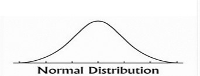

- es una de las  distribuciones de probabilidad de variable continua más frecuente
-  permite modelar numerosos fenómenos naturales, sociales y psicológicos
- está identificada por una combinación de valores de dos parámetros: $\mu$  y $\sigma$
- definida por una **Función de densidad**
<center>
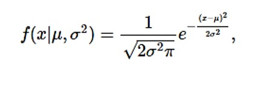

$\mu$ = media, mediana y la moda de la distribución

$\sigma$ = la desviación estándar ( $\sigma$ >0 )

$\sigma^{2}$ = la variación 

Estandarizar->***N*** **( $\mu$ , $\sigma$)** **->** ***N*** **(0,1)**
---
###**Distribucion normal**
<br>

```{r}
library(stats)
help("Distributions")
```
Vamos a modelar una distribución normal

```{r include=FALSE}
set.seed(1234)
n <- 1000
mu <- 0
sigma <- 1

y <- rnorm(n, mean = mu, sd = sigma)

```

```{r echo=TRUE, fig.height=4, fig.width=4}

hist(y, breaks = 40, freq = FALSE, main="")
lines(density(y), lwd = 2, lty=3, col="darkgrey")
xvec <- seq(min(y)-0.5,max(y)+0.5, by=0.1) 
lines(xvec, dnorm(xvec, mean = mu, sd = sigma), lwd = 2)
```

---
##**Ejemplo**

<br>
Estamos estudiando el proceso de invasión de árboles en la sabana del Parque Nacional El Palmar, y para eso desarrollamos un experimento en el que colocamos plántulas de *Allophylus edulis* cerca de las palmeras y medimos su altura al cabo de un año. 
Sabemos que la media de la altura de esta especie es de 8 cm y la varianza es de 6.25 cm. 

```{r echo=FALSE, fig.height=5, fig.width=5}
n <-100
mu <- 8
sigma <- 2.5
y <- rnorm(n, mean = mu, sd = sigma)
hist(y, breaks = 10, freq = FALSE, main="")
lines(density(y), lwd = 2, lty=3, col="darkgrey")
xvec <- seq(min(y),max(y), by=0.1) 
lines(xvec, dnorm(xvec, mean = mu, sd = sigma), lwd = 2)
```

---
<br>
<br>

Sabemos que nuestra variable altura tiene una distribución normal. Si la plantula logra pasar la altura media en cercania de una palmera, tiene mayor probabilidad de asentarse y  queremos evaluar qué probabilidad hay de que la plántula crezca por debajo de la media+su desvio estandar ( es decir, por debajo de 8-2.5= 5.5) al cabo de un año de comenzado el experimento. 

```{r echo=TRUE}
pnorm(5.5, mean=8, sd=2.5)

```
```{r echo=TRUE}
pnorm(12, mean=8, sd=2.5)
```
```{r echo=TRUE}

qnorm(0.9452007, mean=8, sd=2.5, lower.tail = FALSE)
```

---
##**Distribucion Binomial**   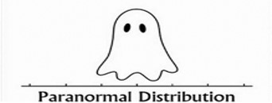
- una distribución de probabilidad de una variable discreta. 

- Describe el resultado de ensayos independientes de ***n***

- puede generar dos resultados:
      - positivo vs. negativo; presente vs ausente -> **Bernoulli**
      - cantidad de positivos vs. cantidad de examinados -> **Binomial**
      
- la variable toma valores discretos cuya probabilidad depende de ***n***, definido como el número de ensayos, y ***p***,  definido como la probabilidad del resultado a contar en cada ensayo. 

<center>
 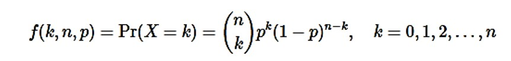
---

##**Ejemplo**
<br>

Además de ver que tanto crecieron las plántulas de *A. edulis* queremos saber también cuántas sobrevivieron en un año. 
- Entonces, si instalamos 5 plantulas por parcela, en un total de 5 parcelas, nuestro ***n*** = 25.
- Sabemos por estudios previos que la probabilidad de que una plantula al azar colocada cerca de una palmera sobreviva es de ***p***= 0.3
- Queremos saber cual es la probabilidad de que ninguna sobreviva

```{r echo=TRUE}
p <-  0.3
n <-  25
k <-  0
dbinom(k,size=n,prob=p)
```
---
<br>
<br>
```{r echo=TRUE, fig.height=5, fig.width=5}
n <- 0:25

plot(dbinom(n, size = 25, prob = 0.3), type = "h", lwd = 2,
     main = "Función de probabilidad binomial",
     ylab = "P(X = x)", xlab = "Número de éxitos")
```
---
```{r echo=FALSE, paged.print=TRUE}
n <- 0:25

plot(dbinom(n, size = 25, prob = 0.3), type = "h", lwd = 2,
     main = "Función de probabilidad binomial",
     ylab = "P(X = x)", xlab = "Número de éxitos")

lines(dbinom(n, size = 25, prob = 0.4), type = "h",
      lwd = 2, col = rgb(1,0,0, 0.7))


lines(dbinom(n, size = 25, prob = 0.5), type = "h",
      lwd = 2, col = rgb(0, 1, 0, 0.7))

legend("topright", legend = c("25  0.3", "25 0.4", "25 0.5"),
       title = "n     p", title.adj = 0.85,
       lty = 1, col = 1:3, lwd = 2, box.lty = 0)

```

```{r eval=FALSE, include=FALSE}
#la diferencia entre las tres curvas es que el parametro de supervivencia cambia y eso se traduce en cambios en el numero de plantulas que sobrevive 
```

---
<br>
- Tambien podemos calcular la probabilidad con la siguiente funcion 

```{r echo=TRUE, fig.height=4, fig.width=4}
pbinom(n,25,0.3)
plot(pbinom(n, size=25, p=0.3))
```
---
Comparamos

dbinom    |	pbinom
--------- | ---------
0.000134  | 0.99986

¿Cuál es la diferencia?

**dbinom** expresa la función de masa, es decir la función de probabilidad;  muestra la probabilidad de tomar al azar una plantula que no sobrevivió
          
**pbinom** expresa la funcion de distribución acumulada;
          muestra la probablidad de supervivencia en las plantas
```{r echo=FALSE}
pbinom(5,25,0.3)#probabilidad de que sobrevivan 5 plantas
pbinom(7,25,0.3)# que sobrevivan siete plantas
```
 Ademas tenemos la funcion **qbinom** para conocer los cuantiles (devuelve la función de densidad acumulativa inversa):
```{r}
qbinom(p = 0.511848, size = 25, prob = 0.3)
```

---
##**Distribucion Bernoulli**   

- toma valores de 0 y 1

```{r echo=TRUE}
bb <- rbinom(25,size=1,prob=0.3)
bb
```

---
```{r echo=FALSE, fig.height=4, fig.width=4}
hist(bb)
plot(pbinom(bb, size=25, p=0.3))
```

```{r echo=FALSE, fig.height=4, fig.width=4}
hist(n)
plot(pbinom(n, size=25, p=0.3))
```
---
##**Distribución de Poisson**  
<br>
- es una distribución de probabilidad discreta
- se usa en conteos
- La ocurrencia media por intervalo suele representarse con la letra griega lambda $\lambda$ y, en base a dicho valor, la distribución de Poisson estima la probabilidad de que se produzcan *x* sucesos dentro de un intervalo dado

<center>
 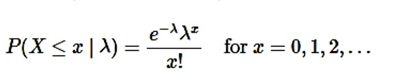
---
##**Ejemplo**
- Siguiendo con el ejemplo anterior, cuantas plantulas crecieron al lado de las palmeras despues de un año
```{r echo=TRUE}

dpois(0, lambda = 5)#probabilidad de que ninguna crezca

dpois(12, lambda =5)#probabilidad de que crezcan 12

ppois(1, lambda = 5) #probabilidad de que mas de una sobreviva

ppois(25, lambda = 5)#probabilidad de que sobrevivan todas

p <- c(0.25, 0.50, 0.75)
qpois(p, lambda = 5)
```
---
<br>

<br>

<br>

<center>
 
---
#**Estadistica descriptiva**

<br>

- *descripción de una población*

- descripción de las diferentes variables

- teniendo en cuenta:
  - valor medio
  - dispersión/variación
  - forma
  
---
###**Medidas de posición**
<br>

- son medidas de tendencia central

- marcan la acumulación de los datos en torno a un valor

- **media, mediana y moda**

###**Media**
- muestra el valor promedio de nuestra variable de interés

<center>
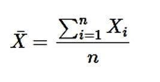
---

<br>

<br>
Podemos calcular la media para nuestra muestra completa o definir qué valores queremos excluir del cálculo

**Ejemplo**   
 
La especie *Steindachneridion melanodermatum*, conocido como "surubí del Iguazú" es una especie endémica de la cuenca del río Iguazú. Queremos saber cual es el peso promedio de la población que estamos estudiando
```{r include=FALSE}

library(readr)
surubi<- read_delim("surubi.csv", 
                   ";", escape_double = FALSE, trim_ws = TRUE)
surubi$peso <- as.numeric(surubi$peso)
surubi$largo <- as.numeric(surubi$largo)
surubi$temp <-  as.numeric(surubi$temp)
surubi$sitio <- as.factor(surubi$sitio)
```

---


**Media de toda la muestra**
```{r echo=TRUE}
mean(surubi$peso)

```

**Media de un conjunto de datos recortado**

```{r echo=TRUE}
mean(surubi$peso, na.rm = TRUE, trim = 0.025)
```

El comando *trim()* nos permite indicar los datos que queremos excluir de cada extremo de la distribución 

---

<br> 
<br>

- Si además de los datos que tomamos en campo, contamos con estudios previos y queremos conocer la media de esa población utilizando todos los datos, se puede calcular la media ponderada

- Esto se realiza con una adaptación de la formula donde incluimos la media y en *n* de las bases que vamos a utilizar. Por ejemplo: nuestros datos tienen una media de 3.668 kg (*n*=50), y los estudios previos muestran medias de 2.15 kg (*n*=25), 3.12 kg (*n*=47)

```{r echo=TRUE}
mpond <- ((3.668*50)+(2.15*25)+(3.21*47))/(50+25+47)
mpond
```

---
##**Mediana**
<br>

- es el valor que se encuentra en la mitad en la lista ordenada de nuestros datos

```{r echo=TRUE}
median(surubi$peso)
```

##**Moda**
- la moda es el valor más frecuente en nuestros datos

- se puede programar siguiendo 
```{r echo=TRUE}
frecuencias <- data.frame(table(surubi$peso))
moda <- frecuencias[which.max(frecuencias$Freq),1]
moda
```
---
<br>

<br>


```{r echo=TRUE}
library(modeest)
mfv(surubi$peso)
```
---
#**Estadistica descriptiva**
##**Medidas de dispersión**
- nos permiten visualizar que tan variables o dispersos son nuestros datos
- valores mínimos y máximos, varianza, el desvío estandar, asimetria y curtosis, cuantiles

##**Mínimo y máximo**
```{r echo=TRUE}
min(surubi$peso)
max(surubi$peso)
range(surubi$peso)
```
---
##**Varianza**
- es el promedio de los cuadrados de los desvíos
- Es la esperanza del cuadrado de la desviación típica de dicha variable respecto a su media
- se expresa en la unidad de la variable al cuadrado
<center>
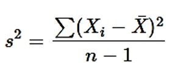

```{r echo=TRUE}
var(surubi$peso)
```

---
<br>
##**Desvio estandar**
- es la raíz cuadrada de la varianza
- se expresa en la misma unidad en la que estan nuestros datos
<center>
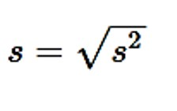

```{r echo=TRUE}
sd(surubi$peso)
```
---
**Error estandar**
- error estándar es la desviación estándar de la distribución muestral 
- una estimación de la desviación estándar, derivada de una muestra particular usada para computar la estimación.
- es la desviación estándar dividida por la raíz cuadrada del número de observaciones. 
```{r echo=TRUE}
library(plotrix)
std.error(surubi$peso)
```
**Cálculo manual**

- EE es el desvío estandar dividido la raíz cuadrada del n° de observaciones
```{r echo=TRUE}
sd(surubi$peso)/sqrt(length(surubi$peso))
```

---
##**Coeficiente de variación**
- Comparar dos grupos de datos de forma estandarizada
- permite comparar datos en diferentes escalas 
- a >CV, menor representatividad de la media
- es una medida relativa 

**Datos que tomamos a campo**
Masa corporal expresada en **kg**

Teniamos una media de 3.67 kg con un desvío de 1.35 kg
```{r echo=TRUE}
sd(surubi$peso)/mean(surubi$peso)#(1.35/3.668)

```

**Datos de la bibliografía**
Masa corporal expresada en **gr**

Teniamos una media de 3120 gr (3.12 kg) con un desvio de 300 gr (0.30 kg)
```{r echo=TRUE}
(300/3120)
```
---
##**Asimetria y curtosis**
- dan cuenta de la forma general de los datos
- nos permite identificar ciertas tendencias y comportamiento de los datos
- se utilizan comandos de la librería **psych**

```{r include=FALSE}
library(psych)
```

**Asimetría**
- da cuenta de cómo se organizan los datos alrededor de la media
- pueden ser simétricas o asimétricas positivas o negativas
- los valor deben encontrarse entre -2 y 2.

```{r echo=TRUE}
skew(surubi$peso)
```
 nos devuelve un valor en la escala de la variable que no nos permite comparar entre diferentes set de datos, entonces lo podemos estandarizar


```{r echo=TRUE}
skew(surubi$peso)/sqrt(6/50) 
```

---
**Curtosis o apuntamiento**

<br>
- mide que tan apuntada o achatada es la distribución de los datos al cercanos a la media

```{r echo=TRUE}
kurtosi(surubi$peso)

kurtosi(surubi$peso)/sqrt(6/50) 
```
**negativa** la distribución es **platicúrtica**

 **igual a cero** la distribución es **mesocúrtica**

**positiva**la distribución es **leptocúrtica**

En nuestro ejemplo, el peso de los surubí estudiados se distribuyen con una forma simétrica platicúrtica 
---

###**¿Qué pasa si queremos comparar dos variables?**

**Covarianza**
- mide la asociación lineal entre dos variables
- puede ser mayor, igual o menor que cero.
- será positica cuando la variable respuesta aumente con el aumento de la explicativa
- nos denota el tipo de relacion: positiva, negativa, neutra

```{r echo=TRUE}
cov(surubi$peso, surubi$largo)
cov(surubi$peso, surubi$temp)
```
---
**Correlacion**
- nos permite estimar el grado en que estan correlacionadas dos variables 
- la relacion lineal será débil si el valor es cercano a cero
- lineal directa fuerte si el valor es cercano a 1
- lineal inversa fuerte si es cercano a -1

```{r echo=TRUE}
cor.test(surubi$largo, surubi$temp)

```
---
```{r include=FALSE}
library(GGally)
```
Con la libreria **GGally**
<br>

```{r echo=TRUE, fig.height=5, fig.width=5}

ggpairs((surubi[,c(4:5)]), mapping=aes(color=surubi$sitio))

```
---
##**Cuartiles, deciles y percentiles**
- se calcula con **quantile()** del paquete *stats* 

**cuartiles**
```{r echo=TRUE}
quantile(surubi$peso, prob=seq(0, 1, 1/4)) 

```

**Deciles**
```{r echo=TRUE}
quantile(surubi$peso, prob=seq(0, 1, length = 11))

```

---
**Percentiles**
<br>

<br>

```{r echo=TRUE, fig.height=5, fig.width=5}

quantile(surubi$peso,seq(0, 1, length = 101)) 
```


---
##**Algunos graficos descriptivos**

```{r include=FALSE}
library(tidyverse)
library(ggplot2)
```
**Grafico de cajas**
<br>
<br>
```{r echo=TRUE, fig.height=5, fig.width=5}
f1<- ggplot(surubi, aes(x= sitio, y= peso, fill=sitio))+ geom_boxplot() + xlab("peso") +theme (text = element_text(face= "bold" , size=15))
f1

```
---
<br>
<br>

```{r echo=TRUE, fig.height=5, fig.width=5}
f2<- ggplot(surubi, aes(x=peso, y=largo))+ geom_line()+ xlab("peso") + ylab ("largo") +theme (text = element_text(face= "bold" , size=15))
f2
```
---
**Dudas y/o consultas** 

[efburgos@conicet.gov.ar]() ; [mariliabioufpr@gmail.com]()
<center>
  

**Ejercicios**  ->  [Ejercicios.pdf]()

**Formulario**->  [https://forms.gle/tmLsFUB5VfVqEcTKA]() 

 *FIN*


 