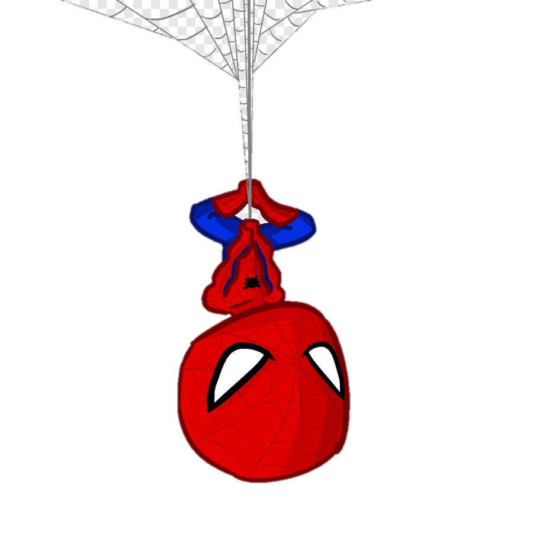

# **Clase 4**
##**CONTENIDO**

 1. [Estadística descriptiva: frecuencias](Estadística descriptiva: frecuencias)
 
 2. [Gráficos](graficos)
 
  
---
##**Frecuencias y distribución de frecuencias**
<br>
 - es la base de la inferencia estadística
 
 - representa la cantidad de veces que un determinado valor se repite en nuestra muestra
 - organiza la información disponible para describir los datos
 
 <br>
 
 <center>
 **lista de valores + frecuencias => distribución de frecuencias**
 
.right[] 
---
## **RETOMAMOS EL EJERCICIO 3 DE LA CLASE ANTERIOR**

> En el marco de la evaluaciónn del estado de conservaciónn de mamíferos de la provincia, nos designaron la especie *Chironectes minimus* mejor conocida como **cuica de agua**,  propia de la Selva Paranaense y que, hasta el momento, en nuestro paí solo se encuentra en Misiones. 
Sabemos que en otras regiones su peso es menor en áreas degradadas respecto de las áreas conservadas. Realizamos la captura de esta especie (con ayuda de un veterinario,  las medidas de bioseguridad adecuadas y los permisos correspondientes), donde registramos el peso y el sexo de los individuos en dos sitios completamente distintos: un área natural protegida y un cultivo de yerba con arroyos y tajamares.


```{r include=FALSE}
library(readr)
datos<- read_delim("Ejercicio_3.csv", 
                   ";", escape_double = FALSE, trim_ws = TRUE)
datos$peso <- as.numeric(datos$peso)
datos$lcorporal <- as.numeric(datos$lcorporal)
datos$sexo <- as.factor(datos$sexo)
datos$uso_suelo <- as.factor(datos$uso_suelo)
datos$anio <- as.factor(datos$anio)
```


---
##**FRECUENCIAS ABSOLUTAS Y RELATIVAS**
**Frecuencia absoluta**
-> es el número de veces que se repite un valor

**Frecuencia relativa**
-> la proporción que representa esa frecuencia absoluta en relación con el total. 

**Frecuencias acumuladas**
-> suma sucesiva de las frecuencias de los datos ordenados de menor a mayor, 

***Ejemplo***: ¿Cuántos individuos tengo relevados en cada uso del suelo?

```{r echo=TRUE}
f.abs <- table(datos$uso_suelo)
f.abs
prop.table(f.abs)
```
---
<br>
si quiero expresarla en porcentaje uso **prop.table()*100**

```{r echo=TRUE}
prop.table(f.abs)
prop.table(f.abs)*100
```
.right[] 

---
***Ejemplo***

¿Cuántos individuos capturé por año? (cada fila de mi planilla corresponde a una captura)
```{r echo=FALSE}
frec.anio<- table(datos$anio)
frec.anio
prop.table (frec.anio)
```


¿Cuántos individuos tengo de cada sexo?

```{r echo=FALSE}
frec.sex<- table(datos$sexo)
frec.sex
prop.table (frec.sex)
```

---
##**Distribuciónn de frecuencias**   

- es la especificaciónn de las frecuencias correspondientes a cada uno de sus valores 

Variable    | Frec. absoluta |Rec. relativa
------------| ---------------|------------
USO DEL SUELO|               |
 reserva    | 20             |  0.5128205
 cultivo    | 19             |  0.4871795 
AÑO         |                |
 2014       | 30             |  0.7692308 
 2015       |  9             |  0.2307692
SEXO        |                |
  m         | 21             |  0.5384615
  h         | 18             |  0.4615385 

---
**Variables cuantitativas**  
- **podemos calcular las frecuencias para cada valor**

```{r echo=FALSE, fig.height=5, fig.width=5}
frec.peso<- table(datos$peso)
frec.peso
prop.table (frec.peso)

```


---

 - **Tabla de distribución de frecuencias**  
 
```{r echo=TRUE, fig.height=3.5, fig.width=3.5}
library(fdth)
tabla <- fdt(datos$peso, start=460, end=715, h=15)
tabla
```

---
###**Frecuencias relativas**
- **Graficar**: Histograma

```{r echo=TRUE, fig.height=5.5, fig.width=5.5}
plot(tabla, type="fh")
```
 

---
- **Graficar**: Polígono de frecuencias

<br>

```{r echo=TRUE, fig.height=5, fig.width=5}
plot(tabla, type="fp", col="red") 
```
  

---
###**Frecuencias acumuladas**
 **Graficar**: Histograma
<br>
```{r echo=TRUE, fig.height=5, fig.width=5, paged.print=FALSE}
plot(tabla, type="cfh") 
```
 

---
 **Graficar**: Polígono de frecuencias
<br>
<br>

```{r fig.height=5, fig.width=5}
plot(tabla, type="cfp",col="red")
```


---
<br>
<br>
<center>
<br>
#**GRÁFICOS**
<br>
  
---
##**GRAFICAR EN R**

Paquete ***stats***
  - histogramas
  - gráficos de densidad
  - gráficos de línea
  - gráficos de cajas
  - gráficos de barra
  - gráficos de torta
  
<br>

  
---
**Histogramas básico para una variable continua**

```{r echo=TRUE}
hist(datos$peso)
```

---
**Histogramas básico para una variable continua**
```{r echo=TRUE, fig.height=6, fig.width=6}
hist(datos$peso, main = "Histograma de peso",
     xlab = "Peso (gr)",
     ylab = "Frecuencia",
     col = "red",
     border = "black",
     )
```


---
**Gráficos de densidad**

<br>

```{r echo=TRUE, fig.height=5, fig.width=5}
densidad <- density(datos$peso)
plot(densidad, 
     main = "Histograma de densidad 1",
     xlab = "Peso (gr)",
     ylab = "Densidad")
```

---
**Gráficos de línea**

<br>
```{r echo=TRUE, fig.height=7, fig.width=7}
plot(datos$peso, type="l", col="blue")

```

---
**Gráficos de caja**
<br>
<br>

```{r echo=TRUE}
boxplot(datos$peso, main = "Gráfico de cajas 1",
        outline = TRUE)
```


---
**Gráficos de barra**
<br>
<br>

```{r echo=TRUE, fig.height=6, fig.width=6}
plot(datos$sexo, main = "Gráfico de barras 1",
     xlab = "Sexo", ylab = "Frecuencia")
```
---
**Gráficos de barra**
<br>
<br>

```{r echo=TRUE, fig.height=5, fig.width=5}
barplot(height=datos$peso, names=datos$uso_suelo)
```

---
**Gráficos de torta**
<br>
<br>

```{r echo=TRUE}
porcentajes <- as.numeric(round(((prop.table(table(datos$sexo)))*100),2))
porcentajes
etiquetas <- c("Hembra", "Macho")
etiquetas
```

```{r echo=TRUE, fig.height=4, fig.width=4, paged.print=FALSE}
pie(porcentajes, etiquetas,
    main = "Gráfico de torta 1",
    sub = "")
```

---
  <br>
  <br>
```{r echo=TRUE, fig.height=5, fig.width=5}
etiquetas <- paste(etiquetas, porcentajes)
etiquetas <- paste(etiquetas, "%", sep = "")
pie(porcentajes, etiquetas,
    main = "Gráfico de torta 1",
    sub = "")
```

---
<br>
<center>
<br>
<br>
<br>
<br>


---
##**Paquete *"tidyverse"***
<br>
Es un conjunto de paquetes que comparten algunas estructuras y funciones para importar, manipular, modelar y graficar datos

.center[]
---
##**ggplot2**
<br>
```{r echo=TRUE}
library(ggplot2)
```

**Estructura**
- datos -> base de datos, tabla
- aes -> asocia los elementos a graficar
- geometrías -> capas, define el tipo de gráfico (histograma, barras, etc)
- facetas -> permite dividir un gráico en dos o mas partes siguiendo las mismas escalas

  
---
##**ggplot2**
<br>
<center>


<br>


[https://www.rstudio.com/wp-content/uploads/2015/04/ggplot2-spanish.pdf]()

---
##**ggplot2**
<br>

  - histogramas
  - gráficos de densidad
  - gráficos de puntos
  - gráficos de línea
  - gráficos de cajas
  - gráficos de barra
  - gráficos de torta
  
  
.right[]  
---
##**Histogramas**
<br>
```{r echo=TRUE, fig.height=4.5, fig.width=4.5}

ggplot(datos, aes(x = peso) )+
  geom_histogram(binwidth = 15) +
  scale_x_continuous("Peso (gr)") + 
  scale_y_continuous("Frecuencia") +
  labs(title = "",
       subtitle = "")
```


---
##**Gráficos de densidad**
<br>
```{r echo=TRUE, fig.height=4.5, fig.width=4.5}
ggplot(datos, aes(x = peso) )+
 geom_density() +
  scale_x_continuous("Peso (gr)") + 
  scale_y_continuous("Frecuencia") +
  labs(title = "",
       subtitle = "")
```

---
##**Gráficos de puntos**
<br>

```{r echo=TRUE, fig.height=6, fig.width=6}
ggplot(data = datos) +
  geom_point(aes(x = peso, y = lcorporal, col = sexo))
```


---
##**Gráficos de puntos**
<br>

```{r echo=TRUE, fig.height=6, fig.width=6}
ggplot(data = datos) +
  geom_point(aes(x = peso, y = lcorporal, col = sexo) , size=6)

```

---
##**Gráficos de puntos**
<br>

```{r echo=TRUE, fig.height=6, fig.width=6}
ggplot(data = datos) +
  geom_point(aes(x = peso, y = lcorporal, col = sexo),size=6, alpha = 1/5)
```

---
##**Gráficos de puntos**
<br>

```{r echo=TRUE, fig.height=6, fig.width=6}
ggplot(data = datos) +
  geom_point(aes(x = peso, y = lcorporal, shape= sexo), size=3)
```

---
##**Gráficos de puntos**

<br>
```{r echo=TRUE, fig.height=5, fig.width=5}
ggplot(data = datos) +
  geom_point(aes(x = peso, y = lcorporal, col=sexo), size=6)+
  facet_grid(.~uso_suelo)
```

---
##**Transformación estadística**
<br>
```{r echo=TRUE, fig.height=5, fig.width=5}
ggplot(data = datos) +
  geom_point(aes(x = peso, y = lcorporal, col=sexo), size=4)+
  geom_smooth(aes(x = peso, y = lcorporal), method = 'lm')
```

---
##**Transformación estadística**
<br>
```{r echo=TRUE, fig.height=5, fig.width=5}
ggplot(data = datos) +
  geom_point(aes(x = peso, y = lcorporal, col=sexo), size=4)+
  geom_smooth(aes(x = peso, y = lcorporal, linetype=uso_suelo), method = 'lm')
```

---
##**Transformación estadística**
<br>
```{r echo=TRUE, fig.height=5, fig.width=5}
ggplot(data = datos) +
  geom_point(aes(x = peso, y = lcorporal, col=sexo), size=4)+
  geom_smooth(aes(x = peso, y = lcorporal), method = 'lm') +
  facet_grid(rows = vars(uso_suelo))
```

---
##**Gráficos de línea**
<br>
```{r echo=TRUE, fig.height=5, fig.width=5}
ggplot(datos) +
  geom_line(aes(x=peso, y=lcorporal))
   
```

---
##**Gráficos de línea**
<br>
```{r echo=TRUE, fig.height=5, fig.width=5}
ggplot(datos) +
    geom_line(aes(x=peso, y=lcorporal, colour=uso_suelo), linetype=1, size=1)  
```

---
##**Gráficos de línea**
<br>
```{r echo=TRUE, fig.height=5, fig.width=5}
ggplot(datos) +
    geom_line(aes(x=peso, y=lcorporal, colour=sexo), linetype=1, size=1)  
```

---
##**Gráficos de barra**
<br>
```{r echo=TRUE, fig.height=5, fig.width=5}
ggplot(data = datos) +
  geom_bar(aes(x = uso_suelo))
```

---
##**Gráficos de barra**
<br>
```{r echo=TRUE, fig.height=5, fig.width=5}
ggplot(datos, aes(fill=sexo,x=uso_suelo)) + 
  geom_bar(position="dodge")
```

---
##**Gráficos de barra**

<br>

 **geom_bar()** y **geom_col()** grafican conteos, proporciones o frecuencias de los datos

<br>

 si queremos graficar los valores crudos de una variable cuantitativa, es mejor usar un gráfico de lineas o de puntos

<br>

 para estas variables también podemos usar boxplot que ademas nos da una idea de las medidas de posicion y dispersion de nuestra variable
 

<br>


.right[ ]
---
##**Gráficos de caja**
<br>
```{r echo=TRUE, fig.height=5, fig.width=5}
ggplot(datos) +
  geom_boxplot(aes(x = uso_suelo, y = peso))+
     geom_jitter(aes(x = uso_suelo, y = peso), 
              size = 2,
              alpha = 0.5,
              width = 0.1)
```

---
##**Gráficos de caja**
<br>
```{r echo=TRUE, fig.height=5, fig.width=5}
ggplot(datos) +
  geom_boxplot(aes(x = uso_suelo, y = peso, fill=sexo))

```

---
##**Gráficos de caja**
<br>
```{r echo=TRUE, fig.height=5, fig.width=5}
ggplot(datos) +
  geom_boxplot(aes(x = uso_suelo, y = peso, fill=sexo))+
  scale_y_continuous(limits=c(400,800))

```

---
##**Gráficos de violin**
<br>
```{r echo=TRUE, fig.height=5, fig.width=5}
ggplot(datos, aes(x=uso_suelo, y=peso, fill=uso_suelo)) + 
  geom_violin()
```

---
##**Gráficos de violin**
<br>
```{r echo=TRUE, fig.height=5, fig.width=5}
ggplot(datos, aes(x=uso_suelo, y=peso, fill=sexo)) + 
  geom_violin()
```

---
##**Gráficos**
<br>

Para ver mas estilos de gráficos y cómo programarlos 

   **->** [https://www.r-graph-gallery.com/index.html]()
   
   <br>

.center[]
---
##**Gráficos temporales**
<br>
```{r echo=TRUE}
library(tidyverse)
library(lubridate)

set.seed(1984)
f <- sample(seq(as.Date('2015-01-01'), as.Date('2021-01-01'), by = "month"), 12)
# Dato de tipo 'date' (tiempo)
fecha <- c(f) %>%
  as.Date()
fecha

```
---
<br>
<br>

```{r echo=TRUE}
rural <- sample(15:30, 12)
urbano <- sample(30:100, 12)
periurbano <- sample(15:70, 12)
data <- data.frame(rural, urbano, periurbano, fecha) %>% 
  pivot_longer(-fecha, 
               names_to = "uso_tierra", 
               values_to = "casos")
data
```
---
**Gráfico de línea**

 <br>
```{r echo=TRUE, fig.height=5, fig.width=5}
ggplot(data, aes(x=fecha, y=casos)) +
  geom_line()
```

---
**Gráfico de línea**

 <br>
```{r echo=TRUE, fig.height=5, fig.width=5}
data %>% 
  ggplot(aes(x = fecha, y = casos, color = uso_tierra)) +
  geom_line() + 
  geom_point()
```
---
**Gráfico de barras**
 <br>
 <br>
 
```{r echo=TRUE, fig.height=5, fig.width=5}
data %>% 
  ggplot(aes(x = fecha, y = casos, fill = uso_tierra)) +
  geom_bar(position="dodge", stat="identity")
```
---
**Gráfico de área**
 <br>
 <br>
 
```{r echo=TRUE, fig.height=5, fig.width=5}
data %>% 
  ggplot(aes(x = fecha, y = casos, fill = uso_tierra)) +
 geom_area(alpha=0.5)
```
---
##**Mapas interactivos**
<br>

```{r}
library(dygraphs)
library(xts)  

```
```{r echo=TRUE, fig.height=4.5, fig.width=4.5}
data1 <- xts(x = data$casos, order.by = data$fecha)

```
---
##**Mapas interactivos**
<br>

```{r echo=TRUE, fig.height=5, fig.width=6}
p <- dygraph(data1) %>%
  dyOptions( fillGraph=TRUE )
p
```

---
##**Gráfico de red**
<br>
También llamados "**Spider**",  gráficos de "**Web**", "**Polar**" o "**Radarchart**"

<br>
Base de datos 

  ** ->** *fila* ** ->** una entidad 
  
  ** ->** *columna* ** ->** variable cuantitativa
  
Las dos primeras filas proporcionan el mínimo y el máximo que se utilizará para cada variable  

Sirve para graficar **RELACIONES** entre los datos
```{r}
library(fmsb)
```
.right[]
  
---
##**Gráfico de red** 
 **Teoria de grafos**

<br>

**Grafos** son un conjunto de **nodos** y **aristas**  

Permiten reprensentar relaciones **binarias** dentro de un conjunto

Relaciones **dirigidas** o **no dirigidas**

.center[]
---
**Ejemplo**

```{r include=FALSE}
set.seed(99)
data <- as.data.frame(matrix( sample( 2:40 , 20 , replace=F) , ncol=10))
colnames(data) <- c("urbano", "periurbano", "periurbano-rural", "rural-subst", "rural-mixto", "rural-ganaderia", "rural-monocultivo", "bosqueprimario", "bosque secundario", "bosque implantado" )
length(data)
rownames(data) <- paste ("especie" , letters[1:2] , sep="-")
data <- rbind(rep(50,15) , rep(0,15) , data)
```
<br>
```{r echo=TRUE}
radarchart(data)
```
---
<center>

```{r echo=FALSE}
colors_border=c( rgb(0.2,0.5,0.5,0.9), rgb(0.8,0.2,0.5,0.9) , rgb(0.7,0.5,0.1,0.9) )
colors_in=c( rgb(0.2,0.5,0.5,0.4), rgb(0.8,0.2,0.5,0.4) , rgb(0.7,0.5,0.1,0.4) )
radarchart( data  , axistype=1 , 
            #custom polygon
            pcol=colors_border , pfcol=colors_in , plwd=4 , plty=1,
            #custom the grid
            cglcol="grey", cglty=1, axislabcol="grey", caxislabels=seq(0,20,5), cglwd=0.8,
            #custom labels
            vlcex=0.8 
)

# Add a legend
legend(x=0.7, y=1, legend = rownames(data[-c(1,2),]), bty = "n", pch=20 , col=colors_in , text.col = "grey", cex=1.2, pt.cex=3)     
```

---
**Ejemplo**
<br>
```{r include=FALSE}
library(fmsb)
set.seed(99)
# Create base: note in High school for Jonathan:
casos <- as.data.frame(matrix( sample( 2:40 , 8 , replace=T) , ncol=8))
colnames(casos) <- c("flebóntomos", "perros", "roedores", "árboles frutales", "gallinas", "basura", "suelo desnudo", "borde forestado" )

# To use the fmsb package, I have to add 2 lines to the baseframe: the max and min of each topic to show on the plot!
casos<- rbind(rep(50,15) , rep(0,15) , casos)
```

```{r echo=FALSE}
radarchart( casos, axistype=1 , 
   cglcol="grey", cglty=1, axislabcol="grey", caxislabels=seq(0,20,5), cglwd=0.8)
```
---
<br>
**Dudas y/o consultas**
<br>

[efburgos@conicet.gov.ar]() ; [mariliabioufpr@gmail.com]()

<CENTER>
  


<br>
**Ejercicios ->** [Ejercicios_Clase4.pdf]()
<br>

**Formulario->** [https://forms.gle/tmLsFUB5VfVqEcTK]()

<br>
*FIN*
