## Introducción

.center[]

<!--
Antes de comenzar la clase, me gustaría decir esto: la programación no es más que una forma de comunicarse con nuestra computadora. Las computadoras, como nosotres, se comunican "por escrito" y los lenguajes de programación son el medio para comunicarse con ellas.
-->

---
## Introducción

.center[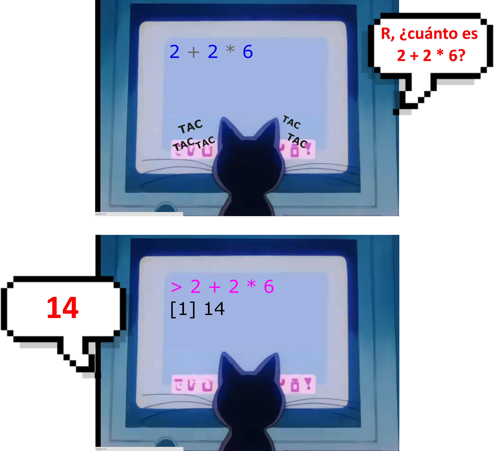]

<!--
Por ejemplo, podemos pedirle a la computadora que calcule una función simple escribiendo y ejecutando código en el lenguaje R.

Esta información me ayudó a no tener miedo de programar. Aprender un lenguaje de programación es como aprender cualquier idioma, como español o portugués.
(:
-->

---
## Introducción
### En nuestras diapositivas

<br>
.center[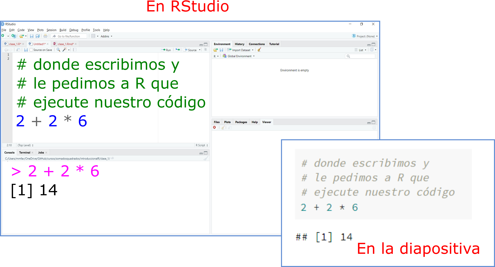]

<!--
También quiero aclararle lo siguiente, en caso de duda: Las áreas grises en las diapositivas corresponden a los códigos R. Debajo de esta área, después de los símbolos "hash", veremos la salida de este código.
-->

---
## Introducción

.center[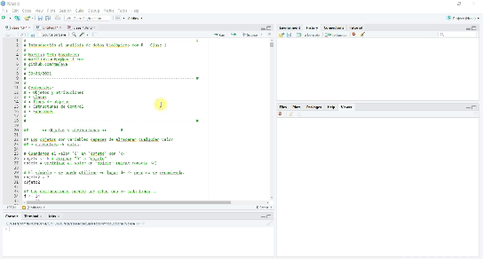

[`clase_1.R`](clase_1.R)
]

<!--
El script de esta clase está disponible en el sitio web del curso (lo dejaré en la descripción del video).

Todo lo que les voy a mostrar se describe en este script.
-->

---
## Introducción

### ¿Script mal configurado?

<button type="button">Tools</button> **>** <button type="button">Global options</button> **>** <button type="button">Code</button> **>** <button type="button">Saving</button> **>** <button type="button">Default text enconding</button> **>** select **UTF-8**

.center[]

<!--
Si abre el script y ve que los acentos no se muestran correctamente o alguna otra configuración incorrecta, intente cambiar la codificación a UTF-8.
-->

---
## Introducción

### Sistema de puntuación

<br>
.center[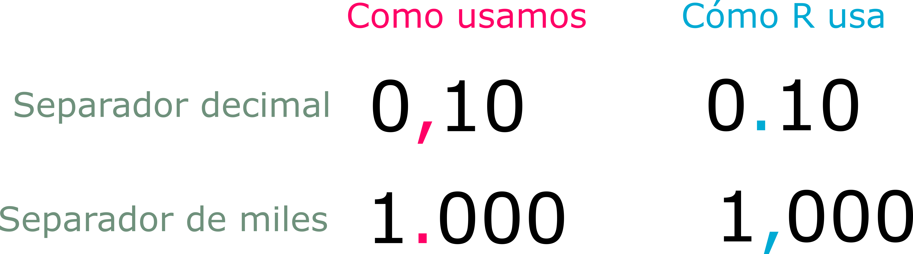]
<br>

<!--
Otro dato importante es que R, a diferencia de nosotres, usa el punto como separador decimal y la coma como separador de miles. Es sumamente importante ser consciente de este hecho para que no obtengamos resultados incorrectos.
-->

---
# Script

- [`clase_1.R`](clase_1.R)

# Contenido de hoy

- [Objetos y atribuciones](#objatr)

- [Clases](#clases)

- [Tipos de objetos](#tipos)

- [Estructuras de Control](#control)

- [Funciones](#funciones)

<!--
En esta clase veremos los siguientes contenidos: Objetivos y asignaciones, clases, tipos de objetos, estructura de control y funciones.
-->

---
name: objatr
class: middle, center

# Objetos y atribuciones

<!--
Comenzando con objetos y asignaciones
-->

---
## Objetos y atribuciones

- Los **objetos** son variables capazes de almacenar cualquier valor o estructura de datos.

<br>
.center[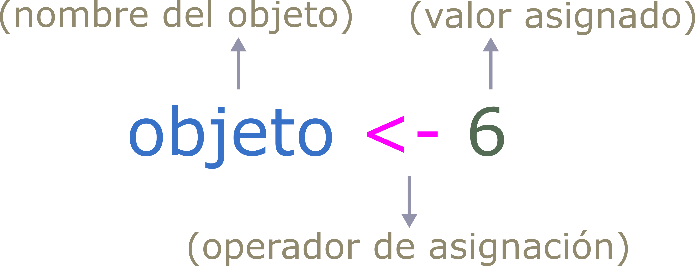]
<br>

```{r}
objeto <- 6 # Guardamos el valor '6' en 'objeto' con '<-'
objeto # Siempre que evaluamos el `objeto`, la R devolverá el valor 6
```

> El símbolo **`=`** se puede utilizar en lugar de **`<-`** pero no se recomienda. 

<!--
Los objetos son variables capazes de almacenar cualquier valor o estructura de datos.

Vamos tener un valor asignado - en el ejemplo es el valor 6 -, un operador de asignação - signo menor y guion - y el nombre del objeto - que en nuestro caso es "objeto". 

Al asignar el valor 6 al nombre "objeto", siempre que escribamos "objeto" seguido de CTRL + ENTER, la R devolverá el valor asignado.

También podemos utilizar el "igual" como símbolo de asignación, pero como escapa a las normas de una buena programación con R, se desaconseja su uso.
-->

---
## Objetos y atribuciones

```{r}
j <- 14 # CRTL + ENTER
```

...está haciendo una **declaración**, es decir, declarando que la variable `j` ahora se convertirá en un objeto que contiene el número `14`. Las declaraciones se pueden hacer una en cada línea ...

```{r}
j <- 14 # CRTL + ENTER
y <- 24 # CRTL + ENTER
```

... o separados por `;`

```{r}
j <- 14; y <- 24 # CRTL + ENTER
```

podemos usar el `;` siguiendo la asignación para llamar a nuestro objeto y ver su contenido:

```{r}
j <- 14; j # CRTL + ENTER
```

<!--
Al declarar "j <-14" en R, estamos declarando que la variable j ahora se convertirá en un objeto que contiene el valor 14.

Podemos hacer una declaración por línea o podemos escribir dos o más declaraciónes en la misma línea, separadas por un punto y coma.

También podemos usar el punto-coma siguiendo la asignación para llamar a nuestro objeto y ver su contenido
-->
---
## Objetos y atribuciones

#### Otros ejemplos de creación de objetos

```{r}
b <- 24 
b

c <- 69
c

d <- "e"
d

e <- "d"
e
```

<!--
Como podemos ver en estes otros ejemplos de asignación, los objetos pueden tener diferentes naturalezas, no siempre serán solo numérico, también tenemos objetos con valores de tipo carácter.
-->

---
## Objetos y atribuciones

**¡¡**Tenga en cuenta que cada objeto solo puede almacenar una estructura a la vez (un número o una secuencia de valores)**!!**

```{r}
a <- 5
a
```

--

```{r}
a <- "bien"
a
```

--

```{r}
a <- 36
a
```

<!--
También es importante tener en cuenta que los objetos solo pueden almacenar una estructura de valor a la vez.

Suponga que inicialmente establecemos el valor "5" para un objeto llamado "a". Cuando llamo "a" en R, R devolverá el valor 5, cierto?

Si en un segundo momento asigno la palabra "bien" al objeto "a", cuando llamo a este objeto R devolverá la palabra "bien" y no el valor 5, ¿se entiende?

Es como si hubiera sustituido un valor por otro ... En este caso, el último valor asignado siempre será el valor válido!!

¡Esto es muy, muy importante! Siempre tenemos que estar atentos para no cometer errores al utilizar R.
-->

---
## Reglas para nombrar objetos

1. Pueden estar formados por *letras*, *números*, "*_*" y "*.*"

2. **No** se puede empezar con un número y/o un punto

3. **No** puede contener espacios

4. Evitar el uso de acentos

5. Evitar el uso de nombres de funciones como:

  > sum, diff, df, var, pt, data, C, etc

6. La **R** distingue entre mayúsculas y minúsculas, por lo que:

  > obj ≠ Obj ≠ OBJ
  
<!--
Existen algunas reglas para nombrar objetos en R.

1. El nombre de los objetos pueden estar formados por *letras*, *números*, underline y punto.

2. **No** se puede empezar con un número y/o un punto

3. **No** puede contener espacios

4. Evitar el uso de acentos

5. Evitar el uso de nombres de funciones como:

  > sum, diff, df, var, pt, data, C, etc

6. La **R** distingue entre mayúsculas y minúsculas, por lo que:

  > obj ≠ Obj ≠ OBJ 
-->

---
## Reglas para nombrar objetos

#### Permitido

```{r eval=FALSE, include=TRUE}
a <- 5
a1 <- 5
obj <- 10
mi_obj <- 15
mi.obj <-15
```

#### No permitido

```{r eval=FALSE, include=TRUE}
1a <- 1
a 1 <- 5
_obj <-15
mi-obj <- 15
```

---
## Objetos y atribuciones

Podemos almacenar el valor de un objeto `k` dentro de un objeto `w`:

```{r}
k <- 10
w <- k
w
```

--

Podemos usar objetos para realizar operaciones matemáticas...

```{r}
a + y / j
```

... y podemos asignar esta operación matemática a un nuevo objeto.

```{r}
k <- a + y / j
k
```

<!--
Otra característica importante de los objetos es que podemos almacenar el valor de un objeto en otro.

Por ejemplo, si le asigno el valor 10 al objeto k, y luego le asigno el objeto k al nombre w, w se convierte en 10.

También podemos usar estos objetos en operaciones matemáticas y asignar esas operaciones matemáticas a un nuevo objeto.
-->
---
## Gestionar el lugar de trabajo

Enumere los objetos creados con la función `ls()`:
```{r eval=TRUE, message=FALSE, warning=FALSE, include=TRUE}
ls()
```

Para eliminar solo un objeto con `rm()`:
```{r eval=TRUE, message=FALSE, warning=FALSE, include=TRUE}
rm(a) # elimina el objeto 'obj'
ls() # ¿Qué objetos quedan?
```

<!--
Para saber qué objetos tengo en mi entorno r, simplemente use la función "ls()".

y para eliminar algun objeto, use la función "rm()" con el nombre del objeto entre los parentesis. 
-->

---
## Gestionar el lugar de trabajo

Para eliminar> 1 objeto con `rm()`:
```{r eval=TRUE, message=FALSE, warning=FALSE, include=TRUE}
rm(c, j, k) # elimina los objetos 'c', 'j' y 'k'
ls() # ¿Qué objetos quedan?
```


Para eliminar todos los objetos:
```{r eval=TRUE, message=FALSE, warning=FALSE, include=TRUE}
rm(list = ls()) # elimina TODOS los objetos
ls() # ¿Qué objetos quedan?
```

<!--
Es posible eliminar más de un objeto con la función rm (), o incluso eliminar todos los objetos usando la función rm(list = ls()).
-->
---
## Gestionar el lugar de trabajo

#### Observación:

La pestaña "**Environmental**" de RStudio muestra los objetos creados en la sesión actual.

<center>
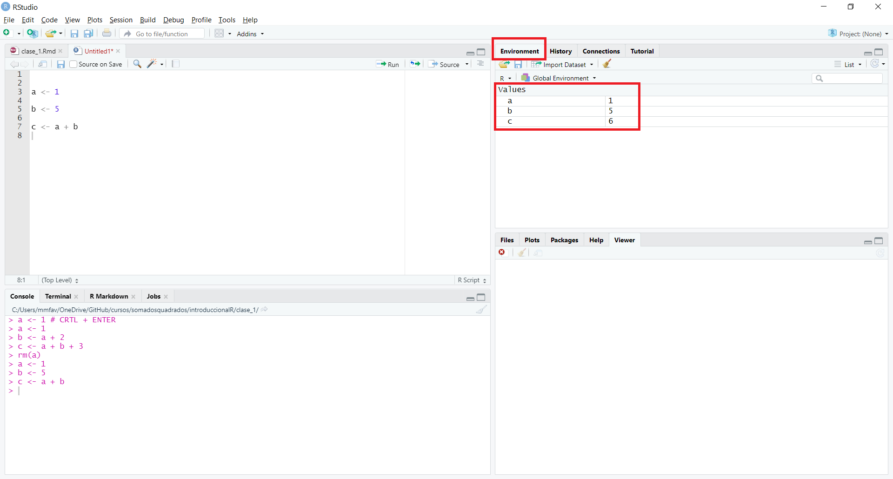
</center>

---
## Ejercicio

.pull-left[
Fuiste al campo y recogiste algunos vectores, que se enumeran en la siguiente tabla. 

```{r echo=FALSE, message=FALSE, warning=FALSE}
library(tidyverse)
Objeto = c("Anopheles_sp", "Lutzomyia_sp", "Aedes_sp", "Desconocido")
n = c(5, 35, 4, 16)

data.frame(Objeto, n) %>% 
  kableExtra::kbl() %>%
  kableExtra:: kable_styling(bootstrap_options = c("striped", "hover"))
```
]

.pull-right[
1 - Cree objetos para cada especie y almacene el número de individuos en cada objeto (**n** en la tabla).

2 - ¿Qué porcentaje de *Lutzomyia sp.* se muestreó?

3 - Si eliminamos los vectores desconocidos, ¿cuál es la cantidad total muestreada? ¿Y cuál es el porcentaje de *Aedes*?
]

<!--
Ahora les voy a dejar un ejercicio para que ustedes intenten responder. Pausa esta clase y, si tienes alguna duda, envíanos un mensaje por telegrama o por mail.
-->

---
name: clases
class: middle, center

# Clases 

---
## Clases y tipos de objetos

Los `objetos` tienen tres características:

> <big> a <- 1</big>

1. **Nombre** que le damos al objeto (= a)

2. **Contenido** en sí del objeto (= 1)

3. **Atributo** del objeto

  - `Clase`: naturaleza del elementos (1 = numerico)
  - `Estructura`: Cómo están organizados los elementos (a = vector)

<!--
Creé un objeto en R llamado "A".

Este objeto tiene:

- un nombre = a
- un contenido = b
- y sus atributos.

Los atributos se pueden dividir en "clase" (que es la naturaleza del elemento) y "estructura" (cómo se organizan los elementos).

Veremos a ambos en la continuación. 
-->

---
## Clases de objetos

La clase de un objeto es muy importante en **R**! Es a partir de ella que las funciones y los operadores pueden saber *exactamente* qué hacer con un objeto. 

--

Por ejemplo, es posible sumar dos objetos numéricos,...

```{r}
a <- 1
b <- 2
a + b
```

--

... pero no podemos sumar dos caracteres:
```{r eval=FALSE, include=TRUE}
c <- "c"
d <- "!"
c + d
```

\## simpleError in "c" + "d": argumento no numérico para el operador binario.

> **R** verificó la naturaleza de "c" y "d" y las identificó como no numéricas.

---
## Clases de objetos

### Objetos atómicos

**R** tiene 5 clases básicas de objetos, también llamados **objetos atómicos**:

.pull-left[
1 - `numeric`: Números reales, punto flotante (decimales).
```{r}
num <- 1.50
```

2 - `integer`: Números enteros.
```{r}
num_int <- 1L
```

3 - `logical`: booleano (True/False).
```{r}
logtf <- TRUE
```
]

.pull-right[
4 -  `character`: una cadena de caracteres, comúnmente utilizada para representar palabras, frases o texto.
```{r}
ca <- "holla!"
```

5 - `complex`: Un número con partes reales e imaginarias.
```{r}
com <- 1.5 + 2i
```
]

---
## Clases de objetos

#### Importante!

1 - Use la función\* `class()` en **R** para verificar si la clase de su objeto es correcta:
```{r}
aa <- 1
class(aa)
```

<small>
> **\*** La idea básica de una función es encapsular un código que se pueda invocar en cualquier momento en R. Su significado y uso son muy similares al de las funciones matemáticas, es decir, hay un nombre, una definición y posterior invocación de la función.

.pull-left[
```{r}
f <- function(x) {
  y <- 6
  x + y
}

f(5)
```
]

.pull-right[
```{r}
5 + 6
```
> **\*\*** Hablaremos más sobre las funciones más adelante.
]

</small>

---
## Clases de objetos

#### Importante!

2 - Las expresiones de tipo `character` deben aparecer entre comillas simples o dobles:
```{r}
bb <- 'Esto es un character!'
bb

cc <- "Lo mismo (:"
cc

dd <- "I'm gonna take my horse to the old town road"
dd
```

---
## Clases de objetos

#### Importante!

3 - Los números en **R** generalmente se tratan como objetos `numeric` (números reales de doble precisión), incluso los que escribimos como enteros. 

Para que un entero se trate como un objeto `integer`, debe usar la letra **L** después del número:

```{r}
dd <- 1
class(dd) # NO interpretado como integer

ee <- 1L
class(ee) # interpretado como integer
```

---
## Clases de objetos

#### Importante!

4 - Los valores `logical` (o booleanos) son **TRUE** (verdaderos) o **FALSE** (falsos). También se aceptan **T** o **F**.
```{r}
ff <- T
gg <- TRUE

ff == gg

hh <- F
ii <- FALSE

hh == ii
```

> **==** : operador matemático "exactamente igual a ..."

---
## Ejercicios

1 - Crea un objeto para las clases `numeric`, `integer`, `character` e `logical` y comprueba que `r fontawesome::fa("r-project")` lo hizo correctamente.

2 - Tenga en cuenta los siguientes objetos:

```{r}
a <- 35 + 18^4 * 2
b <- 2L + 3L + 5L
c <- 2L + 3L + 5
d <- "Me encanta la r" == TRUE
e <- F
f <- "2L + 3L + 5L"
```

a) ¿Cuál es la clase de cada objeto?

b) ¿Qué objetos tienen la misma clase y cuáles no?

b) ¿Qué objetos tienen el mismo valor y cuáles no?

---
name: tipos
class: middle, center

# Tipos de objetos

---
## Tipos de objetos

.pull-left[
- El tipo del objeto está relacionado con la **clase** y la **estructura/organización**.

- Pueden estar formados por elementos de la misma clase o de clases diferentes.

- Pueden tener de una hasta n dimensiones.

- En **R** tenemos cinco estructuras:
  - `Vector`
  - `Matrix`
  - `Array`
  - `List`
  - `Data frame`
]

.pull-right[

</small>
]

---
## Tipos de objetos

.pull-left[
- El tipo del objeto está relacionado con la **clase** y la **estructura/organización**.

- Pueden estar formados por elementos de la misma clase o de clases diferentes.

- Pueden tener de una hasta n dimensiones.

- En **R** tenemos cinco estructuras:
  - `Vector`
  - `Matrix`
  - `Array`
  - `List`
  - `Data frame`
]

.pull-right[
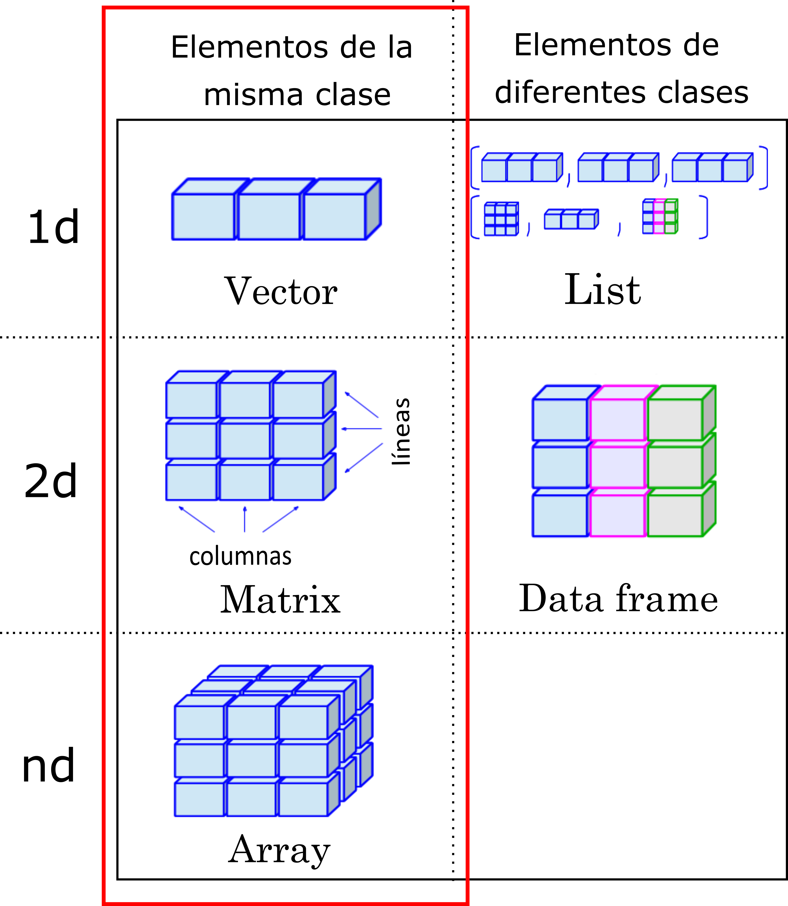
</small>
]

---
## Tipos de objetos

### Vetores

- Colección **unidimensional** de valores:

.center[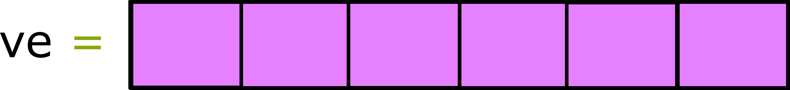]

- Almacena datos de una misma clase.

- La forma más sencilla de crear un `vector` es enumerar los valores separados por comas dentro de una `c()`:

.pull-left[
```{r}
area <- c("urb", "rur", "urb", "rur", "urb", "rur")
area
```
]

.pull-right[
```{r}
temperatura <- c(20, 23, 18, 20, 14, 17)
temperatura
```

]

---
## Tipos de objetos

### Vetores

#### Coerción

- No es posible mezclar datos de dos clases en un vector.

- Si lo intenta, **R** exhibirá el comportamiento conocido como **coerción**.

```{r}
aa <- c(1, 2, 3, 4, "a")
class(aa)

bb <- c(1L, 2L, 3.50, 4.1)
class(bb)
```

> **DOMINANTE** character > numeric > integer > logical **RECESIVO**

---
## Tipos de objetos

### Vetores

#### Conversión 

- Es posible intentar forzar a un vector a tener una clase específica:
```{r}
a <- 1
```

.pull-left[
```{r eval=TRUE, message=FALSE, warning=FALSE, include=TRUE}
a1 <- as.character(a) 
class(a1)

a2 <- as.integer(a)
class(a2)
```
]

.pull-right[
```{r}
a3 <- as.numeric(a)
class(a3)

a4 <- as.logical(a)
class(a4)
```
]

---
## Tipos de objetos

### Vetores 

Hay algunas formas prácticas de crear vectores...

- Secuencia de unidade: `x1:xn`.

```{r}
anos <- 2001:2021
anos
```

- Secuencia con espaciado diferente: `seq()`

```{r}
edad <- seq(from = 0, to = 80, by = 20)
edad
```

---
## Tipos de objetos

### Vetores 

- Repetición: `rep()`.
```{r}
area <- rep(x = c("urb", "rur"), times = 3)
area

mes <- rep(x = c(1, 2), times = 3)
mes
```

---
## Tipos de objetos

### Vetores 

- Nombres con secuencia numérica: `paste()`.

```{r}
# Sin una separación definida
muestras <- paste("muestra", 1:10)
muestras

# Con una separación definida
muestras <- paste("muestra", 1:10, sep = "_")
muestras
```

---
## Tipos de objetos

### Vetores 

- Muestreo aleatorio de valores: `sample()`.
```{r}
# sorteo sin reemplazo
sorteo1 <- sample(1:100, 20, replace = F)
sorteo1

# sorteo con reemplazo
sorteo2 <- sample(1:100, 20, replace = T)
sorteo2
```

---
## Tipos de objetos

### Vetores 

- **¡**Muy importante para el análisis de datos**!** 

- Un `data frame` se compone de diferentes vectores.

.center[

]

---
## Tipos de objetos

### Vetores 

**Pertenece** (`%in%`) es un operador muy útil cuando necesitamos verificar si un cierto valor está dentro de nuestro conjunto de valores (vector):

```{r}
# ¿recuerdas el objeto "área" que creamos?
area

# ¿Hay 'valores' llamados 'urb' en él?
"urb" %in% area

# ¿Hay 'valores' llamados 'for'?
"for" %in% area
```

---
## Tipos de objetos

### Vetores 

#### Ejercicios

1. Comenzará un estudio con flebótomos en la ciudad de Puerto Iguazú y deberá seleccionar al azar 3 de 10 vecindarios para el muestreo. Haga un sorteo con `r fontawesome::fa("r-project")` y almacena los resultados en un objeto.

2. Crear un nuevo objeto mediante la repetición de los barrios donde recogerá los flebótomos 4 veces (una por cada estación de barrio). Por ejemplo, si va a muestrear los vecindarios "1", "3" y "6", el resultado debería ser `(1, 3, 6, 1, 3, 6, 1, 3, 6, 1, 3, 6)`.

3. ¿El barrio "1" forma parte de su muestra? ¿Y el barrio "10"? ¿Y el "7"?

---
## Tipos de objetos

### Factor

- Colección **unidimensional** de valores.

- Almacena datos de la clase `character`.

- El factor representa medidas de una variable *cualitativa*, que puede ser *nominal* u *ordinal*.

```{r}
estacion <- factor(x = c("verano", "verano", "primavera", "primavera", "primavera", "otono", "invierno",  "invierno"), 
                    levels = c("verano", "primavera", "otono", "invierno"))

estacion
```

<!--
Los factores corresponden a una colección unidimensional de valores de la clase "character".

Los factores se utilizan para representar variables categóricas. Las variables categóricas pueden ser nominales (desordenadas) u ordinales (ordenadas).

Los objetos de tipo factor se crean utilizando la función factor() en R. Los posibles valores de un objeto de tipo factor se denominan niveles (levels).

De esta manera, un factor contendrá un vector de valores y sus valores representan niveles.

Por ejemplo, puedo tener un factor que represente las veces que he muestreado en el campo. En este caso, realicé dos muestreos en "verano", tres en "primavera", uno en "otoño" y uno en "invierno".

Como estamos trabajando con factores, R entenderá que valores iguales a "verano" se refieren al mismo nivel que mi factor.
-->

---
## Tipos de objetos

### Factor

> Internamente, **R** almacena los factores como `interger`.

<br>
.center[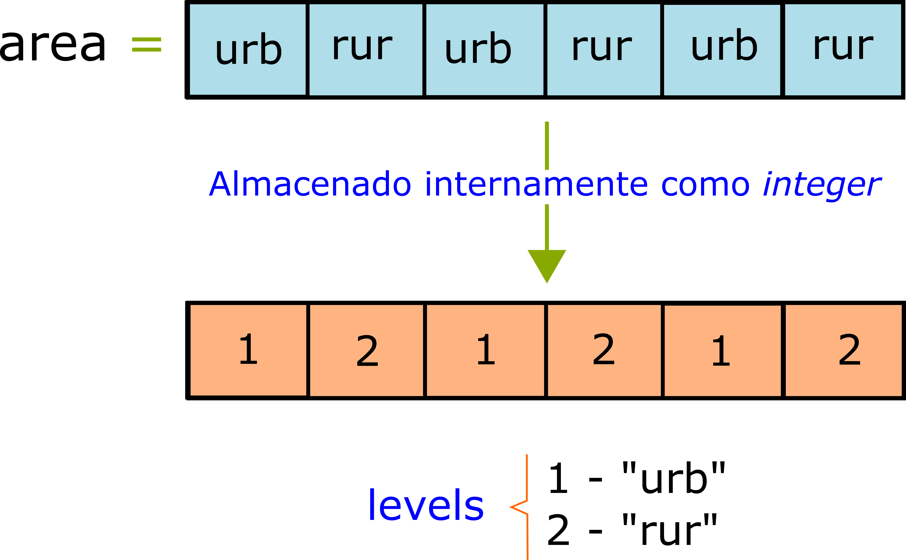]

---
## Tipos de objetos

### Factor

#### Tipos

- *Factor nominal*: variables nominales.

```{r}
genero <- factor(x = c("Lonomia", "Megalopyge", "Automeris", "Hylesia", "Megalopyge", "Automeris", "Hylesia", "Lonomia", "Hylesia", "Megalopyge"),
                 levels = c("Lonomia", "Megalopyge", "Hylesia", "Automeris"))
genero

levels(genero)
```

---
## Tipos de objetos

### Factor

#### Tipos

- *Factor ordinal*: variable ordinal.

```{r}
mes <- factor(x = c("enero", "enero", "febrero", "febrero", "marzo", "marzo"),
              levels = c("enero", "febrero", "marzo"), ordered = TRUE)
mes

levels(mes)
```

---
## Tipos de objetos

### Factor

Convertir un vector para un factor: `as.factor()`.

```{r}
# Vector de caracteres.
letras <- c("a", "c", "b", "d", "c", "a", "b", "d", "c")
letras

# Convierta el objeto en factor.
letras2 <- as.factor(letras)
letras2

```

---
## Tipos de objetos

### Factor

#### Ejercicios

Muestrará en tres áreas diferentes de Puerto Iguazú (Misiones, Argentina): 

1. El Parque Nacional Iguazú (PNI)

2. un área antropogénica

3. un área rural

De esta manera, cree un vector que repita 12 veces el nombre de cada ubicación de recolección (= 1 año de muestreo). 

---
## Tipos de objetos

### Matrix

- Colección **bidimensional** de valores:

  - líneas (por ejemplo, unidades de muestreo)
  
  - columnas (variables cuantitativas o cualitativas, por ejemplo: horario, tubo de ensayo, ubicación)
  
- Almacena datos de una única clase.

.center[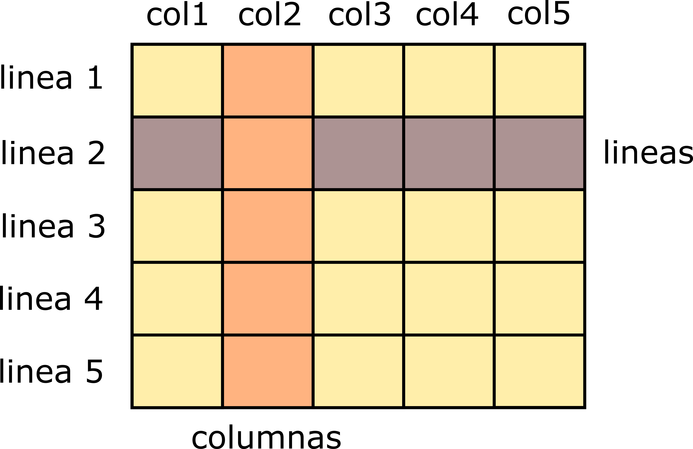]

---
## Tipos de objetos

### Matrix

- Colección **bidimensional** de valores:

  - líneas (por ejemplo, unidades de muestreo)
  
  - columnas (variables cuantitativas o cualitativas, por ejemplo: horario, tubo de ensayo, ubicación)
  
- Almacena datos de una única clase.

.center[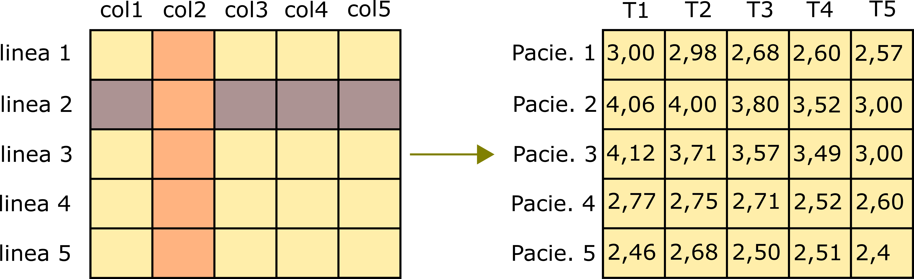]

.center[Volume respiratório forzado (vez)]

---
## Tipos de objetos

### Matrix

Puede construir matrices en **R** de dos formas:

1 - Disposición de elementos de un vector: `matrix()`.

```{r}
ma <- 1:12
ma
```


.pull-left[
```{r}
m <- matrix(data = ma, nrow = 4, ncol = 3, byrow = TRUE)
m
```
]

.pull-right[
```{r}
m <- matrix(data = ma, nrow = 4, ncol = 3, byrow = FALSE)
m
```
]

---
## Tipos de objetos

### Matrix

Puede construir matrices en **R** de dos formas:

2 - Combinación de vectores: 

```{r}
# Creamos dos vectores con r
v1 <- c(1, 2, 3); v2 <- c(4, 5, 6)
```


.pull-left[
- Combinar vectores por línea - `rbind()`.

```{r}
# Combinamos los vectores verticalmente, 
# uno debajo del otro
vr <- rbind(v1, v2)
vr
```

]

.pull-right[
- Combinar vectores por columna - `cbind()`.

```{r}
# Combinamos los vectores horizontalmente, 
# uno al lado del otro.
vr <- cbind(v1, v2)
vr
```
]

---
## Tipos de objetos

### Matrix

Para cambiar el nombre de las filas y columnas de una `matrix`, utilice las funciones `rownames()` y `colnames()` respectivamente.

.pull-left[
- Antes
```{r}
ma <- 1:12
m <- matrix(data = ma, nrow = 4, ncol = 3, byrow = TRUE)
m
```
]

.pull-right[
- Después
```{r}
colnames(m) <- c("A", "B", "C") # cambia columnas
rownames(m) <- c("LA", "LB", "LC", "LD") # cambia lineas
m
```
]

---
## Tipos de objetos

### Matrix

#### Ejercicios

Está desarrollando un medicamento para la fiebre y desea analizar el efecto a lo largo del tiempo. Tiene 3 pacientes y midió su fiebre después de la medicación en los tiempos: 5 m, 10 m, 15 m, 20 m y 25 m. Los resultados son:

- Paciente 1: 38, 37.9, 37.3, 37.2, 36.9
- Paciente 2: 37.9, 37.6, 37.1, 36.8, 36
- Paciente 3: 38.2, 38, 37.8, 37.2, 36.8

Configure una matriz de datos con pacientes en filas y tiempos en columnas.

---
## Tipos de objetos

### Array

- Tiene **n dimensiones** - "varias matrices emparejadas".

- Tiene filas, columnas y dimensiones (`arrays`).

- Almacena datos de una única clase.


---
## Tipos de objetos

### Array

Construir un array en **R**: `array()`.

```{r}
vc <- 1:8 # datos
ar <- array(data = vc, dim = c(2, 2, 2)) # array
ar
```

---
## Tipos de objetos

.pull-left[
- El tipo del objeto está relacionado con la **clase** y la **estructura/organización**.

- Pueden estar formados por elementos de la misma clase o de clases diferentes.

- Pueden tener de una hasta n dimensiones.

- En **R** tenemos cinco estructuras:
  - `Vector`
  - `Matrix`
  - `Array`
  - `List`
  - `Data frame`
]

.pull-right[
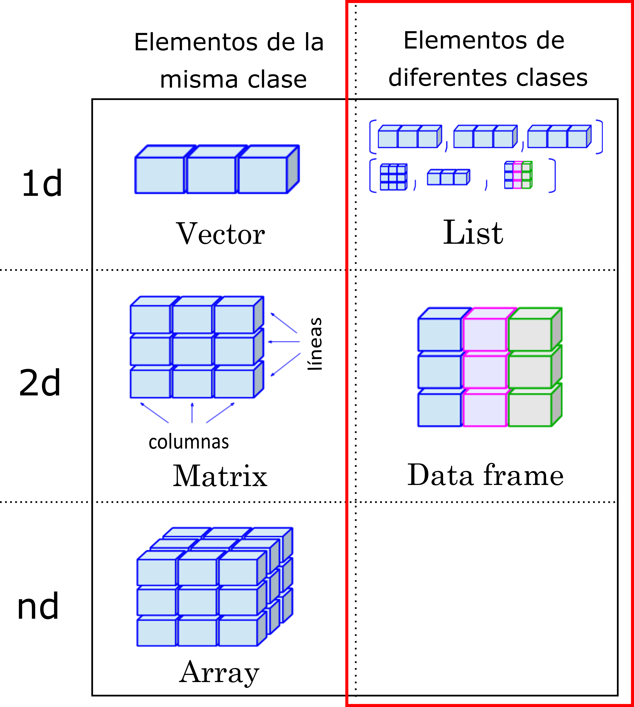
]

---
## Tipos de objetos

### Data frame

- Colección **bidimensional** de valores:

  - líneas (unidades de muestreo)
  
  - columnas (variables cuantitativas o cualitativas, por ejemplo: horario, tubo de ensayo, ubicación)
  
- Almacena datos de ≠ clases.

.pull-left[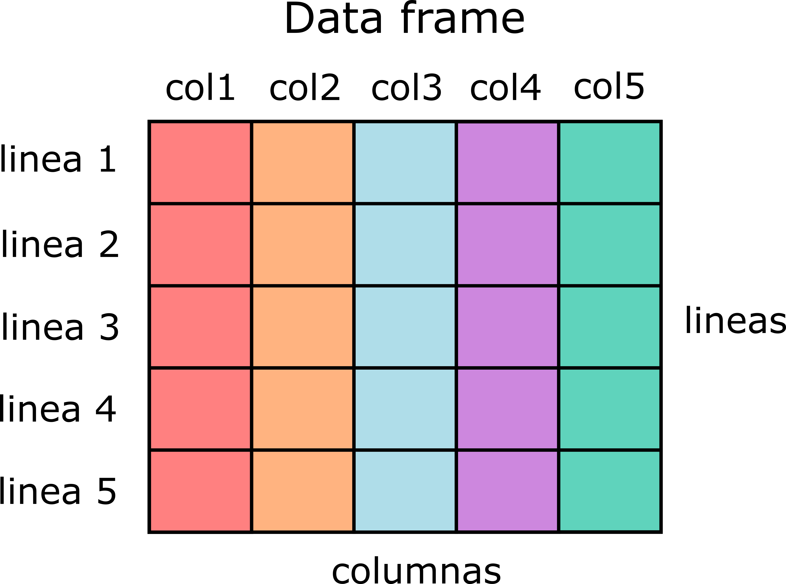]

--

.pull-right[
<br>
]

---
## Tipos de objetos

### Data frame


---
## Tipos de objetos

### Data frame


---
## Tipos de objetos

### Data frame

Cómo construir un **data frame** en **R**: `data.frame()`. 

.pull-left[
```{r}
# Vamos a crear 4 vectores
area <- c("urb", "rur", "urb", "rur", "urb", "rur")
mes <- c(1, 1, 2, 2, 3, 3)
presencia <- c(T, T, F, F, T, T)
temperatura <- c(20.1, 21.2, 22.2, 23.8, 22.9, 23)

area; mes; presencia; temperatura
```
]

--

.pull-right[
```{r}
# Unamos los vetores en un dataframe. 
# Observe que cada vector se convierte en una columna.
dtf <- data.frame(area, mes, presencia, temperatura)
dtf
```
]

---
## Tipos de objetos

### Data frame

#### Ejercicio

Cree un `data frame` con los datos de su investigación (máximo de 6 filas y 6 columnas). Si no tiene datos, utilice los datos a continuación:

```{r echo=FALSE}
localidad <- c("A", "A", "B", "B", "C", "C")
tiempo <- rep(c(1, 2), 3)
poblacion <- c(10326, 9658, 6985, 6300, 3265, 4005)
accidentes <- c(396, 400, 236, 123, 238, 632)


tabla <- data.frame(localidad, tiempo, poblacion, accidentes)

tabla %>% 
  kableExtra::kbl() %>%
  kableExtra::kable_styling(font_size = 22, position = "left")
```


---
## Tipos de objetos

### List

- Colección **unidimensional** de objetos.
  
- Almacena datos de ≠ tipos (`vectors`, `arrays`, `data frame`, `lists`).

- Es un vector especial que acepta objetos como elementos.
  
> Muchas funciones que usamos para analizar datos en R tienen listas como salida.


---
## Tipos de objetos

### List

crea una **lista** en r: `list()`.

```{r}
lis <- list(rbind(c(3,6), c(4,5)), 
            sample(1:100, 5), 
            factor(c("a", "a", "b", "c")))
lis
```

---
name: control
class: middle, center

# Estructuras de Control

---
## Estructuras de Control

- **¿Por qué programar?** `r fontawesome::fa("laptop-code")`
  - Evite la repetición innecesaria de análisis o cálculos que se repiten con frecuencia.
  
  - Documente los pasos que tomó para llegar a un resultado.
  
  - Fácil recuperación y modificación del programa. 
  
- **¿Cómo programar?** `r fontawesome::fa("robot")`

  - ¡Creando programas! (guiones/scripts, rutinas, algoritmos).
  
  - Crear una secuencia lógica de comandos que se deben ejecutar en orden.
  
  - Utilizar las herramientas básicas de programación: 
  
      - Estructuras de repetición (`for()`)
      
      - Estructuras de selección (`if()`)
      
      - Estructura de repetición (`while()`)

---
## Estructuras de Control

### Estructuras de repetición: `for()`

- Sirve para repetir uno o más comandos varias veces. 

<br>
.center[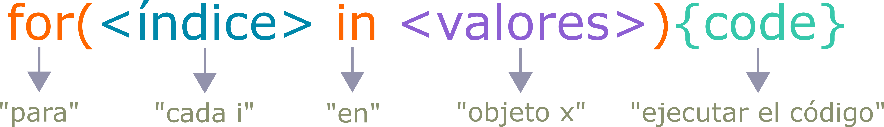]
<br>

- En otras palabras, estamos diciendo que para **cada elemento i** contenido en el **conjunto de valores** ejecutaremos los comandos que están dentro de las llaves (**code**).

```{r eval=FALSE, include=TRUE}
for(i in conjunto_de_valores){code}
```

> El índice no tiene que ser **i**, en realidad puede ser cualquier letra o palabra. 

---
## Estructuras de Control

### Estructuras de repetición: `for()`

- Para facilitar la comprensión, veamos dos ejemplos muy simples:

  - Imprimamos los números del 1 al 6.

    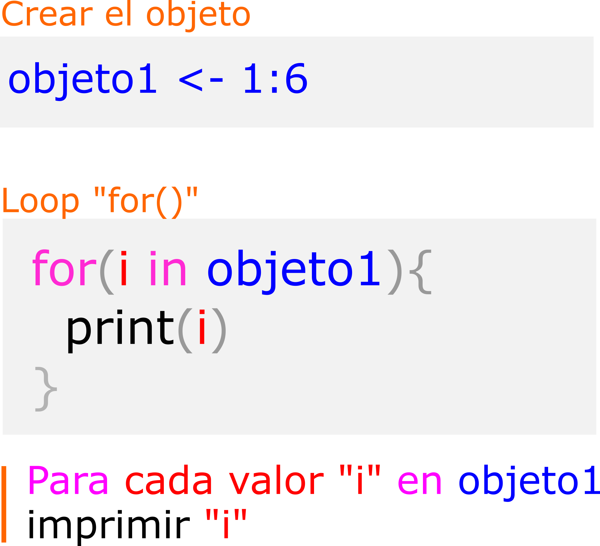

---
## Estructuras de Control

### Estructuras de repetición: `for()`

- Para facilitar la comprensión, veamos dos ejemplos muy simples:

  - Imprimamos los números del 1 al 6.

<br>
.center[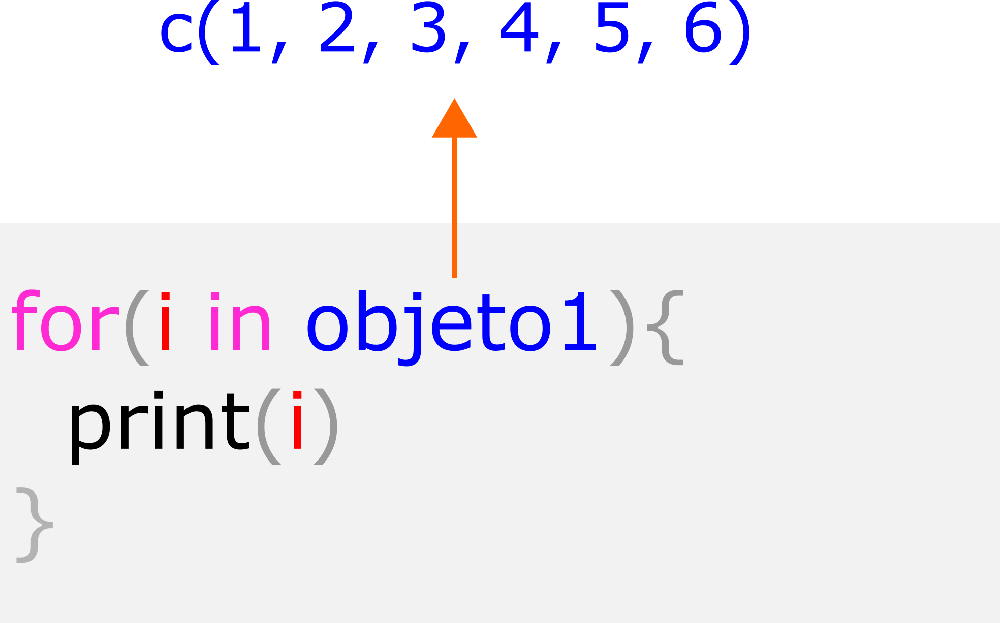]

---
## Estructuras de Control

### Estructuras de repetición: `for()`

- Para facilitar la comprensión, veamos dos ejemplos muy simples:

  - Imprimamos los números del 1 al 6.

<br>
.center[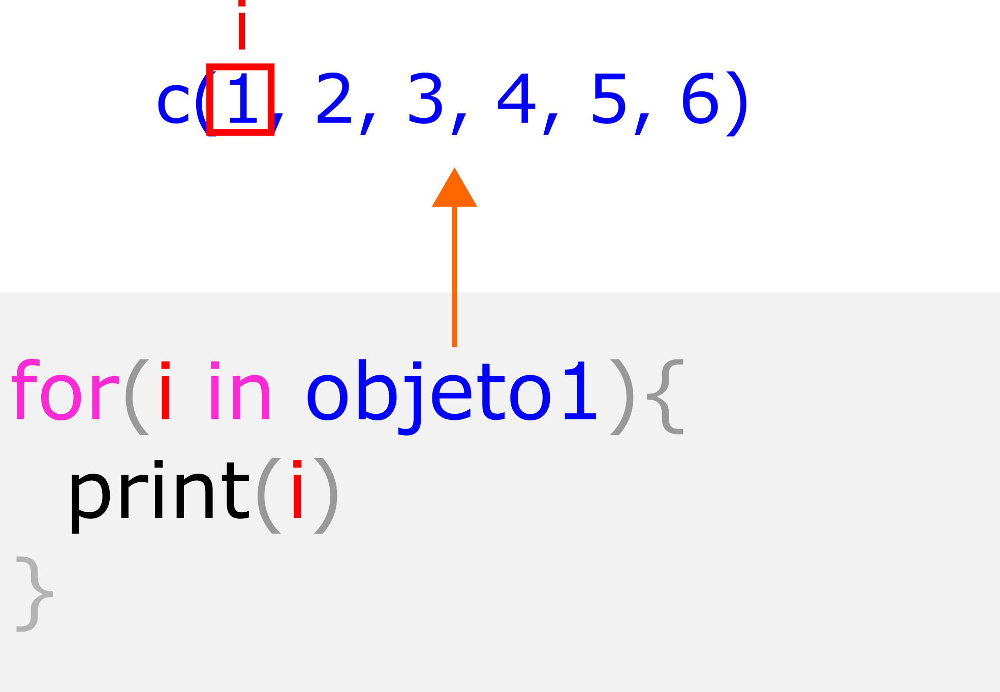]

---
## Estructuras de Control

### Estructuras de repetición: `for()`

- Para facilitar la comprensión, veamos dos ejemplos muy simples:

  - Imprimamos los números del 1 al 6.

<br>
.center[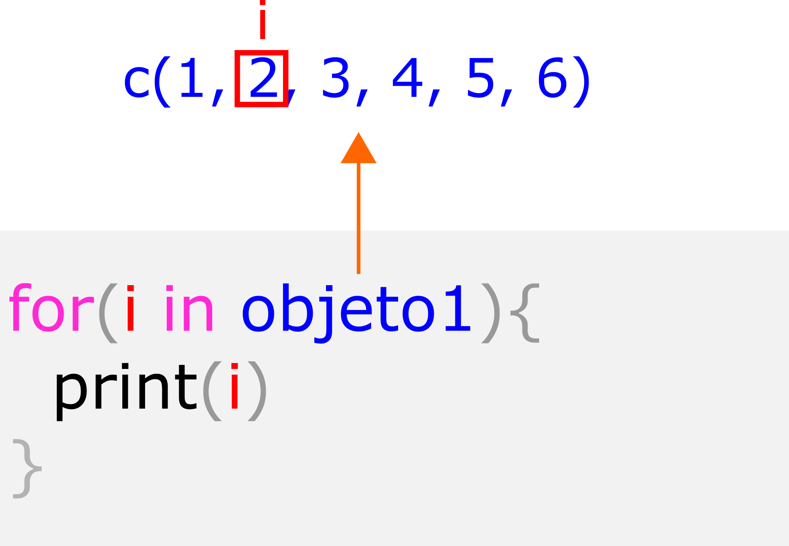]

---
## Estructuras de Control

### Estructuras de repetición: `for()`

- Para facilitar la comprensión, veamos dos ejemplos muy simples:

  - Imprimamos los números del 1 al 6.

<br>
.center[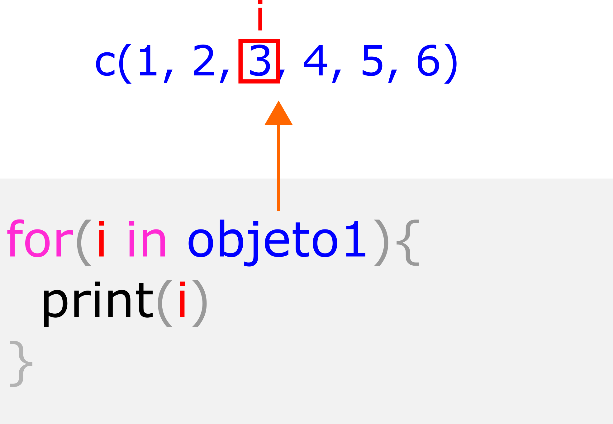]

---
## Estructuras de Control

### Estructuras de repetición: `for()`

- Para facilitar la comprensión, veamos dos ejemplos muy simples:

  - Imprimamos los números del 1 al 6.

<br>
.center[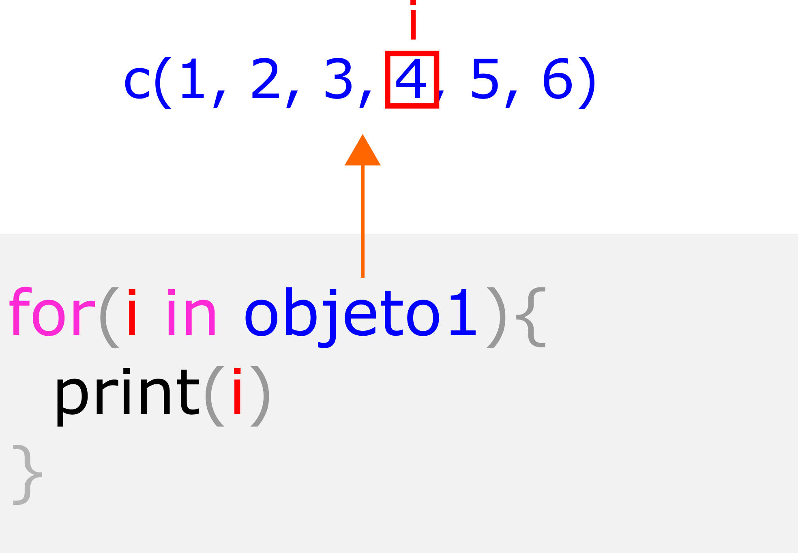]

---
## Estructuras de Control

### Estructuras de repetición: `for()`

- Para facilitar la comprensión, veamos dos ejemplos muy simples:

  - Imprimamos los números del 1 al 6.

<br>
.center[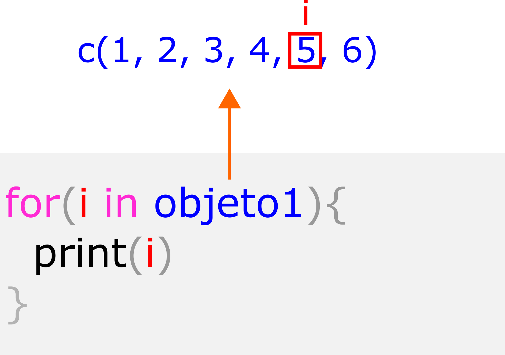]

---
## Estructuras de Control

### Estructuras de repetición: `for()`

- Para facilitar la comprensión, veamos dos ejemplos muy simples:

  - Imprimamos los números del 1 al 6.

<br>
.center[]

---
## Estructuras de Control

### Estructuras de repetición: `for()`

- Para facilitar la comprensión, veamos dos ejemplos muy simples:

  - Imprimamos los números del 1 al 6.

<br>
.center[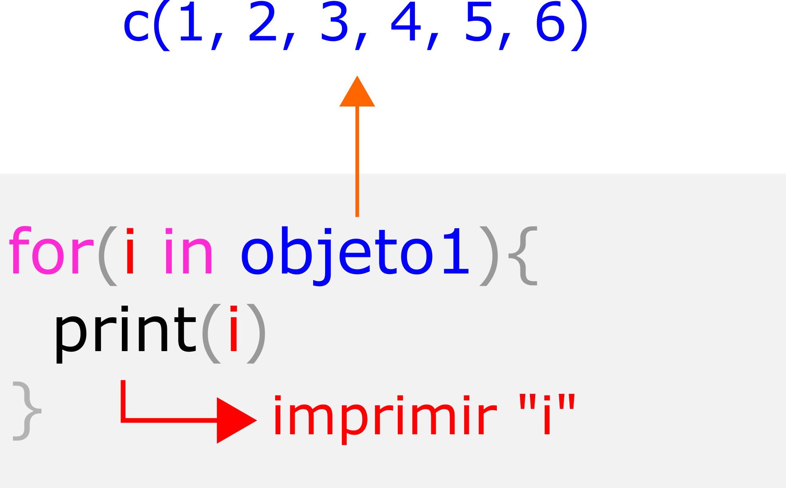]

---
## Estructuras de Control

### Estructuras de repetición: `for()`

- Para facilitar la comprensión, veamos dos ejemplos muy simples:

  - Imprimamos los números del 1 al 6.
  
.pull-left[
```{r}
# Creamos un vector con valores entre 1 y 6
objeto1 <- 1:6

for(i in objeto1){ # Para cada valor i en 'objeto1' (= i)
  print(i) # imprime el valor i
}
```
]

--

.pull-right[
```{r}
# También podemos pedirle a R que imprima 
# valores entre 1 y 6 directamente:

for(i in 1:6){ # Para cada valor i entre 1 y 6 (= i)
  print(i) # imprime el valor i
}
```
]

---
## Estructuras de Control

### Estructuras de repetición: `for()`

- Para facilitar la comprensión, veamos dos ejemplos muy simples:

  - Le pedimos a la r que sume +1 a cada valor entre 1 y 6 y luego imprima.
  
    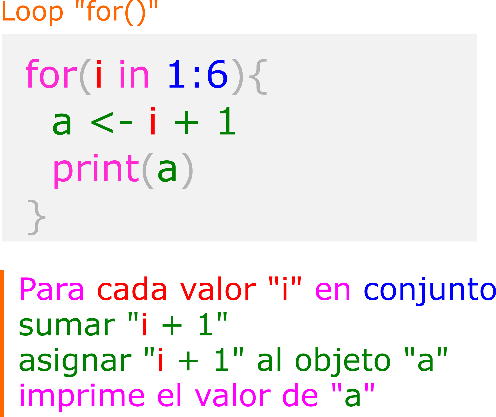
---
## Estructuras de Control

### Estructuras de repetición: `for()`

- Para facilitar la comprensión, veamos dos ejemplos muy simples:

  - Le pedimos a la r que sume +1 a cada valor entre 1 y 6 y luego imprima.

.center[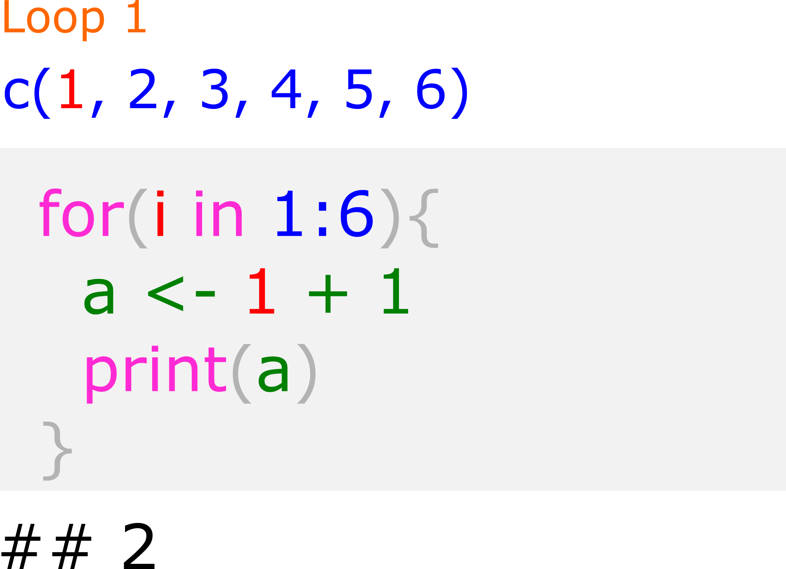]

---
## Estructuras de Control

### Estructuras de repetición: `for()`

- Para facilitar la comprensión, veamos dos ejemplos muy simples:

  - Le pedimos a la r que sume +1 a cada valor entre 1 y 6 y luego imprima.

.center[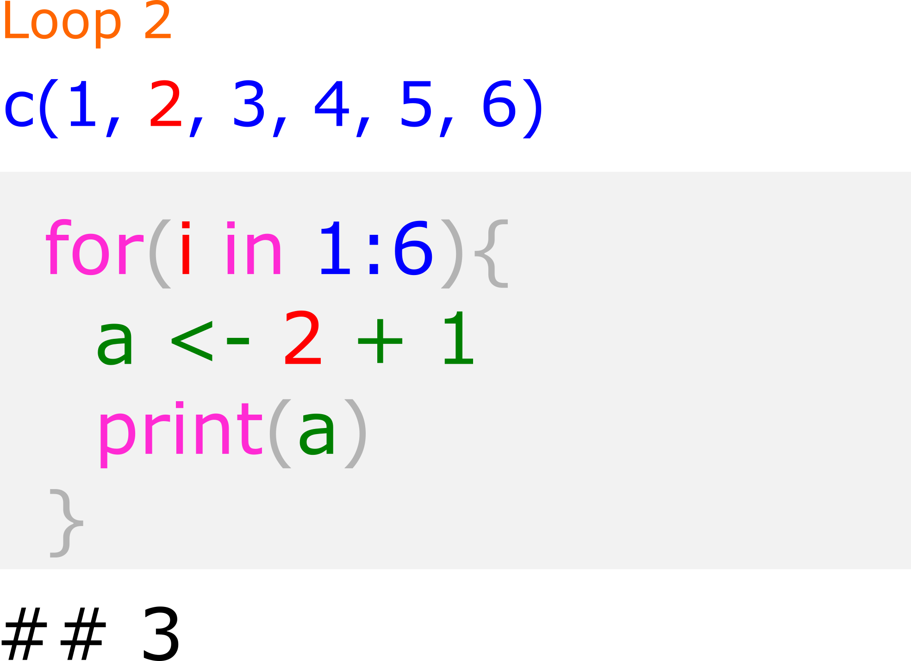]

---
## Estructuras de Control

### Estructuras de repetición: `for()`

- Para facilitar la comprensión, veamos dos ejemplos muy simples:

  - Le pedimos a la r que sume +1 a cada valor entre 1 y 6 y luego imprima.

.center[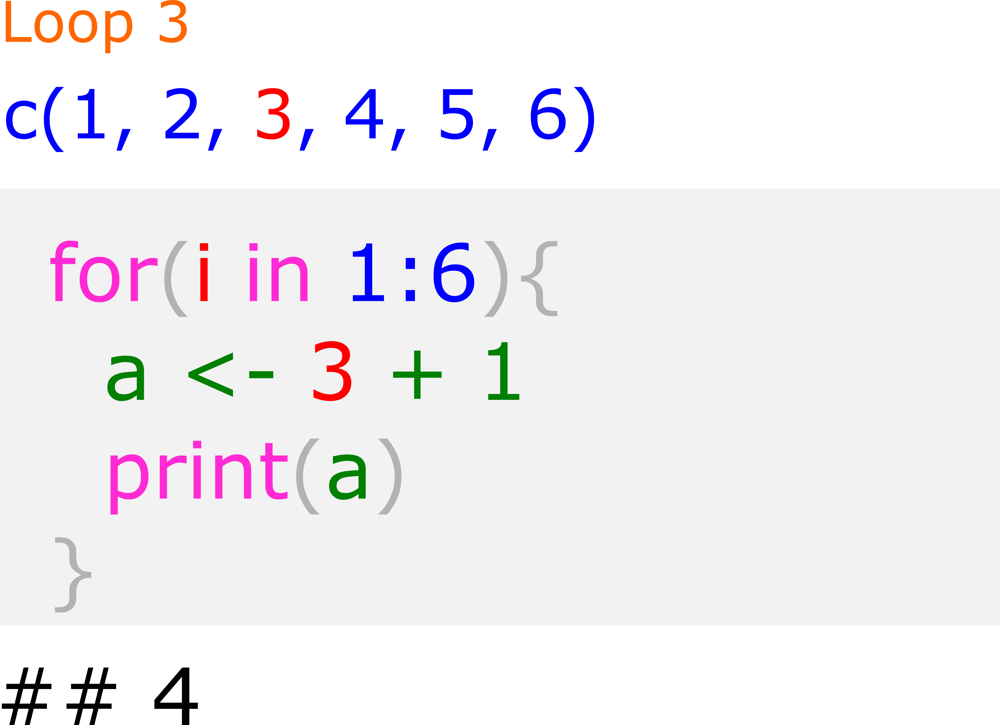]

---
## Estructuras de Control

### Estructuras de repetición: `for()`

- Para facilitar la comprensión, veamos dos ejemplos muy simples:

  - Le pedimos a la r que sume +1 a cada valor entre 1 y 6 y luego imprima.

.center[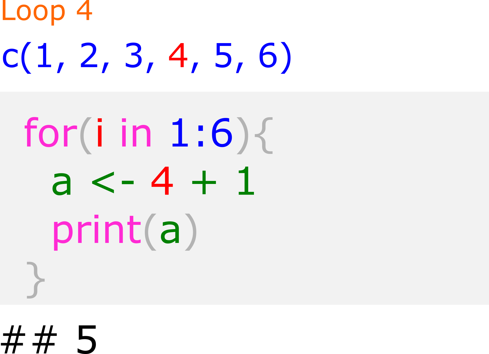]

---
## Estructuras de Control

### Estructuras de repetición: `for()`

- Para facilitar la comprensión, veamos dos ejemplos muy simples:

  - Le pedimos a la r que sume +1 a cada valor entre 1 y 6 y luego imprima.

.center[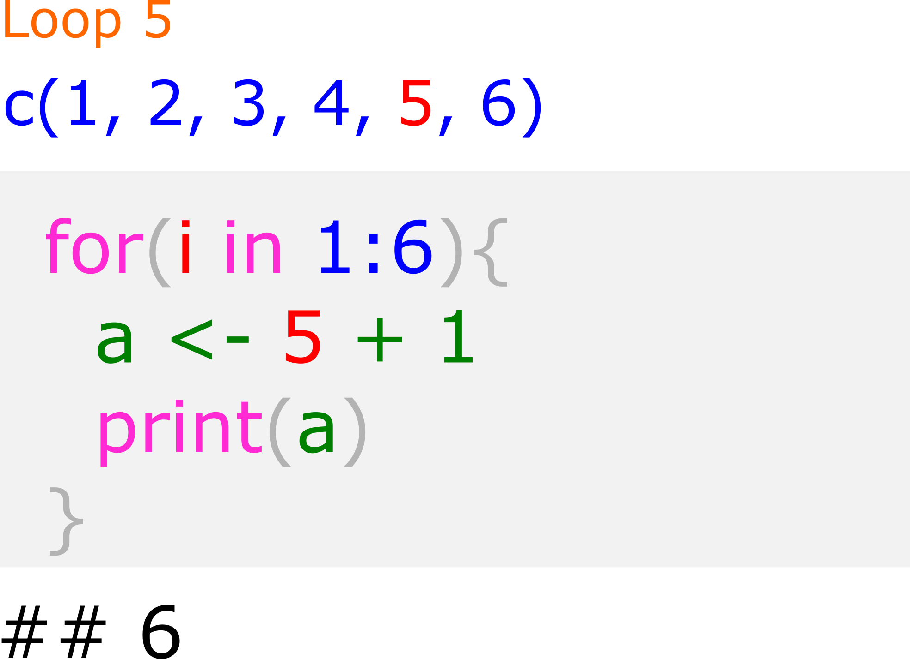]

---
## Estructuras de Control

### Estructuras de repetición: `for()`

- Para facilitar la comprensión, veamos dos ejemplos muy simples:

  - Le pedimos a la r que sume +1 a cada valor entre 1 y 6 y luego imprima.

.center[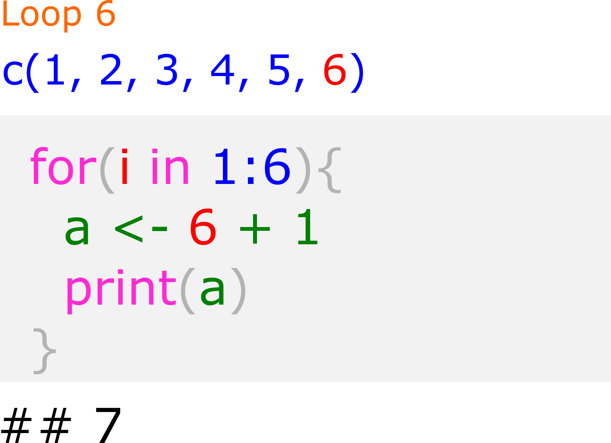]
    
---
## Estructuras de Control

### Estructuras de repetición: `for()`

- Para facilitar la comprensión, veamos dos ejemplos muy simples:

  - Le pedimos a la r que sume +1 a cada valor entre 1 y 6 y luego imprima.
  
```{r}
for(i in 1:6){ # Para cada valor i entre 1 y 6 (= i)
  a <- i + 1 # agregue el valor en i con 1 y guárdelo en "a"
  print(a) # imprime el objeto a
}
```

---
## Ejercicio

1 - Supongamos que ha estado en el campo durante 6 meses, registrando números de especies por cada mes. Al final del campo, desea calcular la frecuencia acumulada de especies.

```{r eval=FALSE, include=TRUE}
# Número de especies muestreadas cada mes
sps <- c(10, 12, 16, 15, 18, 11)

# Loop
total <- 0

for(n in sps){
  total <- total + n
  print(total)
}

```

> En una hoja de papel, escriba todos los pasos por los que pasará este *loop* y el resultado de cada ciclo. 

---
## Ejercicio

2 - Escriba un loop `for` que calcule el cubo de cada número entre 1 y 7 usando la función `print()` para imprimir el resultado.

3 - Pesó a diferentes personas con 1.80 m de altura y obtuvo los siguientes valores: 70, 85, 90, 68. Cree un loop `for` para calcular el IMC de estas personas según la siguiente expresión matemática: IMC = Peso ÷ (Altura × Altura).

---
## Estructuras de Control

### Estructuras de selección: `if()`

- Una estructura de selección - `if()` - sirve para ejecutar algún comando solo si se satisface alguna condición (en forma de expresión condicional).

.center[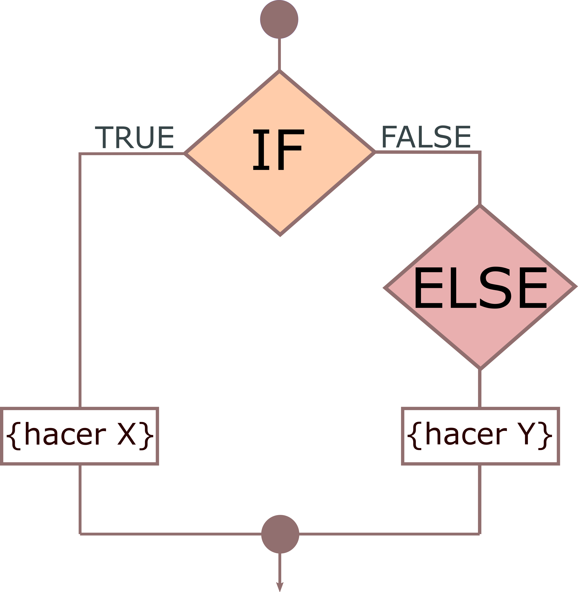]

> En español, piense en el `if` como la palabra "*SI*" y el else como "*DEMÁS*"

---
## Estructuras de Control

### Estructuras de selección: `if()`

- La sintaxis siempre estará en la forma:

.center[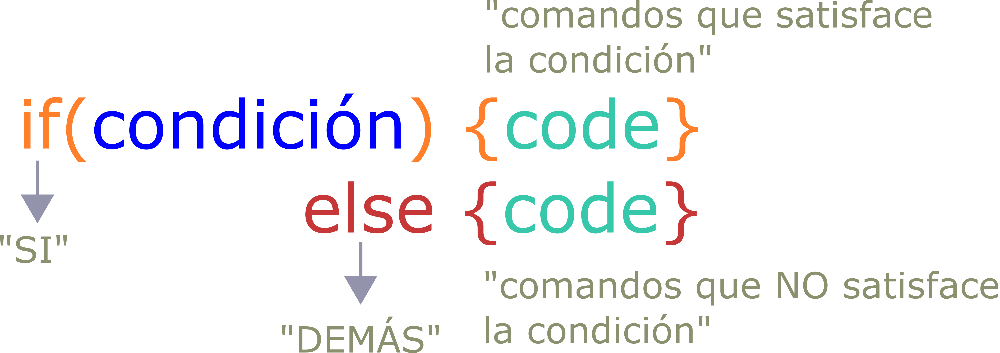]

- En **R**:

```{r eval=FALSE, include=TRUE}
if(<condicion 1>){
  # comandos que satisface la condición
}else{
  # comandos que NO satisface la confidición
    }
```

---
## Estructuras de Control

### Estructuras de selección: `if()`

- Es posible que deseemos clasificar los niveles de vitamina D de los pacientes en "ideales (>21)" y "no ideales (<=21)": c(5, 30, 39, 14, 45).

<br>
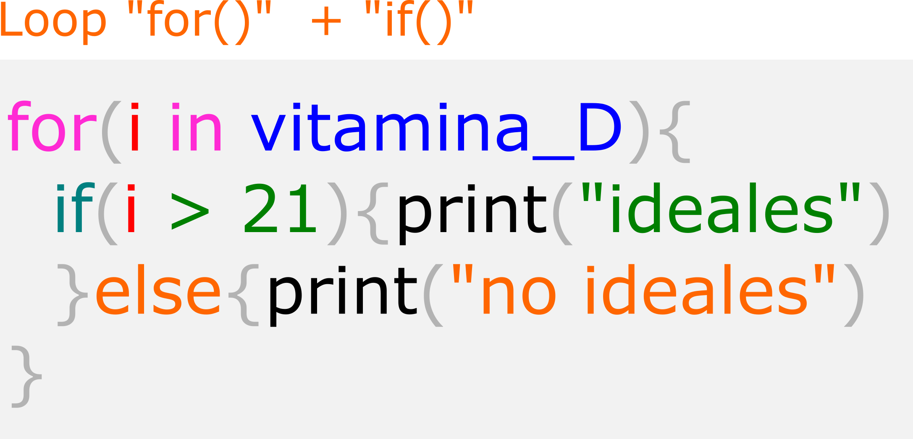

---
## Estructuras de Control

### Estructuras de selección: `if()`

- Es posible que deseemos clasificar los niveles de vitamina D de los pacientes en "ideales (>21)" y "no ideales (<=21)": c(5, 30, 39, 14, 45).

<br>
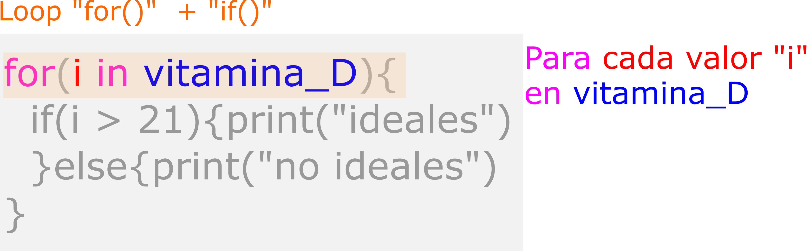

---
## Estructuras de Control

### Estructuras de selección: `if()`

- Es posible que deseemos clasificar los niveles de vitamina D de los pacientes en "ideales (>21)" y "no ideales (<=21)": c(5, 30, 39, 14, 45).

<br>
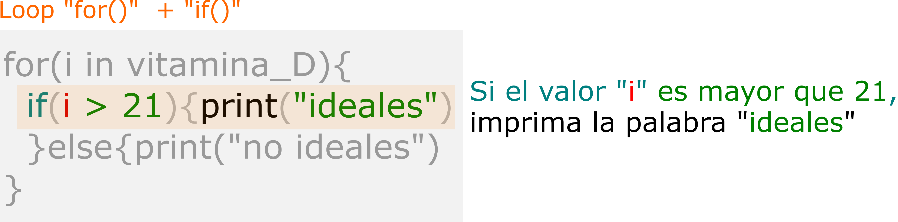

---
## Estructuras de Control

### Estructuras de selección: `if()`

- Es posible que deseemos clasificar los niveles de vitamina D de los pacientes en "ideales (>21)" y "no ideales (<=21)": c(5, 30, 39, 14, 45).

<br>
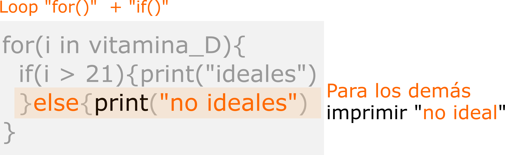

---
## Estructuras de Control

### Estructuras de selección: `if()`

- Es posible que deseemos clasificar los niveles de vitamina D de los pacientes en "ideales (>21)" y "no ideales (<=21)": c(5, 30, 39, 14, 45).

<br>
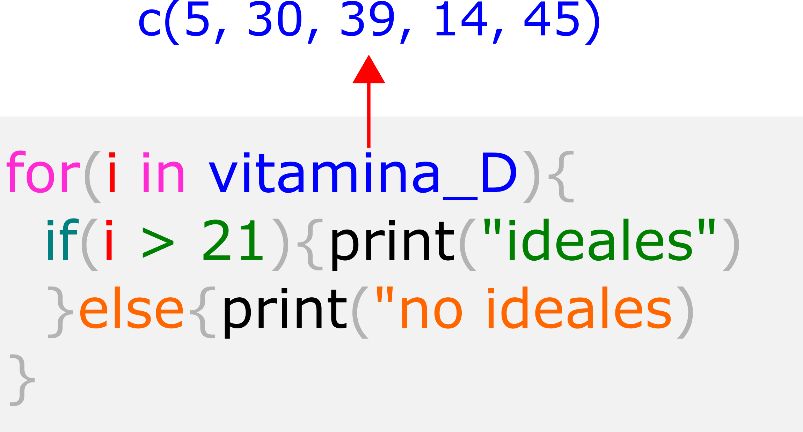

---
## Estructuras de Control

### Estructuras de selección: `if()`

- Es posible que deseemos clasificar los niveles de vitamina D de los pacientes en "ideales (>21)" y "no ideales (<=21)": c(5, 30, 39, 14, 45).

<br>
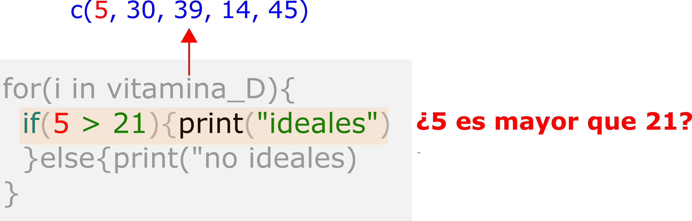

---
## Estructuras de Control

### Estructuras de selección: `if()`

- Es posible que deseemos clasificar los niveles de vitamina D de los pacientes en "ideales (>21)" y "no ideales (<=21)": c(5, 30, 39, 14, 45).

<br>
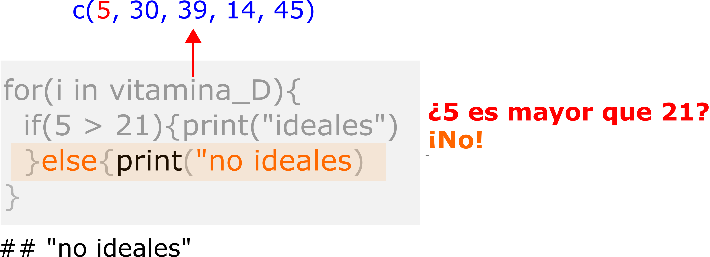

---
## Estructuras de Control

### Estructuras de selección: `if()`

- Es posible que deseemos clasificar los niveles de vitamina D de los pacientes en "ideales (>21)" y "no ideales (<=21)": c(5, 30, 39, 14, 45).

<br>
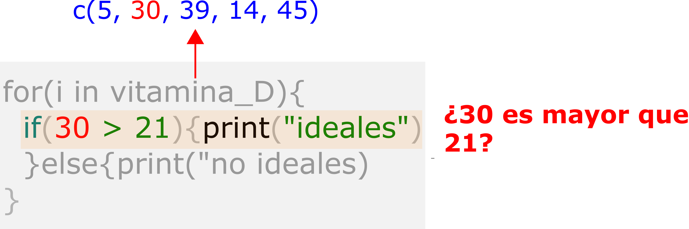

---
## Estructuras de Control

### Estructuras de selección: `if()`

- Es posible que deseemos clasificar los niveles de vitamina D de los pacientes en "ideales (>21)" y "no ideales (<=21)": c(5, 30, 39, 14, 45).

<br>
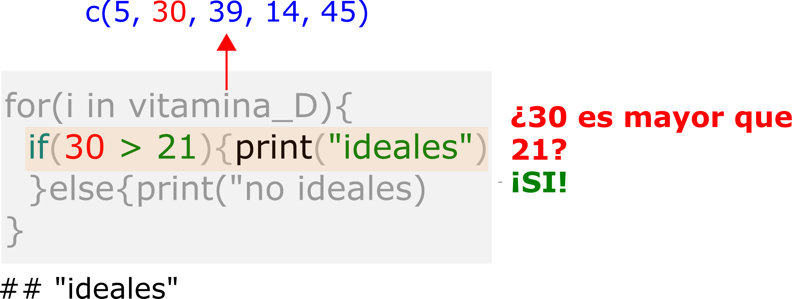

---
## Estructuras de Control

### Estructuras de selección: `if()`

- Es posible que deseemos clasificar los niveles de vitamina D de los pacientes en "ideales (>21)" y "no ideales (<=21)": c(5, 30, 39, 14, 45).

<br>
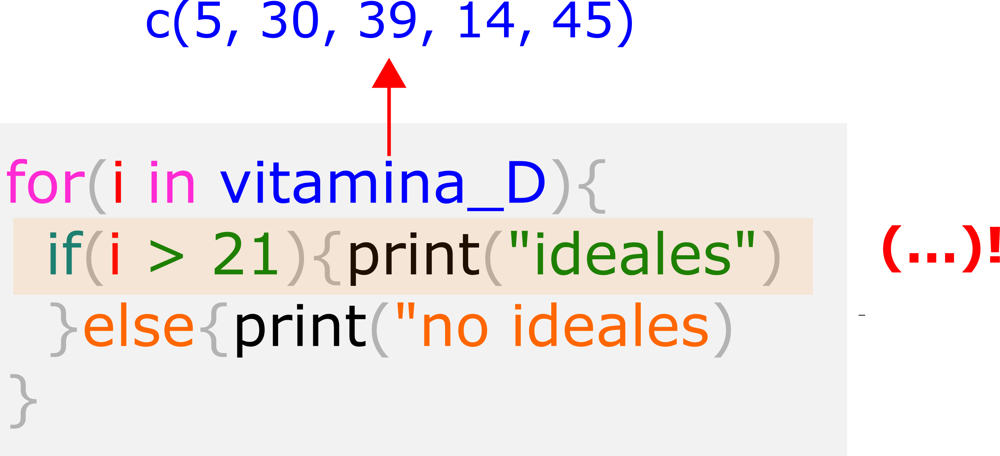

---
## Estructuras de Control

### Estructuras de selección: `if()`

- Es posible que deseemos clasificar los niveles de vitamina D de los pacientes en "ideales (>21)" y "no ideales (<=21)": c(5, 30, 39, 14, 45).

```{r}
vitamina_D <- c(5, 30, 39, 14, 45)
vitamina_D
```

```{r}
for(i in vitamina_D){ # para cada uno de los pacientes en "vitamina_D"...
  if(i > 21){print("ideales")} # si el paciente tiene un valor> 21, imprima "ideal" 
  else{print("no ideales")} # demás, imprima "no ideales"
}
```

---
## Estructuras de Control

### Estructuras de selección: `if()`

- Podemos usar `else if()` para poner otras condiciones.

.center[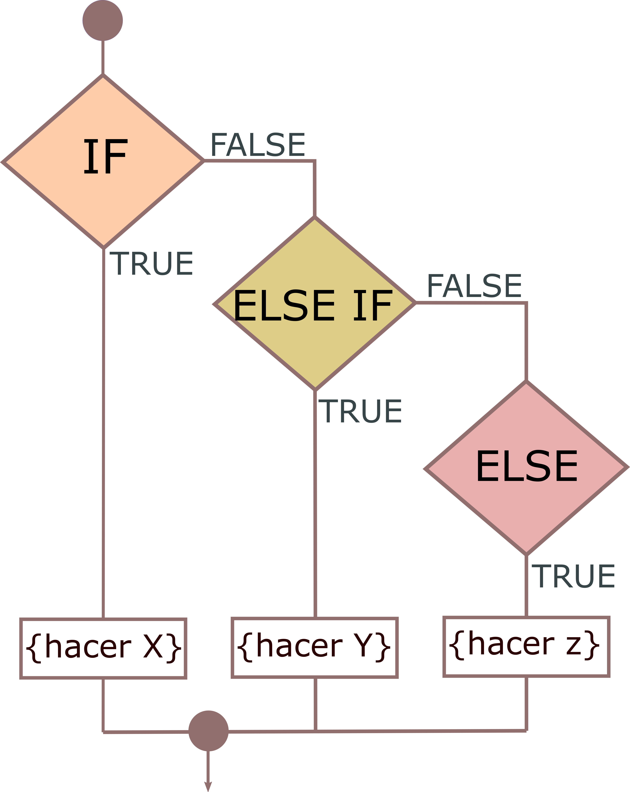]

> El `else if` es una condicion intermediaria entre if y else. 

---
## Estructuras de Control

### Estructuras de selección: `if()`

- La sintaxis es:

.center[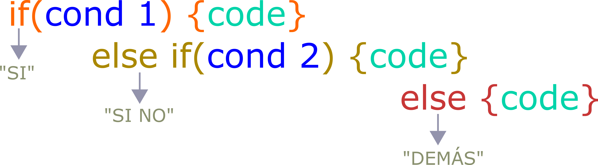]

- En **R**:

```{r eval=FALSE, include=TRUE}
if(condición 1){
  # comandos que satisface la condición 1
  } else if (condición 2){
    # comandos que satisface la condición 2
    } else { # comandos que NO satisface las confidiciónes
}
```

---
## Estructuras de Control

### Estructuras de selección: `if()`

Se realizaron pruebas de glucosa en cuatro pacientes. A partir de los resultados se desea realizar la siguiente clasificación: 70-99 mg/dl = normal; 100-125 mg/dl = prediabetes; \> 126 mg/dl = diabetes. 

```{r}
glicose <- sample(70:130, 4); glicose
```

```{r}
for(paciente in glicose){ # para cada paciente con datos de glucosa...
  if(paciente <= 99){print("normal")} # si el paciente tiene un valor <=99 - diabetes normal
  else if(paciente >= 126){"diabetes"} # si el paciente tiene valores superiores o iguales a 126 - diabetes
  else{print("prediabetes")} # los demás son prediabetes. 
}
```

---
## Ejercicio

.pull-left[
Tomando como entrada la altura y el sexo (codificados de la siguiente manera: 1 = mujer 2 = hombre) de una persona, calcule e imprima su peso ideal, usando las siguientes fórmulas:

- para mujeres: (62.1 * altura) - 44.7
- para hombres: (72.7 * altura) - 58
]

.pull-right[
```{r echo=FALSE}
cod <- rep(c(1,2), each = 2)
altura <- c(1.65, 1.72, 1.78, 1.81)

t <- data.frame(cod, altura)

t %>% 
  kableExtra::kbl() %>%
  kableExtra::kable_styling(font_size = 22, position = "left")
```
]

---
## Estructuras de Control

### Estructura de repetición: `while()`

- Un ciclo `while` en la programación **R** es una función diseñada para ejecutar algún código hasta que se cumpla una condición.

.center[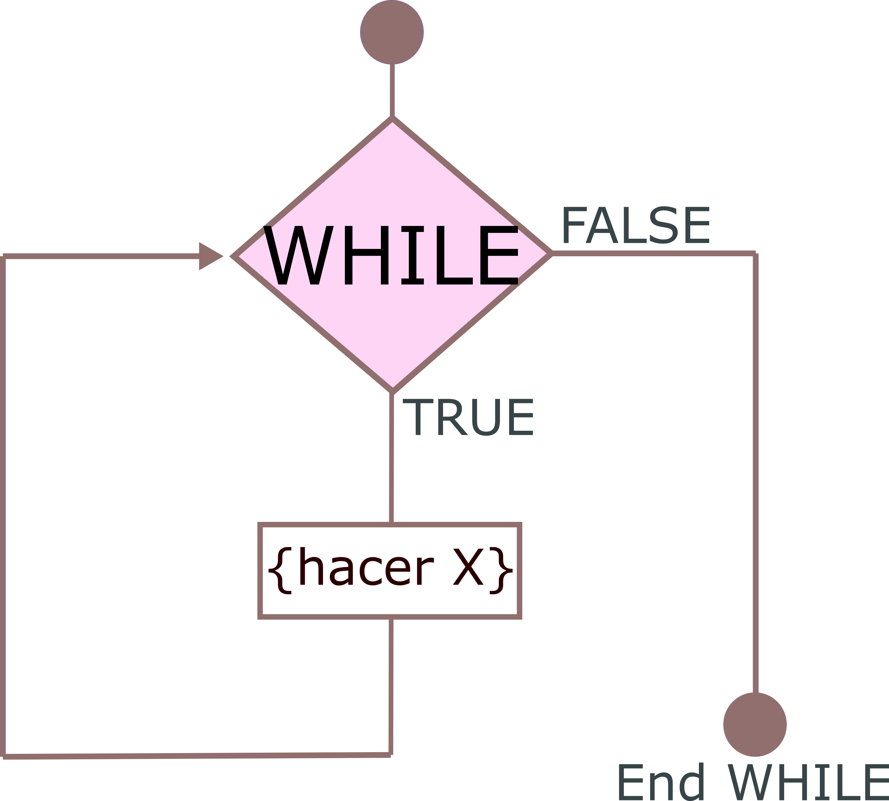]

- Si bien la condición lógica es VERDADERA, el código no dejará de ejecutarse. 

> El loop `while` es muy similar al loop `for`, pero en el segundo definirás el número de iteraciones a ejecutar.

---
## Estructuras de Control

### Estructura de repetición: `while()`

- Para un loop `while` necesitas usar la función con la siguiente sintaxis:

<br>
.center[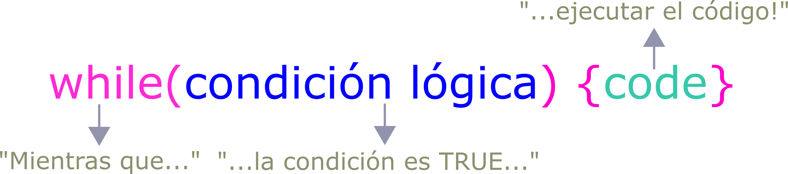]
<br>

- En `r fontawesome::fa("r-project")`:

```{r eval=FALSE, include=TRUE}
while(condición lógica){
  # Code
  }
```

---
## Estructuras de Control

### Estructura de repetición: `while()`

- Por ejemplo, dado que n = 5, siempre que no sea igual a 0, R no detendrá la ejecución del ciclo.

  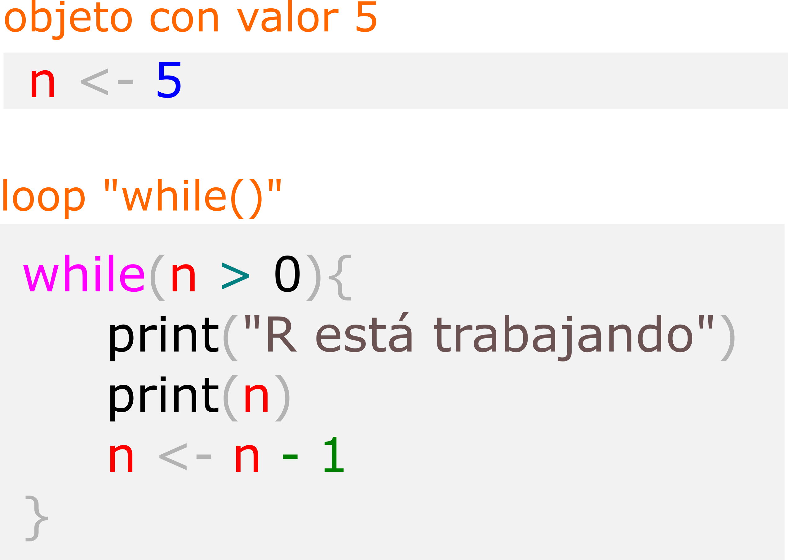

---
## Estructuras de Control

### Estructura de repetición: `while()`

- Por ejemplo, dado que n = 5, siempre que no sea igual a 0, R no detendrá la ejecución del ciclo.

  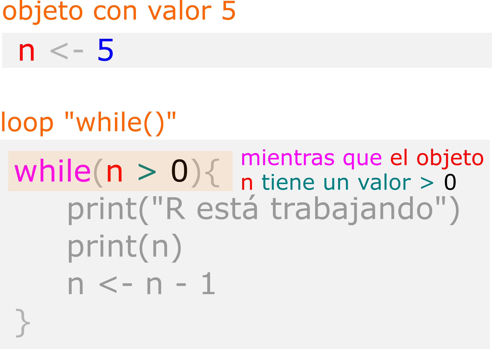

---
## Estructuras de Control

### Estructura de repetición: `while()`

- Por ejemplo, dado que n = 5, siempre que no sea igual a 0, R no detendrá la ejecución del ciclo.

  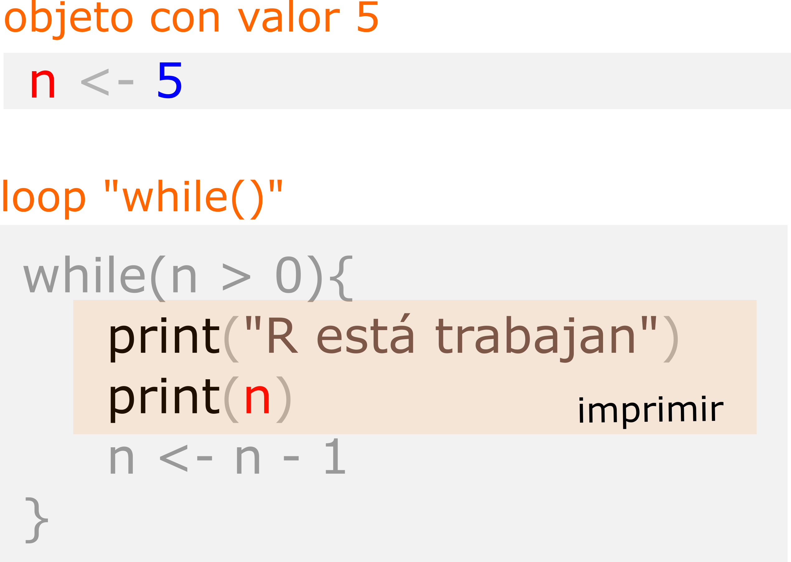
  
---
## Estructuras de Control

### Estructura de repetición: `while()`

- Por ejemplo, dado que n = 5, siempre que no sea igual a 0, R no detendrá la ejecución del ciclo.

  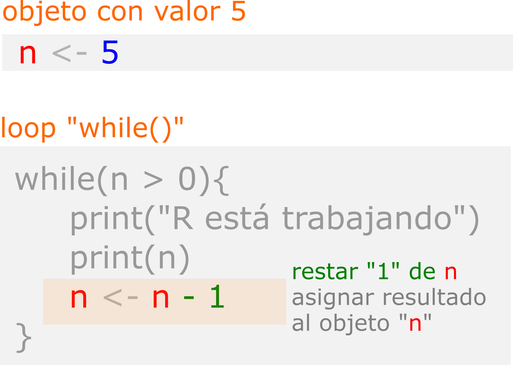
  
---
## Estructuras de Control

### Estructura de repetición: `while()`

- Por ejemplo, dado que n = 5, siempre que no sea igual a 0, R no detendrá la ejecución del ciclo.

  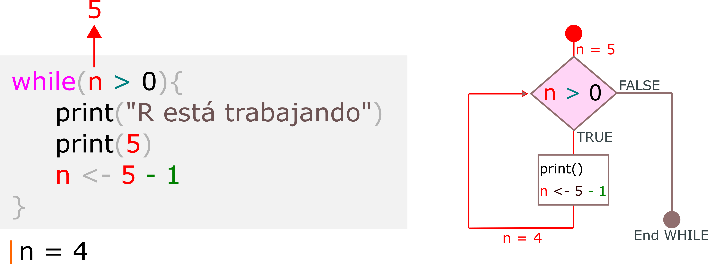

---
## Estructuras de Control

### Estructura de repetición: `while()`

- Por ejemplo, dado que n = 5, siempre que no sea igual a 0, R no detendrá la ejecución del ciclo.

  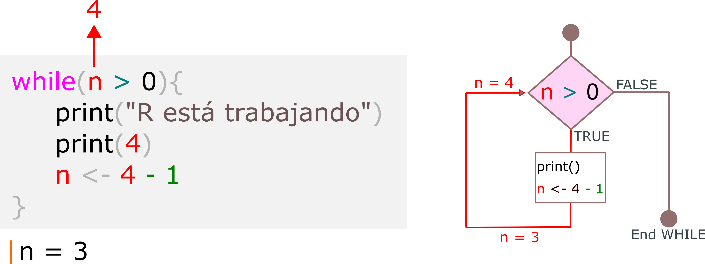
  
---
## Estructuras de Control

### Estructura de repetición: `while()`

- Por ejemplo, dado que n = 5, siempre que no sea igual a 0, R no detendrá la ejecución del ciclo.

  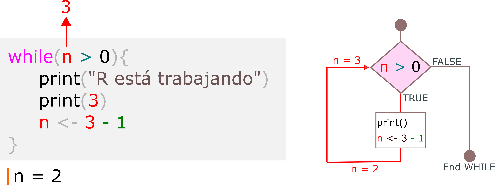
  
---
## Estructuras de Control

### Estructura de repetición: `while()`

- Por ejemplo, dado que n = 5, siempre que no sea igual a 0, R no detendrá la ejecución del ciclo.

  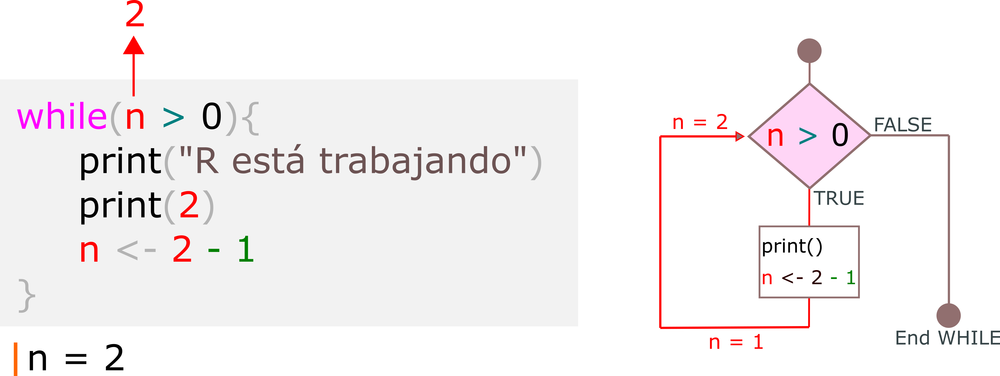
  
---
## Estructuras de Control

### Estructura de repetición: `while()`

- Por ejemplo, dado que n = 5, siempre que no sea igual a 0, R no detendrá la ejecución del ciclo.

  
  
---
## Estructuras de Control

### Estructura de repetición: `while()`

- Por ejemplo, dado que n = 5, siempre que no sea igual a 0, R no detendrá la ejecución del ciclo.

  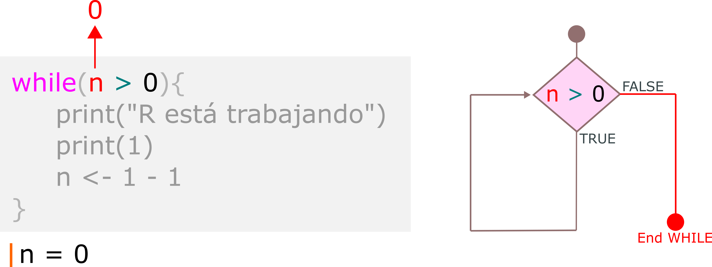
  
---
## Estructuras de Control

### Estructura de repetición: `while()`

- Por ejemplo, dado que n = 5, siempre que no sea igual a 0, R no detendrá la ejecución del ciclo.

```{r}
n <- 5

while(n > 0){ # siempre que el valor de n sea mayor que 0 ...
  print("R está trabajando")
  print(n)
  n <- n - 1
}
```

---
name: funciones
class: middle, center

# Funciones

---
## Funciones

- Mientras que los **objetos** son *nombres que contienen valores*, las **funciones** son *nombres que contienen un código R*.

.center[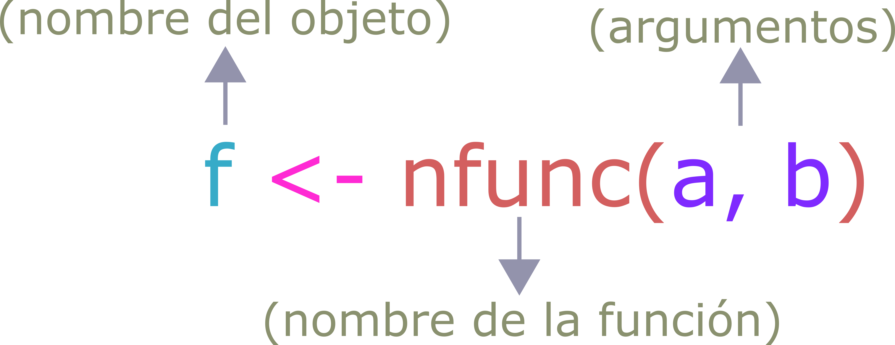]

-  La idea básica de una función es encapsular un código que se pueda invocar en cualquier momento en R. 
<br>

<br>
.center[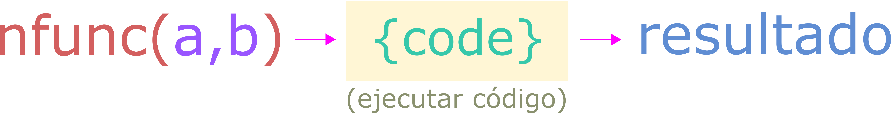]

> Usamos algunas funciones hasta ahora: `c()`, `rep()`, `data.frame()`, `class()`, otros.

---
## Funciones

### Argumentos

- Las funciones toman **argumentos**.

- Los argumentos son los valores u objetos que ponemos entre paréntesis y que las funciones necesitan para funcional (calculando un resultado).

- Por ejemplo, la función `class()` necesita recibir un objeto para investigar la clase y devolverlo:

```{r}
a <- 3
class(a)
```

> En este caso, "a" es el argumento que incluimos en la función `class()`.

---
## Funciones

### Argumentos

- Para las funciones que toman más de un argumento, tenemos que separar los argumentos con comas.

- Por ejemplo, cuando usamos la concatenación (`c()`) para crear un **vector**.

```{r}
ve <- c(1, 2, 3, 4)
```

--
**Importante:**

**!!** Observe cómo debe ser la entrada de valores para que funcione la función.

```{r eval=FALSE, include=TRUE}
class(1, 2, 3, 4)
```
<small> \# simpleError in class(1, 2, 3, 4): 4 argumentos passados para 'class', que requer 1 </small>

```{r}
class(ve)
```

---
## Funciones

### Argumentos

Los argumentos de las funciónes también tienen **nombre**, que pueden o no ser usando en la función. Por ejemplo a función `rep()`.

```{r eval=FALSE, include=TRUE}
rep(x, 
    times = 1,
    length.out = NA, 
    each = 1) 
```

- **x**: valores que se repetirán.
- **times**: Un vector de valor entero que da el número (no negativo) de veces que se repite cada elemento si tiene una longitud (x), o que se repite todo el vector si tiene una longitud 1.
- **lenght.out**: La longitud deseada del vector de salida.
- **each**: Cada elemento de x se repite cada vez.

---
## Ejercicio

#### ¿Cuál es la diferencia entre las salidas?

```{r}
rep(x = 1:3, 
    times = 3,
    length.out = NA, 
    each = 2) 
```

```{r}
rep(x = 1:3, 
    times = NA,
    length.out = 10, 
    each = 2) 
```

---
## Funciones

### Argumentos

También podemos usar la función sin incluir los nombres de los argumentos:

```{r}
rep(x = 1:3, 
    times = 2,
    length.out = NA, 
    each = 1) 
```

```{r}
rep(1:3, 
    2,
    NA, 
    1) 
```

---
## Funciones

### Creación

- Las funciónes en `r fontawesome::fa("r-project")` son muy similares al de las funciones matemáticas, es decir, hay un *nombre*, una *definición* y posterior *invocación de la función*.

- Siempre que ejecute una función, el código que almacena se ejecutará y se devolverá el resultado.

- Además de usar las funciones listas, puede crear su propia función. La sintaxis es la siguiente:

<br>
.center[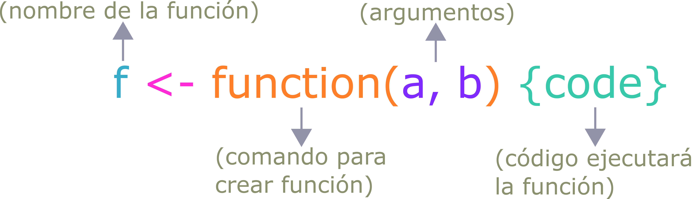]
<br>

---
## Funciones

### Creación

- En `r fontawesome::fa("r-project")`:

```{r eval=FALSE, include=TRUE}
# creando una función llamada 'f':
f <- function(a, b) { 
  code 
}

# invocando la función:
f(a, b)
```

> Tenga en cuenta que `function` es un nombre reservado en R, es decir, no podrá crear un objeto con ese nombre.

---
## Funciones

### Creación

Creemos una función para calcular el peso ideal de las mujeres en función de la altura: 

```{r}
peso <- function(altura){
  p <- (62.1 * altura) - 44.7
  p
}
```

- Nuestra función tiene los siguientes argumentos:
  - **peso**: nombre de la función
  - **altura**: argumento de la función
  - **p <- (62.1 * altura) - 44.7**: operación que realizará la función
  - **p**: valor devuelto por la función

```{r}
peso(1.7) # resultado para 1.70m
```

---
## Funciones

### Argumentos

- Nuestra función también toma un vector como argumentos:

```{r}
v <- c(1.7, 1.5, 1.65)
peso(v)
```

- Y también podemos usar con conjuntos de control:

```{r}
# Usando nuestra función en un loop 'for'.
for(i in v){
  print(peso(i))
}

```

---
## Funciones

**!!** Observaciones importantes:

- De forma predeterminada, las funciones siempre devuelven la última línea de código como resultado de la función. En nuestro caso, es el valor contenido en '**p**'.

```{r eval=FALSE, include=TRUE}
peso <- function(altura){
  p <- (62.1 * altura) - 44.7
  p # nuestra función devolverá p
}
```

- ¿Y qué pasa si eliminamos **p** de nuestra función?...

```{r}
peso <- function(altura){
  p <- (62.1 * altura) - 44.7
}

peso(1.65)
```

- ... ¡La R no devuelve nada!

---
## Funciones

**!!** Observaciones importantes:

- En el caso comentado, la última línea de código es la función matemática que será el 'valor' devuelto.

- En este caso, para ver el resultado de la función debemos hacer:

```{r}
peso <- function(altura){
  p <- (62.1 * altura) - 44.7
}

p1 <- peso(1.65)
p1
```

- En nuestro caso, es como si lo estuviéramos haciendo directamente: `p1 <- (62.1 * 1.65) - 44.7`.

---
## Funciones

- **¿**Existe una función lista para mi problema**?**

- **¿**Cómo averiguar el nombre de esta función**?**

.center[]

---
name: paquetes
class: middle, center

# Paquetes

---
## Paquetes

- Las funciones provienen de dos fuentes: 
  1. paquetes **R** estándar que se cargan siempre que trabajamos con el lenguaje 
  2. paquetes que instalamos y cargamos por comandos.

- Básicamente, un paquete es una convención para organizar y estandarizar la distribución de funciones **R**.

<br>
.center[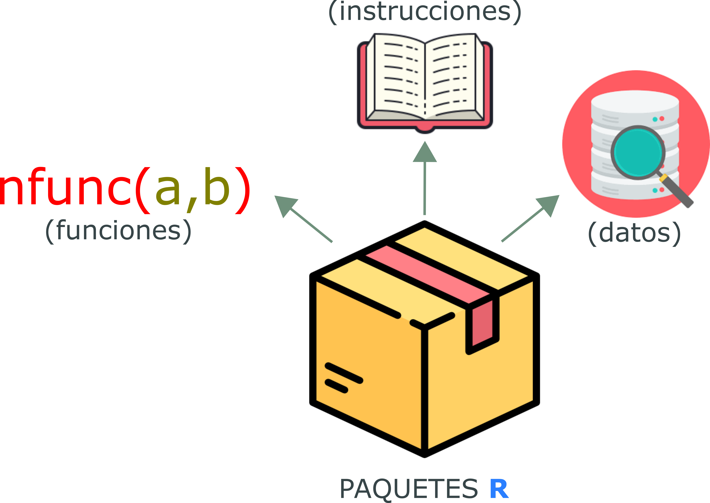]

---
## Paquetes

- La principal motivación de crear un paquete **R** es de organizar y compartir funciones de nuevos métodos y/o implementaciones creadas y que son útiles para otras personas.

- En general, descargamos paquetes de dos fuentes: [CRAN](https://cran.r-project.org/) y [GitHub](https://github.com/). 

<br>
.center[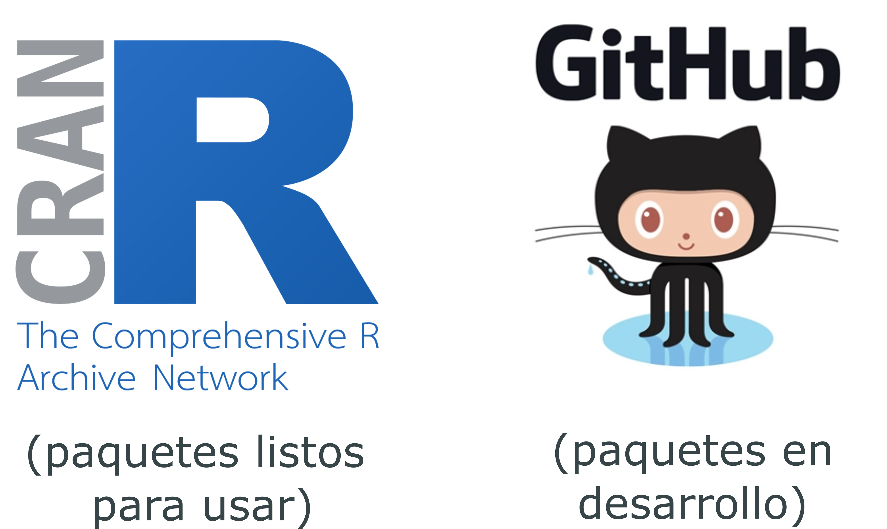]

---
## Paquetes

### Instalación

- Para instalar paquetes desde **CRAN** usamos el comando `install.packages("nombre_paquete")`.

```{r eval=FALSE, include=TRUE}
install.packages("ggplot2") # Para instalar el paquete "ggplot2"
```

> **\*** Tenga en cuenta que el nombre del paquete siempre debe ir entre comillas para la instalación.

<br>
- Compruebe si el paquete se ha instalado:

.pull-left[
```{r eval=FALSE, include=TRUE}
library()
```
> abre una nueva pestaña en R escrita "Paquetes R disponibles".

]
.pull-right[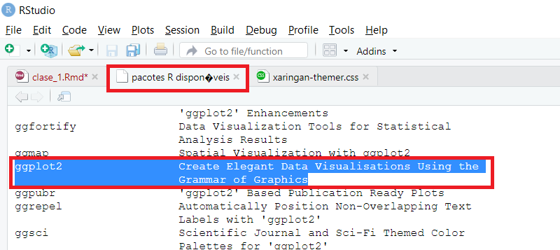]


---
## Paquetes

### Instalación

- Para instalar paquetes de **Github**, usamos el paquete `devtools`: `install_github("direccion/nombre_paquete")`.

- Para hacer esto, necesitaremos la dirección y el nombre del paquete de un repositorio de GitHub (<https://github.com/tidyverse/dplyr>)

```{r eval=FALSE, include=T}
# Instalar el paquete 'devtools'
install.packages("devtools")

# Cargar el paquete para su uso
library(devtools)

# Incluir la dirección de descarga 
# del paquete do github en install_github()
install_github("tidyverse/dplyr")
```

---
## Paquetes

### Instalación

- Para instalar paquetes de **Github**, usamos el paquete `devtools`:

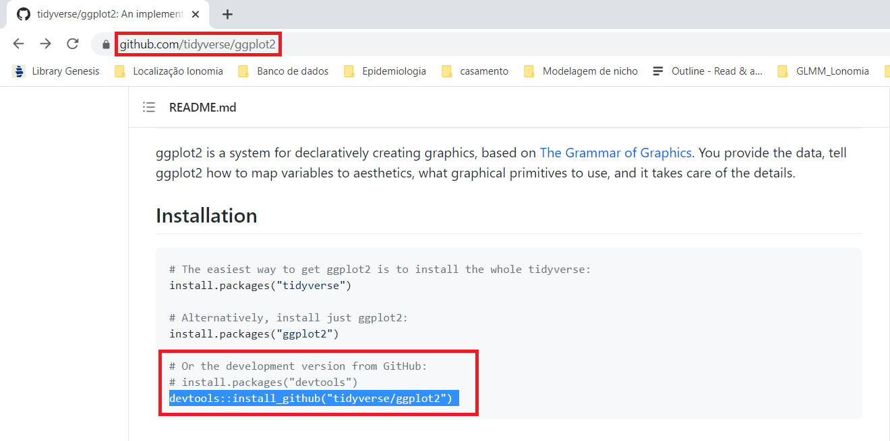

---
## Paquetes

### Instalación

- Solo instalamos los paquetes una vez.

- Los paquetes se descargan a través de la internet.

- El nombre del paquete debe estar entre comillas (`"paquete_nombre"`), independientemente de si lo vamos a descargar de **CRAN** o **GitHub**.

- Para cargar paquetes en R usamos la función `library(paquete_nombre`). 
  - En este caso no es necesario incluir comillas.
  - Cargamos paquetes para usar sus funciones. 

```{r eval=FALSE, include=TRUE}
library(ggplot2)
library(dplyr)
```

---
## Paquetes

### Actualización

- Los paquetes no se actualizan solos.

- Es necesario actualizarlos de vez en cuando.

- ¡Es un proceso que lleva tiempo!

```{r eval=FALSE, include=TRUE}
update.packages(ask = FALSE)
```

### Dirección en mi compu

- ¿Dónde están los paquetes?

  - Windows: `C:/Users/nombre_del_compu/Documentación/R/win-library/versión_r`
  - Unix (Linux o MacOS): `/home/nombre_del_compu/R/tipo_compu/versión_r`

---
## Paquetes

### Dos paquetes útiles para empezar

.pull-left[
- **tidyverse** es una colección obstinada de paquetes R diseñados para la ciencia de datos. 
 - dplyr
 - ggplot2
 - forcats
 - tibble
 - readr
 - stringr
 - tidyr
 - purr
]

.pull-right[
- **tidymodels** es una colección de paquetes R para modelado y aprendizaje automático utilizando principios tidyverse.
  - tidymodels
  - rsample
  - parsnip
  - recipes
  - tune
  - yardstick
]

---
## Paquetes

### Cantidad de paquetes disponibles
```{r}
nrow(available.packages(repos = "http://cran.r-project.org"))
```

.center[]

---
## Paquetes

### Help! (ayuda)

- El "help" de **R** es muy útil cuando necesitamos ayuda para comprender una función.

```{r eval=FALSE, include=TRUE}
help("sum") 
# es necesario encerrar el nombre de 
# la función entre comillas.
```

.center[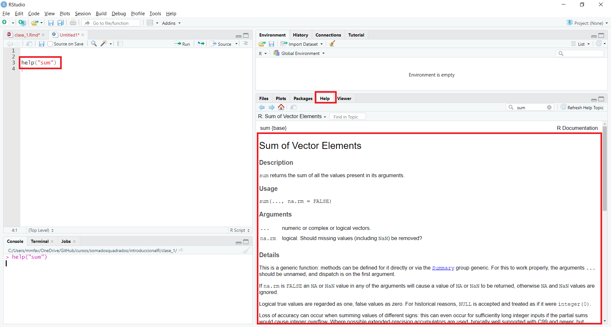]

---
## Paquetes
### Help! (ayuda)
- *Description*: Una declaración sobre el propósito de la función.

- *Usage*: Muestra cómo debemos usar la función (parámetros y argumentos).

- *Arguments*: Explica lo que significa cada uno de los argumentos de la función.

- *Details*: Explica algunos detalles sobre el uso y la aplicación de la función.

- *Value*: La salida de la función (o resultados).

- *Note*: Notas de función.

- *Authors*: Los autores de la función.

- *References*: Las referencias utilizadas para desarrollar la función/método.

- *See also*: Otras funciones relacionadas que se pueden consultar en R help.

- *Examples*: Ejemplos de cómo utilizar la función

---
## Paquetes

###  ¿Cómo citar la **R**?

```{r}
citation()
```

---
## Paquetes

###  ¿Cómo citar la **R**?

```{r}
citation("ggplot2")
```

---
## Paquetes

### Ejercicios

Trabajarás con índices de disimilitud y para eso usarás el paquete "vegan" (CRAN).
Instale el paquete, asegúrese de que esté instalado, cárguelo en R y obtenga su cita.

---
class: clear, center

## ¡¡Fin de clase!!

.center[]

---
class: middle

## [¡No olvides tu tarea!](https://forms.gle/J4iwNMt9PNSmjxcK8) `r icons::icon_style(icons::fontawesome("user-edit"), fill = "#000000")`

<br> 

<br>

### Soma dos quadrados

- `r icons::icon_style(icons::fontawesome("github"), fill = "#000000")` [Soma-Dos-Quadrados/introduccionalR](https://github.com/Soma-dos-Quadrados/introduccionalR)
- `r icons::icon_style(icons::fontawesome("youtube"), fill = "#000000")` [/somaquadrados](https://www.youtube.com/channel/UC8_OHjnszxRiit92ZJlNH4A)
- `r icons::icon_style(icons::fontawesome("twitch"), fill = "#000000")` [/somadosquadrados](https://www.twitch.tv/somaquadrados)
- `r icons::icon_style(icons::fontawesome("twitter"), fill = "#000000")` [@somadosquadrados](https://twitter.com/somaquadrados)


### Marília Melo Favalesso 

- `r icons::icon_style(icons::fontawesome("envelope", style = "solid"), fill = "#000000")` [mariliabioufpr@gmail.com](mariliabioufpr@gmail.com)
- `r icons::icon_style(icons::fontawesome("globe-americas", style = "solid"), fill = "#000000")` [www.mmfava.com](www.mmfava.com)
- `r icons::icon_style(icons::fontawesome("github"), fill = "#000000")` [ /mmfava](https://github.com/mmfava)
