```{r global_options, include=FALSE}
knitr::opts_chunk$set(fig.path = 'assets/chunks/', cache.path = "assets/cache/", dpi = 300)
library(tidyverse)
theme_set(theme_grey(base_size = 16))
library(emo)
#devtools::install_github("ropenscilabs/icon")
#devtools::install_github("hadley/emo")
```

## Archivos

- [enejul2018.csv](enejul2018.csv)
- [juldic2018.csv](juldic2018.csv)

## Contenido de hoy

.pull-left[

- [R Markdown](#RMarkdown)
- [Instalación](#instalacion)
- [Estructura de un R Markdown](#estructura)
- [YAML](#YAML)
- [Texto](#texto)
- [Renderizado el documento](#renderizado)
- [Chunk](#chunk)
]

---
name: RMarkdown
class: middle, center

# R Markdown

---
## R Markdown

<br>

<br>
.center[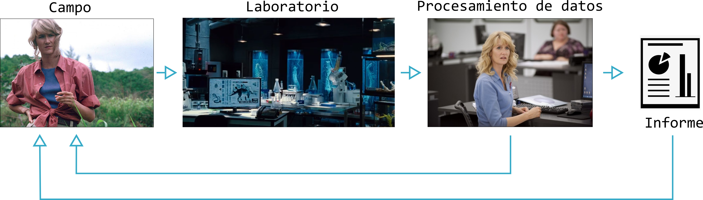]
<br>

---
## R Markdown

<br>
.center[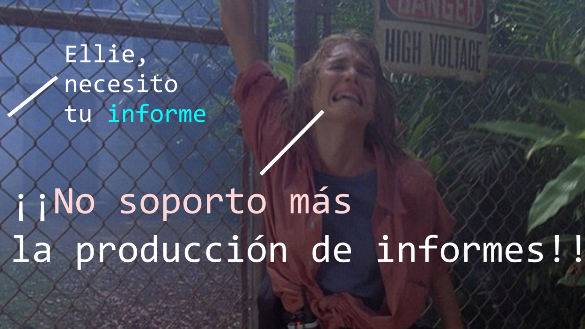]
<br>

---
## R Markdown

<br>
.center[]
<br>

---
## R Markdown

<br>
.center[]
<br>

---
## R Markdown

<br>
.center[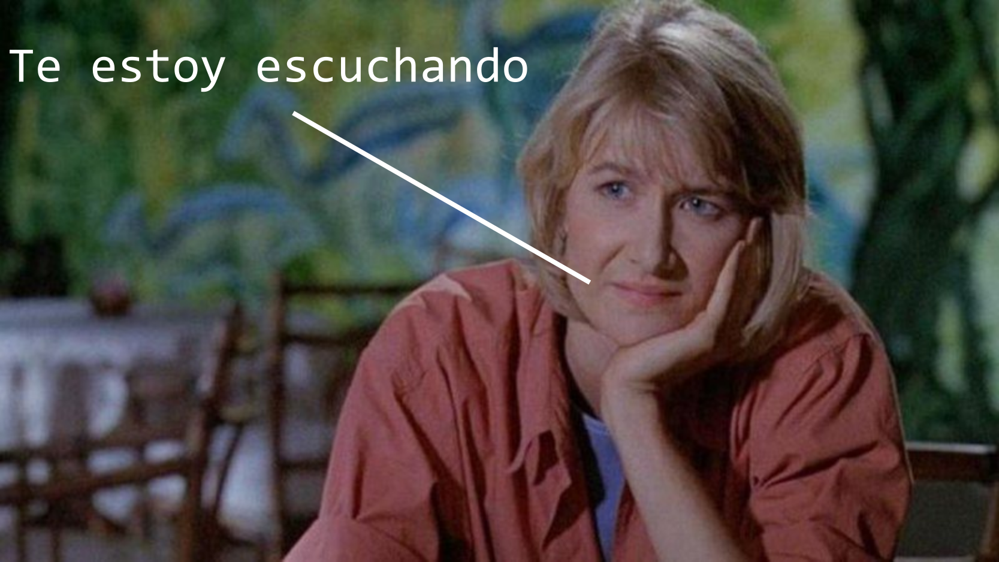]
<br>

---
## R Markdown

.pull-left[

- R Markdown es una poderosa herramienta para combinar análisis e informes en el mismo documento 💪.

- Permite compartir un solo archivo que contiene todos el texto, el código R y los metadatos necesarios para reproducir un análisis de datos del principio a fin 😉.

- No es necesário tener que conocer ningún código HTML o LaTeX ni preocuparse por obtener el formato correcto en un archivo DOCX de Microsoft Word 😎.

- Puede generar una variedad de formatos diferentes, y todo esto se hace usando un solo archivo de texto con algunos bits de formato ✌. 
]

.pull-right[
.center[

[R Markdown Reference Guide](https://www.rstudio.com/wp-content/uploads/2015/03/R Markdown-reference.pdf)
]
]

---
## R Markdown

### Beneficios
👉 **Reproducible**: Documenta los pasos de una investigación o estudio científico.

👉 **Colaborativo**: Fácil de trabajar con otros en investigaciones y estudios científicos.

👉 **Eficiente**: Genere y actualice informes automáticamente (ej., HTML, MS Word y PDF).

👉 **Atractivo**: Incruste figuras, mapas y tablas interactivos en los informes (solo HTML).
]

### Aplicación 
.pull-left[
- [dashboard](https://pkgs.rstudio.com/flexdashboard/)
- [site](https://bookdown.org/yihui/blogdown/)
- [libros](https://bookdown.org/yihui/bookdown/)
- [tesis](https://ourcodingclub.github.io/tutorials/R Markdown-dissertation/)
]
.pull-right[
- [diapositivas](https://beatrizmilz.github.io/IME-27-08-2019/#1)
- [reportes](http://www.botanicaamazonica.wiki.br/labotam/doku.php?id=bot89:precurso:R Markdown:inicio)
- [póster académico](póster académico)
- [↑ ¡mucho más!]()
]

---
## R Markdown

.center[]

> P.S: Las diapositivas de la clase se realizaron con los paquetes **R Markdown** + **Xarigan**.

---
## R Markdown

.pull-left[
.center[]
]

.pull-right[
### ¡Utilice **R Markdown** en todo!

-----

La recomendación es crear un archivo **R Markdown** para cada uno de sus proyectos R. La intención es documentar tanto del proyecto como sea posible.

-----
**R Markdown** proporciona un documento más legible con mejores descripciones de cómo y por qué se realizó una actividad que un script R estándar con algunas líneas comentadas.

-----
]

---
## R Markdown

<br>
.center[]

---
## R Markdown

.center[]

<!---
- *Markdown* es un lenguaje de marcado para desarrollar y formatear documentos;

- El paquete `knitr` ejecutará "fragmentos" de código y generará un archivo **.Rmd** con los códigos y sus resultados. A continuación, pandoc, que es un conversor, lo convierte al formato de
seado, generando los archivos en `.html`, `.docx`, `.pdf`, o `.odt`. 
--->

---
## R Markdown

<br>

.center[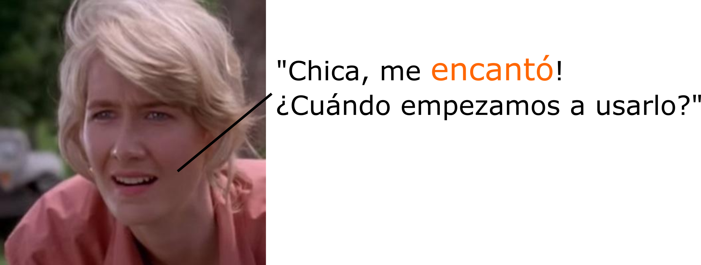]

---
name: instalacion
class: middle, center

# Instalación

---
## Instalación

- Instalar el paquete `R Markdown`:

```{r eval=FALSE, include=TRUE}
# Instalar desde CRAN
install.packages('R Markdown')

# O si desea probar la versión de desarrollo, instálela desde GitHub:
devtools::install_github('rstudio/R Markdown') 
```

------
- Instalar el paquete `knitr`:

```{r eval=FALSE, include=TRUE}
# Instalar desde CRAN
install.packages('knitr')

# O si desea probar la versión de desarrollo, instálela desde GitHub:
devtools::install_github('yihui/knitr') 
```

------
> **Nota:** el uso de "::" ayuda a acceder a la función exacta de un paquete específico: `nombre del paquete::función()`.

---
name: estructura
class: middle, center

# Estructura de un R Markdown

---
## Estructura de un R Markdown

- Empiece a crear un documento:

.center[
<button type="button">File</button> ⟶ <button type="button">New File </button> ⟶ <button type="button">R Markdown</button> ⟶  **OK**

]

---
## Estructura de un R Markdown

<br>
.center[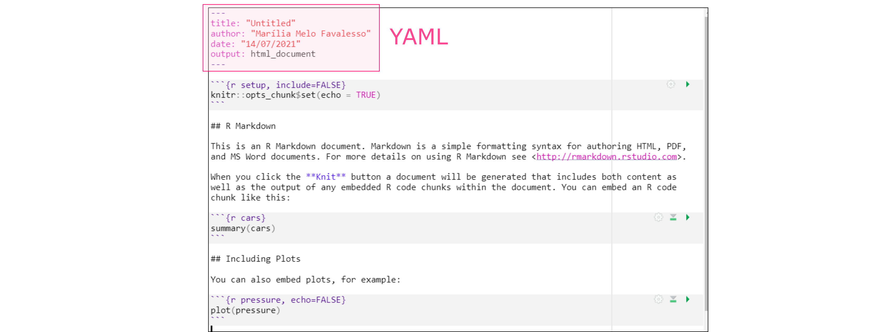]

---
## Estructura de un R Markdown

<br>
.center[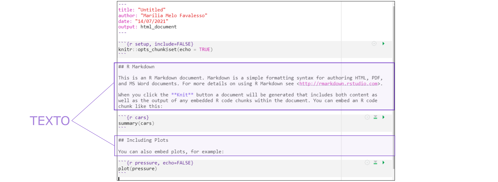]

---
## Estructura de un R Markdown

<br>
.center[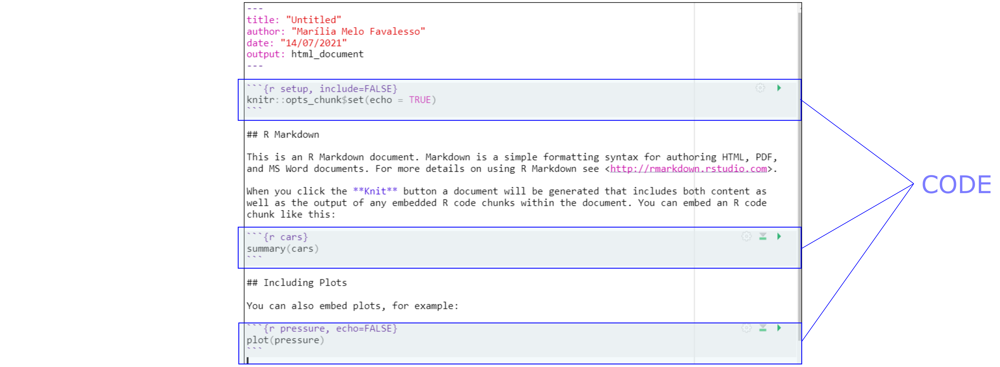]

---
## Estructura de un R Markdown

<br>
.center[]

---
name: YAML
class: middle, center

# YAML

---
## YAML

- YAML es responsable de la configuración del documento.

<br>
.center[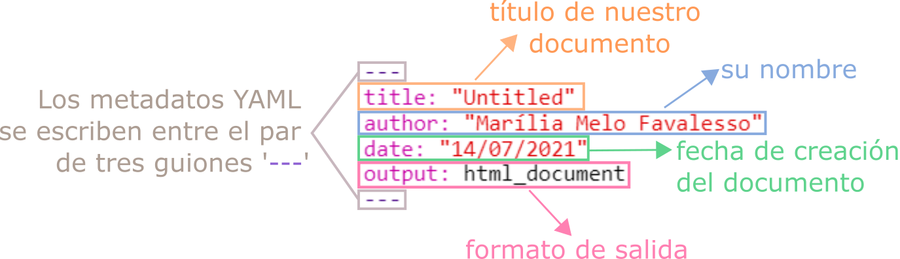]

---
## YAML

.center[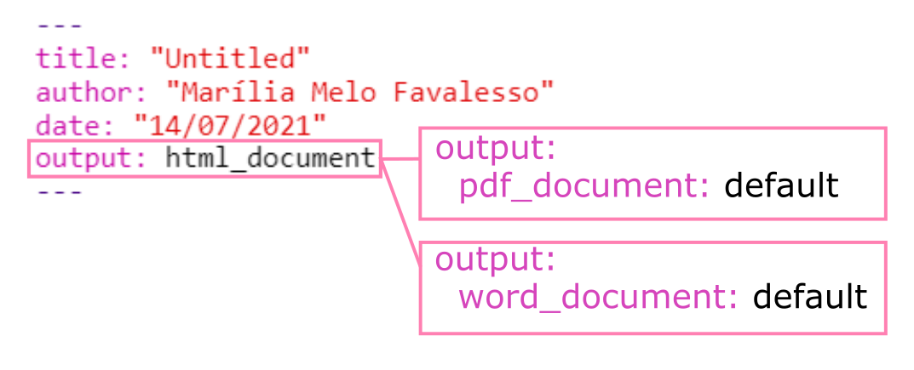]

- En el ejemplo se define como salida `html_document`, pero podemos modificar esta salida a otros formatos.

---
## YAML

### Otros cambios

- También podemos agregar otras informaciónes o cambiar configuraciones en nuestro documento ([consulte el documento de pandoc para obtener más información](https://pandoc.org/MANUAL.html#variables-for-latex)). 

- A continuación, se muestran algunos cambios que se aplican a **TODOS** los formatos de salida.

.center[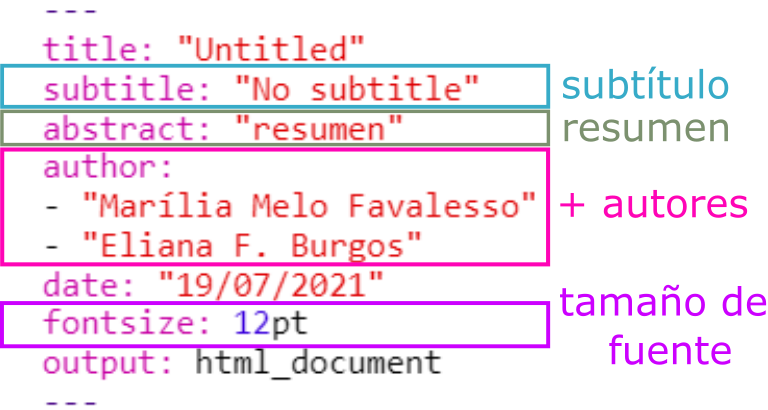]

- `fontsize: 10pt, 11pt o 12pt`.

---
## YAML

### Para salida en PDF

- Especificar `output: pdf_document` en el encabezado **YAML** producirá un archivo `.pdf` formateado con **LaTeX**.

<br>
.center[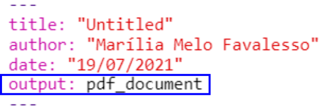]
<br>

- **LaTeX** (pronunciado LAY-tech) es otro lenguaje de marcado de documentos, que permite al usuario usar etiquetas para formatear texto sin formato con un control muy fino. 

```
\color{red}{texto}
```
<p style="color:red">texto</p>

---
## YAML

### Para salida en PDF

- La compilación de un archivo **LaTeX** en un documento PDF legible requiere que también se instale una distribución **TeX** (por ejemplo, [MikTeX](https://miktex.org/)).

- Puede instalar una versión pequeña de **TeX** en su computadora directamente a través de **R** con el paquete [tinyTeX](https://yihui.name/tinytex/).

```{r eval=FALSE, include=TRUE}
# Instalar desde CRAN
install.packages('tinytex')

# Instalar TinyTeX
tinytex::install_tinytex()  
```

> ¡Ahora es solo comezar a editar y generar sus archivos `.PDF` con R Markdown!

> A continuación, hablaremos sobre algunos parámetros útiles para editar archivos `PDF`.

---
## YAML

### Para salida en PDF

.center[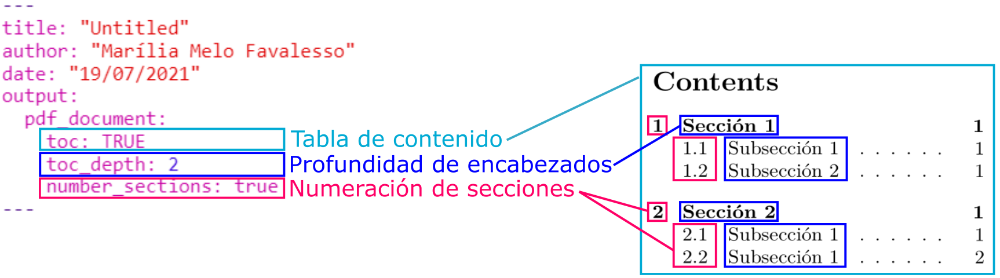]

- Puede agregar una tabla de contenido usando la opción `toc=TRUE`. 

- Para especificar la 'profundidad' de los encabezados de la tabla de contenido tenemos la opción `toc_depth = 2`. 

- Puede agregar numeración de secciones a los encabezados usando la opción `number_sections: TRUE`. 

- Simplemente haga clic en el nombre de la sesión para acceder a ella .

---
## YAML

### Para salida en PDF

<br>
.center[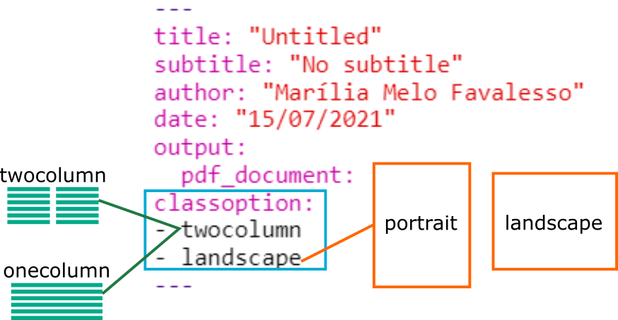]

---
## YAML

### Para salida en PDF

<br>
.center[]

---
## YAML

### Para salida en PDF

<br>
.center[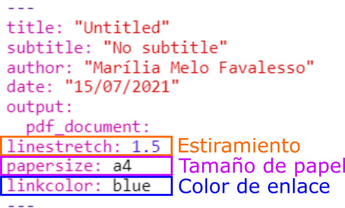]

---
## YAML

- Otra opción útil es utilizar `xelatex` para cambinar la fuente de nuestro documento:

<br>
.center[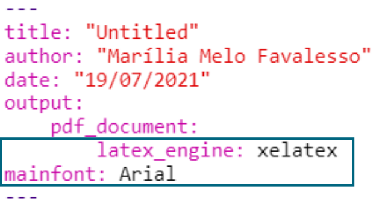]

- `latex_engine: xelatex` permite el uso de fuentes del sistema (no disponible para el *default engine* `pdflatex`).

> `mainfont: font-family` especifica la fuente que se utilizará.

---
### Ejercicio 🤓

<br>

Comencemos por eliminar todo el contenido que tenemos en nuestro archivo **R Markdown**, con la excepción de *YAML*.

.center[]

---
### Ejercicio 🤓

> ¡Elaboración de un CV!

1 - Cambie el formato de archivo a `PDF`.

2 - Incluya la siguiente información en el **YALM** de su documento:

a) El título "Mi curriculum vitae". <br>
b) Su nombre. <br>

2 - Eliminar el tópico "fecha". 

4 - El archivo debe tener la siguiente configuración:

a) Fuente: 12pt.<br>
b) Márgenes: superior e inferior: 2 cm; izquierda y derecha: 1cm.<br>
c) El interlineado debe ser 1.25.<br>
d) El color de los enlaces debe ser azul.

5 - Guarda el archivo .
---
name: texto
class: middle, center

# Texto

---
## Texto

### Markdown `r icons::icon_style(icons::fontawesome("markdown"), fill = "#000000")`

- Un lenguaje de *marcado simple*, **no** de programación.

- Textos con caracteres no alfabéticos (`#`, `\`, `*`, `!`, `[]` y `()`), que se utilizan para configurar títulos, listas, cursiva, negrita e insertar imágenes.

- Creado originalmente por [John Gruber](https://en.wikipedia.org/wiki/John_Gruber) y [Aaron Swartz](https://pt.wikipedia.org/wiki/Aaron_Swartz). 

- Vantajas son la simplicidad y la posibilidad de utilizar un lenguaje común para crear varios tipos de documentos (ej: HTML, PDF y Word).

- Es como *word*, pero con una gama de aplicaciones mucho más amplia.

---
## Texto

### Markdown `r icons::icon_style(icons::fontawesome("markdown"), fill = "#000000")`

.pull-left[

- *Markdown* fue diseñado originalmente para ser la abreviatura de *HTML*. Por ejemplo, para poner un texto en cursiva en *HTML*, lo encierra en `<em>texto</em>`. En *Markdown*, tenemos que hacer `\*texto\*`.

- **R Markdown** usa la versión *Markdown* de [Pandoc](https://pandoc.org/MANUAL.html#pandocs-markdown), que difiere ligeramente del Markdown estándar.

- Debido a su simplicidad, Markdown es muy fácil de usar 😺.
]

.pull-right[]

---
## Texto

### Edición de texto

.center[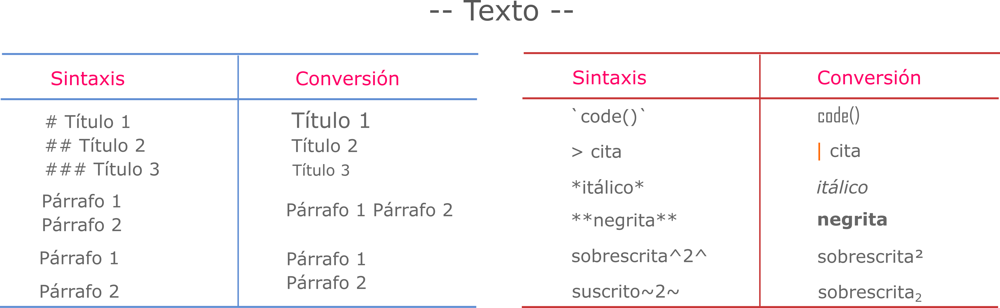]

- No inserte espacios entre las *tags* de formato y el texto.

- Cualquier carácter precedido por una barra invertida (**\\**) se tratará como un carácter literal y no como una etiqueta de código: **\\\*cursiva\\\*** produce **\*cursiva\***.

---
## Texto

### Edición de texto

<br>
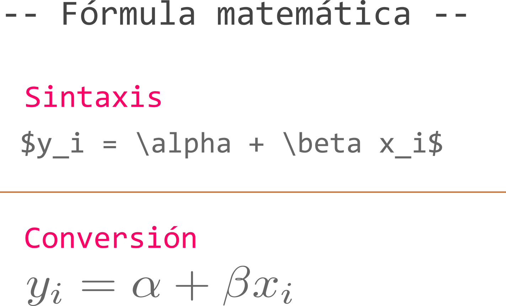

- Las fórmulas matemáticas están escritas en [sintaxis de ecuación de LaTeX](https://latex.codecogs.com/eqneditor/editor.php).

- Las fórmulas se escriben dentro de los signos de dólar (**$**) para luego convertirse en ecuaciones matemáticas con los símbolos apropiados.

---
## Texto

### Edición de texto

.center[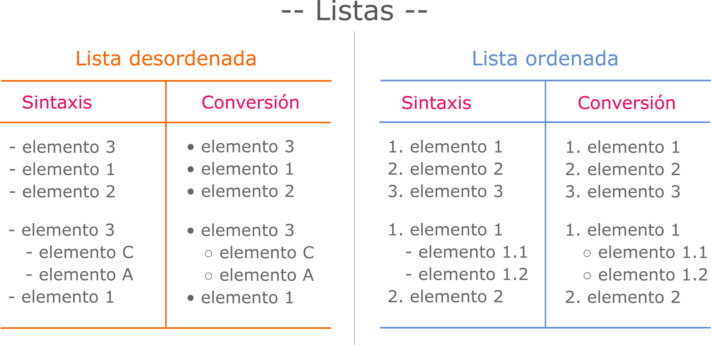]

- Para crear una lista, anteponga a cada elemento de la lista ***** (o **+** o **-**) y un espacio.
- Para agregar sublistas, sangra 4 espacios.
- Use números con puntos como *tags* para listas numeradas.

---
## Texto

### Edición de texto

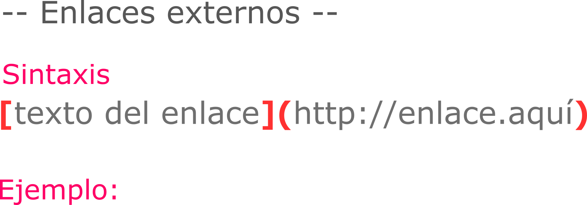
<br>

```
[Accede al sitio web del curso aquí](https://introduccionalr.netlify.app/)
```
[Accede al sitio web del curso aquí](https://introduccionalr.netlify.app/)

---
## Texto

### Edición de texto

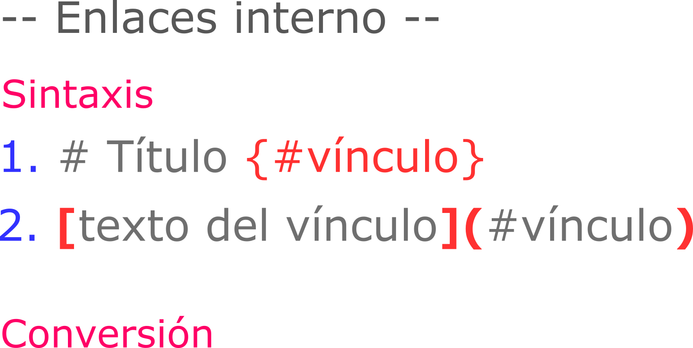


---
## Texto

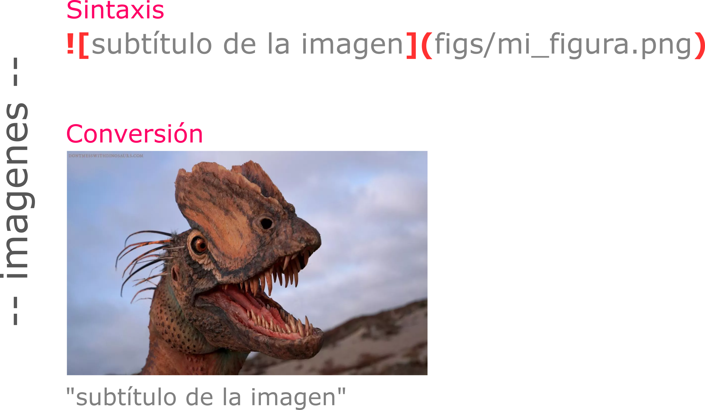
<br>

---
## Texto


<br>

--

> También puede utilizar la dirección virtual de una figura para incluirla en su trabajo. Por ejemplo:
> ``

---
name: renderizado
class: middle, center

# Renderizado el documento

---
## Renderizado el documento

- Genera el archivo PDF

<br>
.center[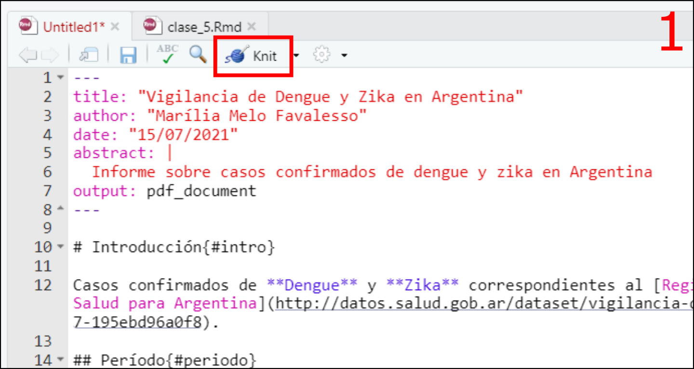]

---
## Renderizado el documento

- Genera el archivo PDF

<br>
.center[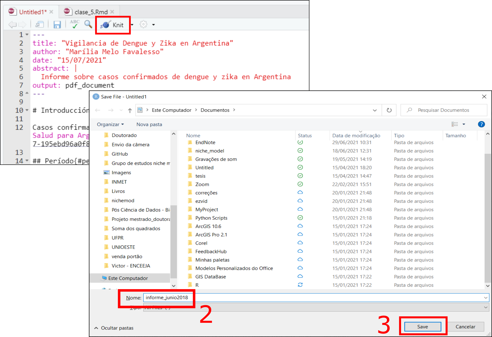]

---
## Renderizado el documento

- Genera el archivo PDF

<br>
<div class="background" style="width: 1050px; height: 440px; white-space: nowrap; overflow-x: scroll; border: 0; padding: 10px;">

.center[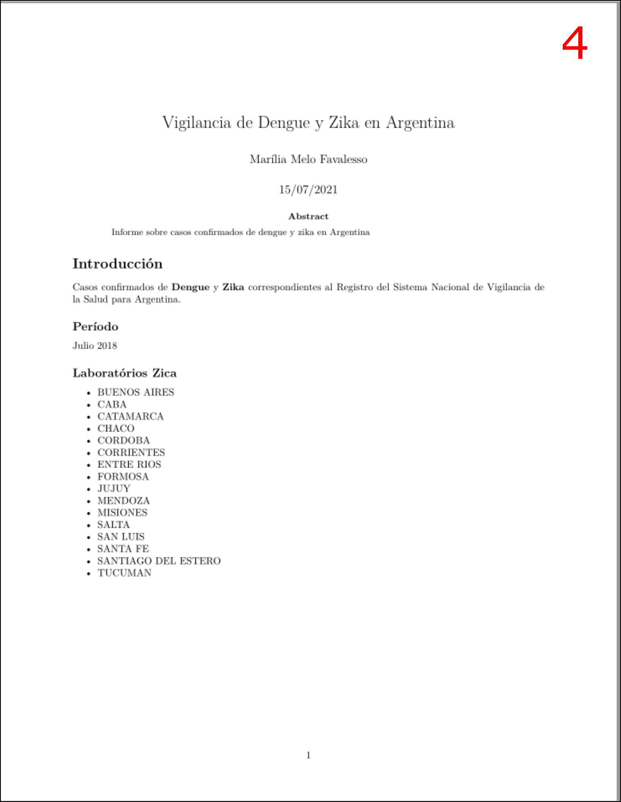]

---
## Ejercicio 🤓

1 - Cree el tópico "Información personal" en su archivo R Markdown. A continuación, incluya las siguientes informaciónes:
- Correo electrónico
- Otros medios de contacto (site, twitter, researchgate, etc)

2 - Cree un tópico llamado "Educación" e incluya información sobre su formación académica.

3 - Cree un tópico llamado "Capacitación adicional" y agregue cursos que ya haya tomado.

4 - Incluye otros temas que creas que son importantes para tu **CV**, por ejemplo:
- Premios por distinción académica
- Publicaciones en congresos
- Artículos científicos
- Clases y / o cursos impartidos

> ¡Utilice y abuse de las funciones de R Markdown!

5 - Genere el archivo en **pdf**.

---
## Ejercicio 🤓

.center[
<div class="background" style="width: 1050px; height: 530px; white-space: nowrap; overflow-x: scroll; border: 0; padding: 0px;">

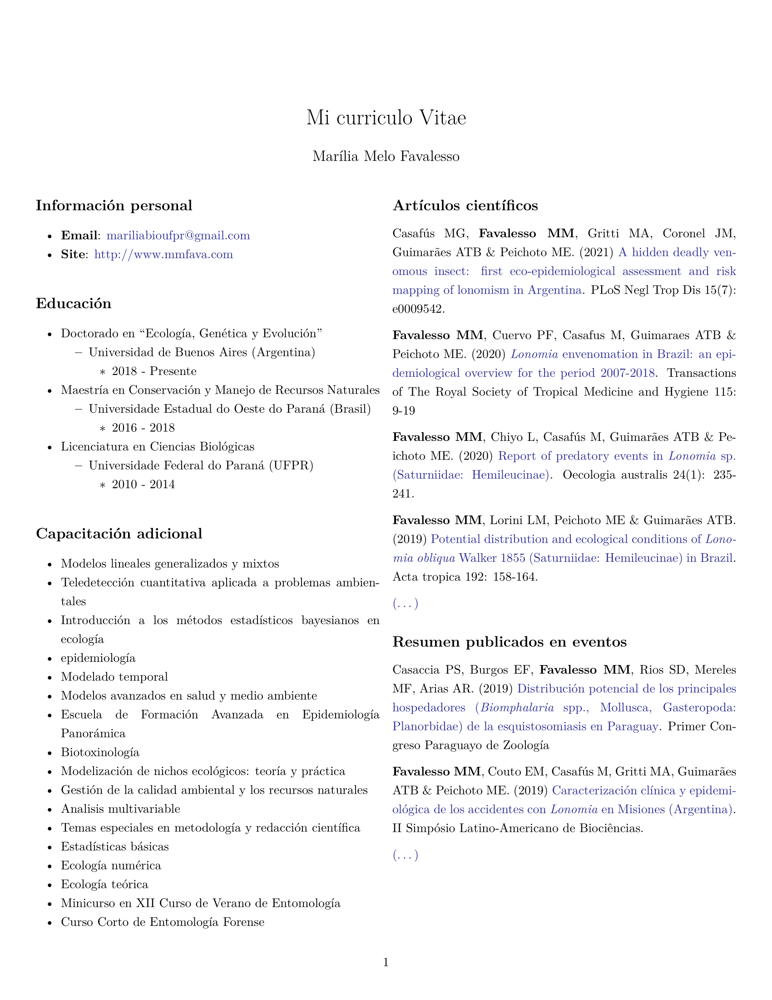
]

---
name: chunk
class: middle, center

# Chunk

---
## Chunk

<br>
Los **code chunks** son fragmentos de código en R que se pueden ejecutar para generar resultados que se incorporarán al documento `.Rmd`. 

<br>
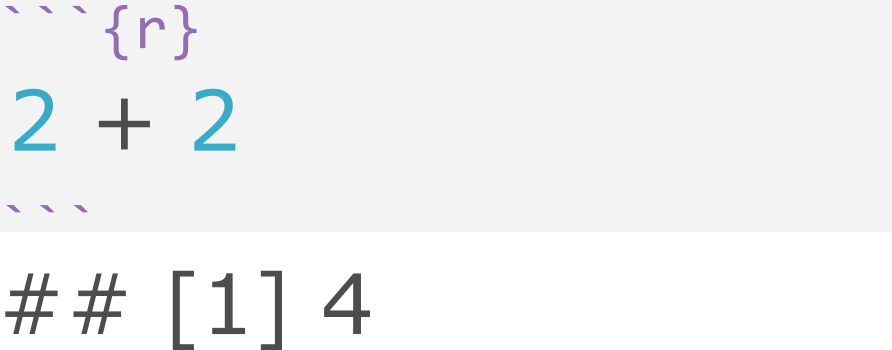

---
## Chunk

<br>
Los **code chunks** son fragmentos de código en R que se pueden ejecutar para generar resultados que se incorporarán al documento `.Rmd`. 

<br>
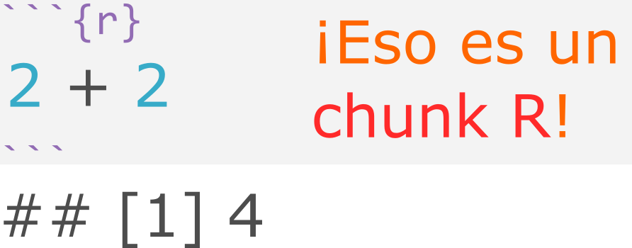

---
## Chunk

<br>
- Los `chunks` están delimitados por tres acentos graves () en la parte superior e inferior.

- Entre las llaves `{}` está el lenguaje de programación que estamos usando dentro del chunk. En nuestro caso, estamos usando `{R}`. 

<br>
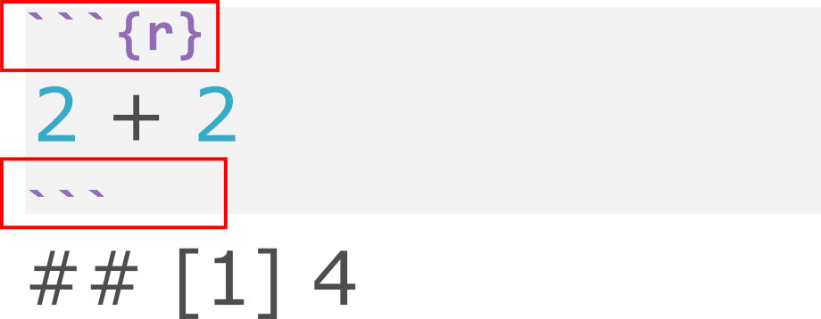
<br>

- Podemos utilizar otros lenguajes de programación: `python`, `css`, `SQL`, etc. 

---
## Chunk

- Escribimos nuestro código R entre los tres acentos graves...

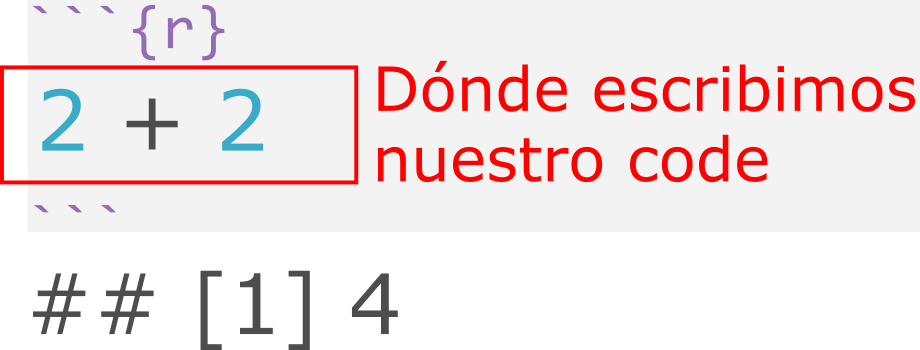
<br>

- ...y la R nos dará la salida de nuestra función debajo del `chunk`.

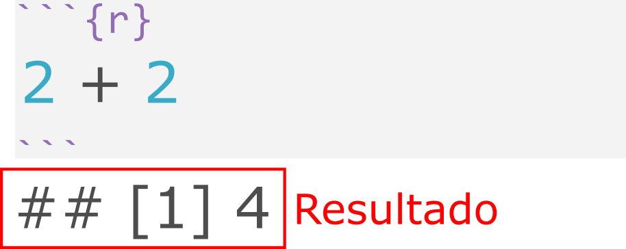
<br>

---
## Chunk

- Puede insertar rápidamente `chunks` en su archivo con:

  - El atajo de teclado `Ctrl + Alt + I` (`OS X: Cmd + Opción + I`).
  
  - Escribiendo los delimitadores de un `chunk`: .

  - O con el comando `Add Chunk` en la barra de herramienta del editor .

<br>
.center[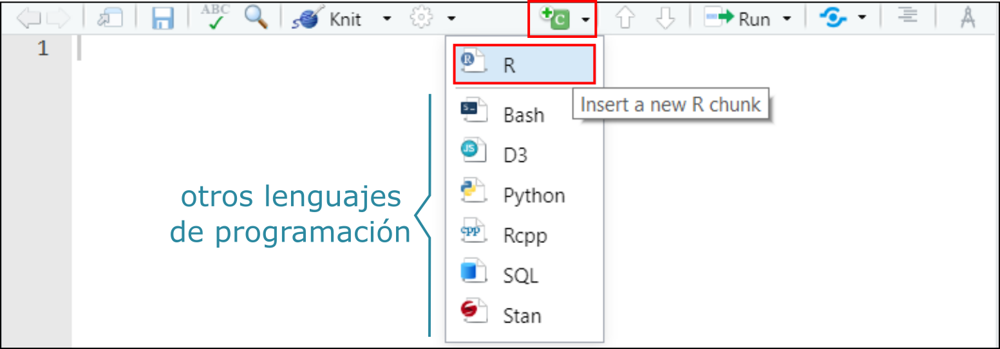]
<br>

---
## Chunk

### Definiciones

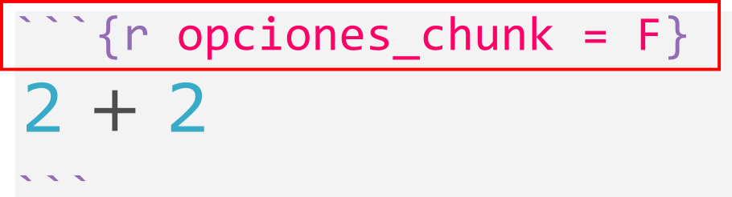
<br>

- La salida del `chunk` se puede personalizar con las opciones de **knitr**, argumentos establecidos en el `{r ...}`.

  - Por ejemplo, podemos pedirle al chunk R que genere un gráfico, pero que no muestre el código que generó el gráfico.

- Aquí veremos algunas de las diversas personalizaciones que podemos hacer.

- Para más informaciónes, acceda: [R Markdown Reference Guide](https://www.rstudio.com/wp-content/uploads/2015/03/R Markdown-reference.pdf)

---
## Chunk

### Definiciones

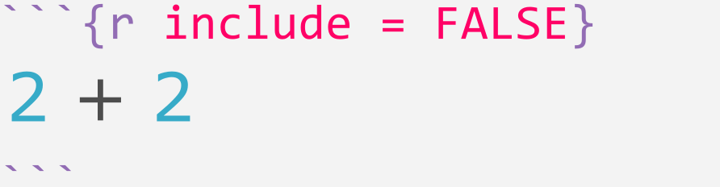
- Para evitar que el código y los resultados aparezcan en el archivo completo.
- *R Markdown* aún ejecuta el código en el fragmento y los resultados pueden ser utilizados por otros fragmentos.

--------
<br>
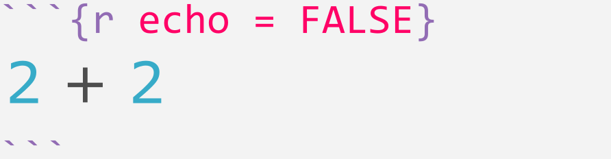

- Para evitar que el código - pero no los resultados - aparezcan en el archivo completo.
- Esta es una forma útil de incorporar imágenes.

---
## Chunk

### Definiciones

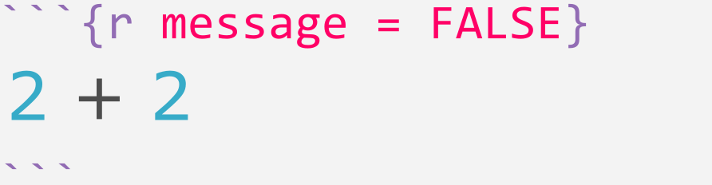

- Evita que los mensajes generados por el código aparezcan en el archivo terminado.

------

<br>
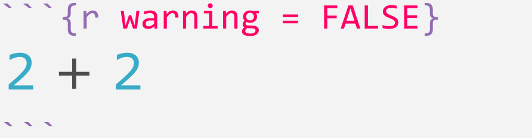

- Evita que las advertencias generadas por el código aparezcan en el final.

---
## Chunk

### Definiciones

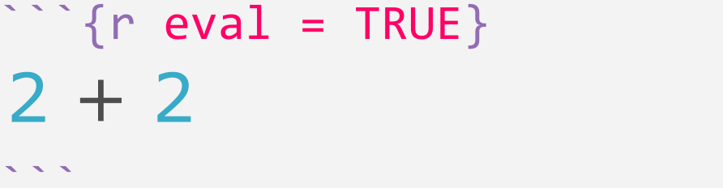

- Indica si el código debe ejecutarse. 

------

<br>


- Agrega una leyenda a los resultados gráficos.

---
### Ejercicios 🤓

<br>
> A cada 6 meses es necesario realizar un informe sobre el número de casos de dengue por provincia de Argentina. Los datos son del [Registro del Sistema Nacional de Vigilancia de la Salud para Argentina](http://datos.salud.gob.ar/dataset/vigilancia-de-dengue-y-zika/archivo/318834df-656d-4e71-9e87-195ebd96a0f8).

> Para facilitar el trabajo, decidió crear un informe dinámico con R Markdown para ayudarle 👩‍💻.

1 - Cree un nuevo archivo R Markdown. En este archivo, incluya las informaciónes:
- Titulo "Vigilancia de Dengue en Argentina"
- Su nombre.
- La fecha

---
### Ejercicios 🤓

2 - Crea un "chunk R". Configure el `chunk` para ocultar códigos, salidas y advertencias. Solo necesitas ejecutar los códigos.

3 - Al comienzo del `chunk`, incluya los paquetes que utilizará:
```{r message=FALSE, warning=FALSE}
## Paquetes ----------------------------------------------------------
library(tidyverse) 
library(kableExtra) 
```

4 - Crea dos objetos, uno llamado "mes_comiezo" y el otro "mes_final". En el primer objeto asigne el valor "enero" y en el segundo asigne "julio". Cree un tercer objeto llamado "año" y asigne el valor "2018".

```{r}
## Curso del tiempo --------------------------------------------------
mes_comiezo <- "Enero"
mes_final <- "Julio"
ano <- 2018
```

---
### Ejercicios 🤓

5 - Abra la siguiente base de datos en R: "`enejul2018.csv`". 

```{r}
## Descarga de la base de datos --------------------------------------
datos <- read_csv2("enejul2018.csv")
```

> ¿Qué variables están disponibles en esta tabla?

---
### Ejercicios 🤓

6 - De la tabla "`datos`" contaremos el número de casos de dengue por provincia.

- Seleccione las columnas en las que queremos los datos.
```{r message=FALSE, warning=FALSE}
datos %>% 
  dplyr::select(provincia_nombre, evento_nombre, cantidad_casos)  #<<
```

---
### Ejercicios 🤓

6 - De la tabla "`datos`" contaremos el número de casos de dengue por provincia.

- Agrupar datos por provincia y enfermedad.
```{r}
datos %>% 
  dplyr::select(provincia_nombre, evento_nombre, cantidad_casos) %>% 
  group_by(provincia_nombre, evento_nombre) #<<
```

---
### Ejercicios 🤓

6 - De la tabla "`datos`" contaremos el número de casos de dengue por provincia.
- Suma el número de casos por provincia

<div class="background" style="width: 1000px; height: 430px; white-space: nowrap; overflow-x: scroll; border: 0; padding: 0px;">
```{r message=FALSE, warning=FALSE}
datos %>% 
  dplyr::select(provincia_nombre, evento_nombre, cantidad_casos) %>% 
  group_by(provincia_nombre, evento_nombre) %>% 
  summarise(total = sum(cantidad_casos)) #<<
```

---
### Ejercicios 🤓

6 - De la tabla "`datos`" contaremos el número de casos de dengue por provincia.

- Muevamos "dengue" y "zika" de filas a columnas.

<div class="background" style="width: 1000px; height: 430px; white-space: nowrap; overflow-x: scroll; border: 0; padding: 0px;">

```{r message=FALSE, warning=FALSE}
datos %>% 
  dplyr::select(provincia_nombre, evento_nombre, cantidad_casos) %>% 
  group_by(provincia_nombre, evento_nombre) %>% 
  summarise(total = sum(cantidad_casos)) %>%
  pivot_wider(names_from = evento_nombre, values_from = total) #<<
```

---
### Ejercicios 🤓

6 - De la tabla "`datos`" contaremos el número de casos de dengue por provincia.

- Borra los datos de Zica.

<div class="background" style="width: 1000px; height: 430px; white-space: nowrap; overflow-x: scroll; border: 0; padding: 0px;">
```{r message=FALSE, warning=FALSE}
datos %>% 
  dplyr::select(provincia_nombre, evento_nombre, cantidad_casos) %>% 
  group_by(provincia_nombre, evento_nombre) %>% 
  summarise(total = sum(cantidad_casos)) %>% 
  pivot_wider(names_from = evento_nombre, values_from = total) %>% 
  dplyr::select(-`Enfermedad por Virus del Zika`) #<<
```

---
### Ejercicios 🤓

6 - De la tabla "`datos`" contaremos el número de casos de dengue por provincia.

- Ordene los datos en orden descendente.

<div class="background" style="width: 1000px; height: 430px; white-space: nowrap; overflow-x: scroll; border: 0; padding: 0px;">
```{r message=FALSE, warning=FALSE}
datos %>% 
  dplyr::select(provincia_nombre, evento_nombre, cantidad_casos) %>% 
  group_by(provincia_nombre, evento_nombre) %>% 
  summarise(total = sum(cantidad_casos)) %>% 
  pivot_wider(names_from = evento_nombre, values_from = total) %>% 
  dplyr::select(-`Enfermedad por Virus del Zika`) %>% 
  arrange(desc(Dengue)) #<<
```

---
### Ejercicios 🤓

6 - De la tabla "`datos`" contaremos el número de casos de dengue por provincia.

- Cambiemos el nombre de las columnas.

<div class="background" style="width: 1000px; height: 430px; white-space: nowrap; overflow-x: scroll; border: 0; padding: 0px;">
```{r message=FALSE, warning=FALSE}
datos %>% 
  dplyr::select(provincia_nombre, evento_nombre, cantidad_casos) %>% 
  group_by(provincia_nombre, evento_nombre) %>% 
  summarise(total = sum(cantidad_casos)) %>% 
  pivot_wider(names_from = evento_nombre, values_from = total) %>% 
  dplyr::select(-`Enfermedad por Virus del Zika`) %>% 
  arrange(desc(Dengue)) %>%
  rename(Provincia = provincia_nombre, Casos = Dengue) #<<
```

---
### Ejercicios 🤓

6 - De la tabla "`datos`" contaremos el número de casos de dengue por provincia.

- Guarde todo el proceso para producir la tabla en un objeto.

```{r message=FALSE, warning=FALSE}
newdt <- datos %>% 
  dplyr::select(provincia_nombre, evento_nombre, cantidad_casos) %>% 
  group_by(provincia_nombre, evento_nombre) %>% 
  summarise(total = sum(cantidad_casos)) %>% 
  pivot_wider(names_from = evento_nombre, values_from = total) %>% 
  dplyr::select(-`Enfermedad por Virus del Zika`) %>% 
  arrange(desc(Dengue)) %>%
  rename(Provincia = provincia_nombre, Casos = Dengue) 
```

---

### <font color="red"> !!!! </font>

- Puede insertar los resultados del código R directamente en los textos de R Markdown.

- Debe incluir un acento grave, la letra `r`, un espacio, el nombre de su objeto y nuevamente un acento grave: 

<br>
.center[]
<br>

> Usemos esta función en nuestro ejercicio.

---
### Ejercicios 🤓

7 - Complete los espacios en el texto usando la sintaxis R.

> En el período de `MES_COMIEZO` - `MES_FINAL` del año `AÑO`, Argentina totalizó `XX` casos de dengue, siendo la provincia de `XXXXX` la que presenta mayor número de afectados.

8 - Pegue el texto del *ejercicio 7* en su archivo R Markdown; abajo del `chunk`.

---
## `kable`

- La función `kable()` en **knitr** es un generador de tablas muy simple

- Es simple por diseño!!

- Solo genera tablas para datos estrictamente rectangulares, como `matrix` y `data.frame`. No puede formatear mucho las celdas de la tabla o combinar celdas. 

- Sin embargo, esta función tiene una gran cantidad de argumentos para personalizar la apariencia de las tablas:

```{r eval=FALSE, message=FALSE, warning=FALSE, include=TRUE}
tabla %>%
  kable(format, # ('latex', 'html', 'pipe', 'simple') 
        digits = getOption("digits"), # número de dígitos
        row.names = NA, # nombres de líneas
        col.names = NA, # nombres de columnas
        align, # Alineación de columnas: 'l', 'c', 'r'
        caption = NULL, # leyenda
        escape = TRUE) # escapar de characters especiales? TRUE/FALSE
```

---
## `kableExtra`

- El paquete `kableExtra` está diseñado para extender la funcionalidad básica de las tablas producidas usando `knitr::kable()`. 

- Dado que `knitr::kable()` es simple por diseño, definitivamente tiene muchas características faltantes que se ven comúnmente en otros paquetes, y `kableExtra` ha llenado el vacío perfectamente. 

- Lo más sorprendente de `kableExtra` es que la mayoría de sus características de tabla funcionan tanto para formatos **HTML** como **PDF**.

- Para más informaciones: 
  - ["*Create Awesome LaTeX Table with knitr::kable and kableExtra*" (Hao Zhu, 2020)](https://haozhu233.github.io/kableExtra/awesome_table_in_pdf.pdf). 

- Instalación:
```{r eval=FALSE, include=TRUE}
install.packages("kableExtra") 
```

---
### Ejercicios 🤓

8 - Cree un nuevo `chunk` que muestre los resultados de la función, pero oculte el código.

9 - Insertemos una tabla con las provincias y el total de casos de Dengue en el texto usando el paquete `kableExtra`.

<div class="background" style="width: 1050px; height: 445px; white-space: nowrap; overflow-x: scroll; border: 0; padding: 0px;">

```{r}
newdt %>% 
  kbl(booktabs = T, # Incluye división entre extremos 
                  align = "c", # Alineación de la tabla en el texto
                  caption = "Distribución de casos de dengue por provincia de Argentina.", # Leyenda
                  longtable = T) %>% # Para tablas largas
  column_spec(1, # columna 1
              width = "6cm", # 6cm de ancho
              latex_valign = "p") %>% # alineamiento vertical
  column_spec(2, # columna 2
              color = "white", # color de las letras = blanco
              width = "2.5cm", # 2.5cm de ancho
              bold = T, # escribiendo en negrita
              background = spec_color(newdt$Casos, end = 0.9, option = "A", direction = -1)) # colorear las líneas de acuerdo con los valores
```

---
### Ejercicios 🤓

10 - ¡Listo, salva en archivo y genera el PDF!. Comprueba los resultados de tu informe.

<div class="background" style="width: 1050px; height: 480px; white-space: nowrap; overflow-x: scroll; border: 0; padding: 0px;">
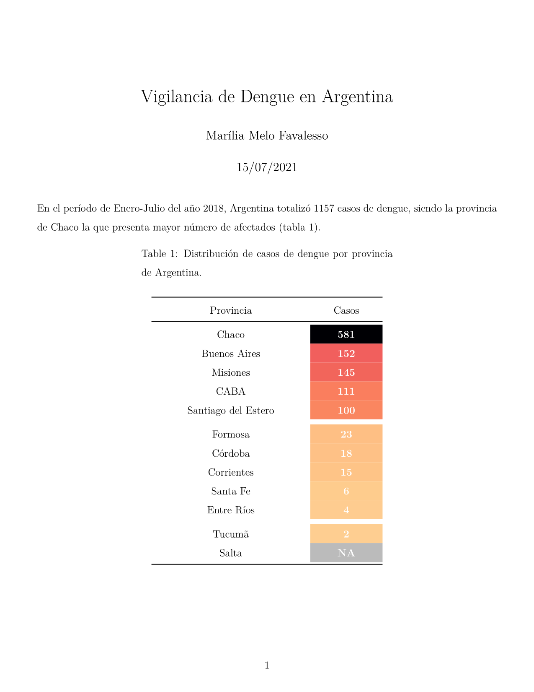

---
<br>

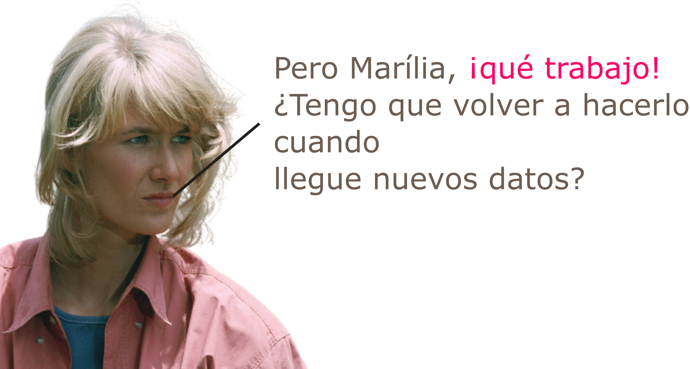

---
<br>


---
### Ejercicios 🤓

> El informe con datos sobre casos de dengue entre enero y julio de 2018 ya se ha entregado, ¡pero es hora de crear un nuevo informe! Con datos de julio hasta diciembre.

11 - Cree un nuevo archivo R Markdown.

12 - Copie y pegue toda la información de su informe anterior en este nuevo archivo.

13 - Cambie el contenido del objeto `mes_comiezo` para "*julio*" y de `mes_final` para "*Diciembre*".
```{r eval=FALSE, include=TRUE}
mes_comiezo <- "Julio"
mes_final <- "Diciembre"
ano <- 2018
```

14 - Cambiar la tabla de datos que se cargará para `juldic2018.csv`.
```{r eval=FALSE, include=TRUE}
datos <- read_csv2("juldic2018.csv.csv")
```

15 - Guarde el archivo y genere el PDF.

16 - Compare los resultados de los dos informes.

---
class: clear, center

## ¡Fin de clase!

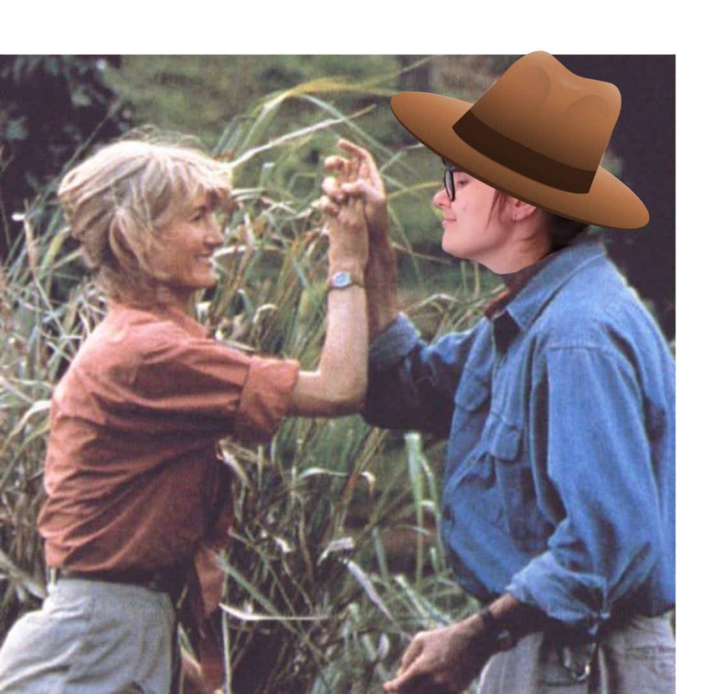

---
## Tarea 💻

1. En lugar de una tabla, representa los datos del dengue con un gráfico.

2. Cambie la fuente a "Times New Roman".

3. Cambie el texto a dos columnas.

4. Agregue una figura o tabla con la distribución de los casos de dengue por edad. Escribe una oración que explique qué grupo de edad tiene el mayor número de casos.

5. Convierta el informe para los casos de virus del Zika, que también están disponibles en las tablas "`enejul2018.csv`" y "`juldic2018.csv`". No olvide cambiar el título y la información de la tabla.

---
class: middle

## [¡No olvides tu tarea!](https://forms.gle/x4EbVJX76dZo3FQP9) `r icons::icon_style(icons::fontawesome("user-edit"), fill = "#000000")`

<br> 

<br>

### Soma dos quadrados

- `r icons::icon_style(icons::fontawesome("github"), fill = "#000000")` [Soma-Dos-Quadrados/introduccionalR](https://github.com/Soma-dos-Quadrados/introduccionalR)
- `r icons::icon_style(icons::fontawesome("youtube"), fill = "#000000")` [/somaquadrados](https://www.youtube.com/channel/UC8_OHjnszxRiit92ZJlNH4A)
- `r icons::icon_style(icons::fontawesome("twitch"), fill = "#000000")` [/somadosquadrados](https://www.twitch.tv/somaquadrados)
- `r icons::icon_style(icons::fontawesome("twitter"), fill = "#000000")` [@somadosquadrados](https://twitter.com/somaquadrados)


### Marília Melo Favalesso 

- `r icons::icon_style(icons::fontawesome("envelope", style = "solid"), fill = "#000000")` [mariliabioufpr@gmail.com](mariliabioufpr@gmail.com)
- `r icons::icon_style(icons::fontawesome("globe-americas", style = "solid"), fill = "#000000")` [www.mmfava.com](www.mmfava.com)
- `r icons::icon_style(icons::fontawesome("github"), fill = "#000000")` [ /mmfava](https://github.com/mmfava)
